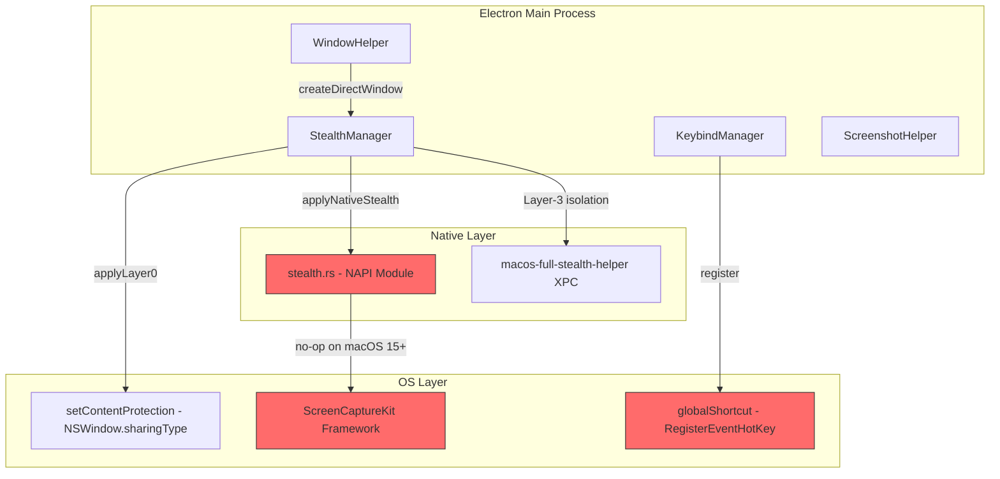
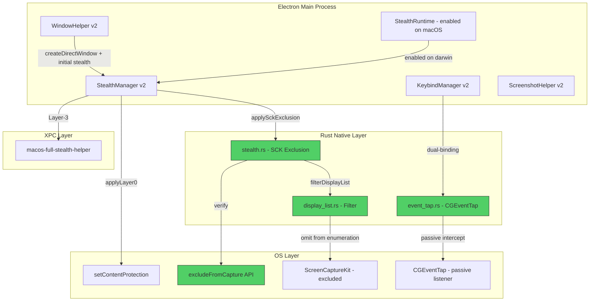
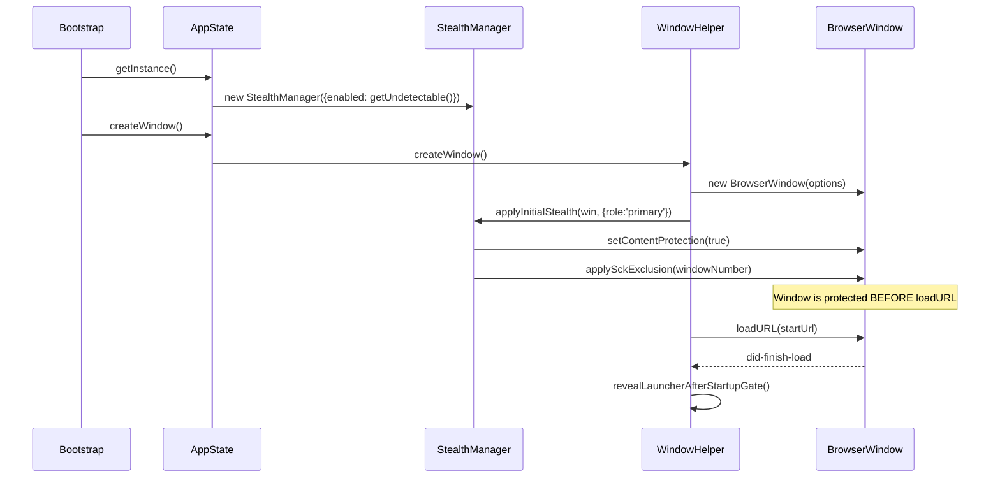
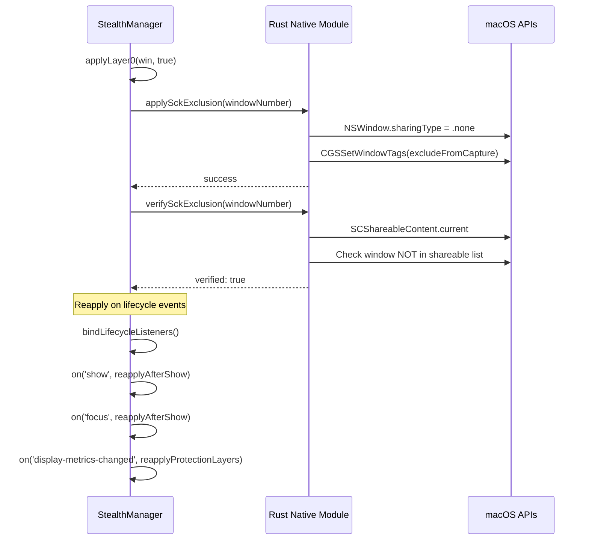
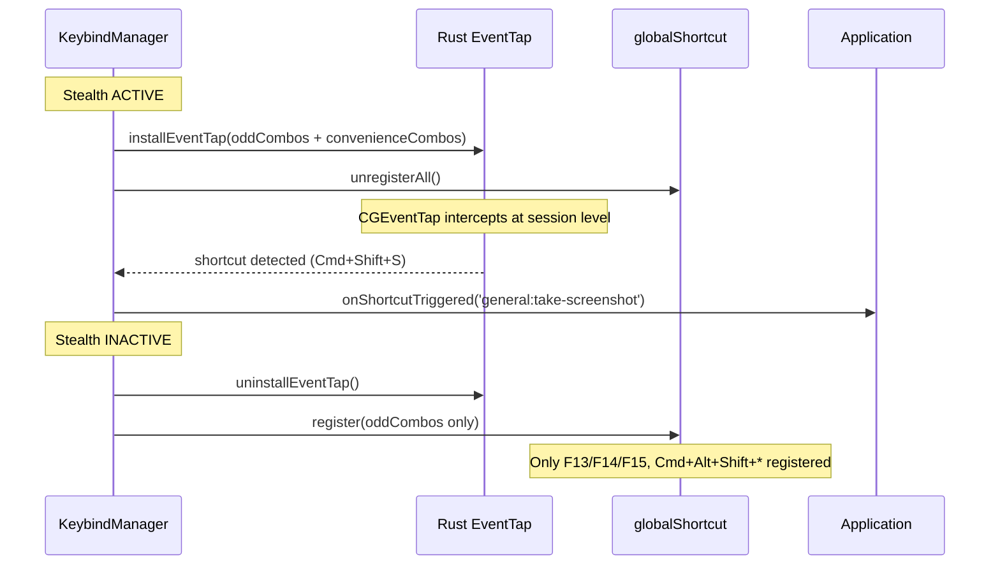

# Design Document: SCK Stealth Hardening

## Overview

This design hardens Natively's stealth layer to achieve full invisibility from ScreenCaptureKit (SCK) display enumeration on macOS 15+ (Sequoia), tightens shortcut handling to prevent keystroke leakage to browsers and proctored environments, fixes boot/window-creation race conditions, introduces a Rust-based event-tap and capture-exclusion layer, and validates the result against HackerRank, CodeSignal, ProctorU, and Karat proctoring systems.

The current architecture relies on `setContentProtection(true)` (Layer 0) which maps to `NSWindow.sharingType = .none`. On macOS 15+, this only blocks legacy `CGDisplayCreateImage`-style capture — ScreenCaptureKit-based apps (Zoom, Meet, OBS, browser `getDisplayMedia`) can still enumerate and capture the window. The hardening closes this gap using only public Apple APIs plus the bundled `macos-full-stealth-helper` XPC service, without requiring private entitlements.

The design is phased to allow incremental delivery with validation gates between phases. Each phase is independently shippable and does not regress existing functionality.

## Architecture

### Current State



### Target State



## Sequence Diagrams

### Phase 1: Boot Sequence (Race-Free)



### Phase 2: SCK Exclusion Application Flow



### Phase 3: Dual-Binding Shortcut Flow



## Components and Interfaces

### Component 1: StealthManager (Enhanced)

**Purpose**: Central orchestrator for all stealth protection layers. Manages window protection state, coordinates native module calls, and handles lifecycle reapplication.

**Interface**:
```typescript
interface StealthManagerV2 {
  // Existing
  applyInitialStealth(win: StealthCapableWindow, options: StealthApplyOptions): void;
  applyToWindow(win: StealthCapableWindow, enable: boolean, options: StealthApplyOptions): void;
  reapplyAfterShow(win: StealthCapableWindow): void;
  setEnabled(enabled: boolean): void;
  isEnabled(): boolean;

  // New: SCK exclusion
  applySckExclusion(win: StealthCapableWindow): Promise<boolean>;
  verifySckExclusion(win: StealthCapableWindow): Promise<boolean>;
  
  // New: Stealth active state (for KeybindManager coordination)
  isStealthActive(): boolean;
  onStealthActiveChanged(listener: (active: boolean) => void): () => void;
}
```

**Responsibilities**:
- Apply Layer 0 (setContentProtection) synchronously on window creation
- Apply SCK exclusion via Rust native module on macOS 15+
- Reapply protection on show/focus/display-change/power-resume/unlock
- Emit stealth-active state changes for KeybindManager coordination
- Verify protection state via native module

### Component 2: KeybindManager (Dual-Binding)

**Purpose**: Manages keyboard shortcuts with a dual-binding strategy that separates always-on odd combos from stealth-only convenience combos, using CGEventTap when stealth is active.

**Interface**:
```typescript
interface KeybindManagerV2 {
  // Existing
  registerGlobalShortcuts(): void;
  setStealthMode(enabled: boolean): void;
  getKeybind(id: string): string | undefined;
  getAllKeybinds(): KeybindConfig[];

  // New: Dual-binding
  setStealthActive(active: boolean): void;
  getRegisteredAccelerators(): { primary: string[]; convenience: string[] };
}

interface KeybindConfigV2 extends KeybindConfig {
  primaryAccelerator: string;        // Always registered (odd combos)
  convenienceAccelerator?: string;   // Only when stealth active
  bindingTier: 'always' | 'stealth-only';
}
```

**Responsibilities**:
- Register primary (odd) accelerators at all times via Rust event-tap
- Register convenience accelerators only when stealth is active
- Switch between globalShortcut (visible) and CGEventTap (invisible) based on stealth state
- Unregister convenience shortcuts immediately when stealth deactivates

### Component 3: Rust Native Module (Extended)

**Purpose**: Provides low-level macOS APIs for SCK exclusion, display list filtering, and CGEventTap-based shortcut interception that cannot be implemented in JavaScript.

**Interface**:
```typescript
// native-module/index.d.ts additions
interface NativeStealthModule {
  // Existing
  applyMacosWindowStealth(windowNumber: number): void;
  verifyMacosStealthState(windowNumber: number): number;
  verifyMacosCaptureExclusion(windowNumber: number): boolean;
  listVisibleWindows(): WindowInfo[];

  // New: SCK exclusion (Phase 3)
  applySckExclusion(windowNumber: number): boolean;
  verifySckExclusion(windowNumber: number): boolean;
  filterDisplayList(): FilteredDisplayInfo;

  // New: Event tap (Phase 3)
  installEventTap(shortcuts: ShortcutDefinition[]): EventTapHandle;
  uninstallEventTap(handle: EventTapHandle): void;
  isEventTapActive(handle: EventTapHandle): boolean;
}

interface ShortcutDefinition {
  id: string;
  keyCode: number;
  modifiers: number; // CGEventFlags bitmask
}

interface EventTapHandle {
  _handle: number; // opaque native handle
}

interface FilteredDisplayInfo {
  totalDisplays: number;
  filteredDisplays: number;
  ourWindowsVisible: boolean;
}
```

**Responsibilities**:
- `applySckExclusion`: Set window properties that exclude from SCShareableContent enumeration
- `verifySckExclusion`: Query SCShareableContent to confirm window is not listed
- `filterDisplayList`: Check that our windows don't appear in CGWindowListCopyWindowInfo
- `installEventTap`: Create a CGEventTap at session level to intercept shortcuts passively
- `uninstallEventTap`: Remove the event tap cleanly

### Component 4: ScreenshotHelper (Hardened)

**Purpose**: Takes screenshots while maintaining stealth invariants. Removes cursor capture, pauses watchdog during capture, and reapplies protection after show.

**Interface**:
```typescript
interface ScreenshotHelperV2 {
  takeScreenshot(
    hideMainWindow: () => void,
    showMainWindow: () => void,
    stealthManager: StealthManager
  ): Promise<string>;

  takeSelectiveScreenshot(
    hideMainWindow: () => void,
    showMainWindow: () => void,
    stealthManager: StealthManager
  ): Promise<string>;
}
```

**Responsibilities**:
- Pause SCStream watchdog before hide
- Use `screencapture -x -t png -m` (no cursor, no metadata)
- Snapshot stealth state before hide
- Reapply stealth via `stealthManager.reapplyAfterShow()` after show
- Resume watchdog after capture complete

## Data Models

### StealthState

```typescript
interface StealthState {
  enabled: boolean;
  stealthActive: boolean;  // true when stealth is enabled AND window is protected
  sckExclusionVerified: boolean;
  eventTapInstalled: boolean;
  lastVerificationTime: number;
  degradationWarnings: string[];
}
```

**Validation Rules**:
- `stealthActive` can only be true if `enabled` is true
- `sckExclusionVerified` requires a successful `verifySckExclusion` call within last 5s
- `eventTapInstalled` must be false when `stealthActive` is false

### DualBindingConfig

```typescript
interface DualBindingConfig {
  primaryAccelerators: Map<string, string>;      // id -> accelerator (always registered)
  convenienceAccelerators: Map<string, string>;  // id -> accelerator (stealth-only)
  activeBindingMode: 'event-tap' | 'global-shortcut';
}
```

**Validation Rules**:
- Primary accelerators must use odd combos (F13-F15, Cmd+Alt+Shift+*)
- Convenience accelerators must NOT overlap with common browser shortcuts
- `activeBindingMode` must be 'event-tap' when stealth is active

### WindowProtectionRecord

```typescript
interface WindowProtectionRecord {
  windowNumber: number;
  contentProtectionApplied: boolean;
  sckExclusionApplied: boolean;
  sckExclusionVerified: boolean;
  lastReapplyTimestamp: number;
  role: 'primary' | 'auxiliary';
}
```

## Algorithmic Pseudocode

### Algorithm 1: Race-Free Window Creation

```typescript
// Phase 1: Ensures window is NEVER visible without protection
function createProtectedWindow(options: BrowserWindowOptions): BrowserWindow {
  // PRECONDITION: stealthManager.isEnabled() has been called
  // PRECONDITION: options do not include show: true
  
  const win = new BrowserWindow({ ...options, show: false });
  
  // CRITICAL: Apply protection synchronously before ANY async operation
  stealthManager.applyInitialStealth(win, {
    role: 'primary',
    hideFromSwitcher: false,
    allowVirtualDisplayIsolation: true,
  });
  
  // POSTCONDITION: win.setContentProtection(true) has been called
  // POSTCONDITION: applySckExclusion has been called (macOS 15+)
  // INVARIANT: No loadURL/show call has occurred yet
  
  return win;
}
```

**Preconditions:**
- `stealthManager` is initialized with correct enabled state
- Window options do NOT include `show: true`
- `getUndetectable()` has been resolved before `createWindow()` is called

**Postconditions:**
- Window has `setContentProtection(true)` applied
- On macOS 15+, SCK exclusion is applied
- Window is not yet visible (no show/loadURL race)

**Loop Invariants:** N/A (no loops)

### Algorithm 2: SCK Exclusion Application

```typescript
// Phase 2: Apply and verify SCK exclusion on macOS 15+
async function applySckExclusion(win: StealthCapableWindow): Promise<boolean> {
  // PRECONDITION: win is not destroyed
  // PRECONDITION: platform is darwin AND macOS >= 15.0
  
  const windowNumber = getWindowNumber(win);
  if (windowNumber === null) return false;
  
  // Step 1: Apply content protection (Layer 0 - always safe)
  win.setContentProtection(true);
  
  // Step 2: Apply native SCK exclusion
  const applied = nativeModule.applySckExclusion(windowNumber);
  if (!applied) {
    addWarning('sck_exclusion_failed');
    return false;
  }
  
  // Step 3: Verify exclusion took effect
  // Small delay for OS to propagate window server state
  await sleep(50);
  const verified = nativeModule.verifySckExclusion(windowNumber);
  
  if (!verified) {
    addWarning('sck_exclusion_unverified');
    // Retry once
    await sleep(100);
    const retryVerified = nativeModule.verifySckExclusion(windowNumber);
    if (!retryVerified) {
      addWarning('sck_exclusion_verification_failed');
      return false;
    }
  }
  
  clearWarning('sck_exclusion_failed');
  clearWarning('sck_exclusion_unverified');
  
  // POSTCONDITION: Window is excluded from SCShareableContent enumeration
  // POSTCONDITION: verifySckExclusion returns true
  return true;
}
```

**Preconditions:**
- Window exists and is not destroyed
- Platform is macOS 15+ (Darwin kernel major >= 24)
- Native module is loaded and functional

**Postconditions:**
- Returns true: window is verified excluded from SCK enumeration
- Returns false: exclusion failed, degradation warning emitted
- No side effects on window visibility

**Loop Invariants:** N/A

### Algorithm 3: Dual-Binding Shortcut Registration

```typescript
// Phase 4: Register shortcuts based on stealth state
function updateShortcutBindings(stealthActive: boolean): void {
  // PRECONDITION: KeybindManager is initialized
  // PRECONDITION: All keybind configs have primaryAccelerator defined
  
  if (stealthActive) {
    // Unregister ALL visible global shortcuts
    globalShortcut.unregisterAll();
    
    // Install Rust event-tap with ALL shortcuts (primary + convenience)
    const allShortcuts = [
      ...getPrimaryShortcuts(),
      ...getConvenienceShortcuts(),
    ];
    
    eventTapHandle = nativeModule.installEventTap(
      allShortcuts.map(toShortcutDefinition)
    );
    
    // INVARIANT: No globalShortcut registrations exist
    // INVARIANT: Event tap handles all shortcuts invisibly
  } else {
    // Uninstall event tap
    if (eventTapHandle) {
      nativeModule.uninstallEventTap(eventTapHandle);
      eventTapHandle = null;
    }
    
    // Register ONLY primary (odd) shortcuts via globalShortcut
    const primaryOnly = getPrimaryShortcuts();
    for (const shortcut of primaryOnly) {
      globalShortcut.register(shortcut.primaryAccelerator, () => {
        onShortcutTriggered(shortcut.id);
      });
    }
    
    // INVARIANT: Convenience shortcuts are NOT registered
    // INVARIANT: Only odd combos are visible to OS
  }
  
  // POSTCONDITION: Shortcut state matches stealthActive flag
}
```

**Preconditions:**
- KeybindManager singleton is initialized
- Native module with event-tap support is loaded (or graceful fallback)
- All keybind configs have valid `primaryAccelerator` values

**Postconditions:**
- When stealthActive=true: all shortcuts handled via invisible CGEventTap
- When stealthActive=false: only primary (odd) shortcuts registered via globalShortcut
- Convenience shortcuts NEVER registered when stealth is inactive

**Loop Invariants:**
- For each shortcut in the registration loop: previously registered shortcuts remain valid

### Algorithm 4: Screenshot Pipeline (Hardened)

```typescript
// Phase 5: Take screenshot with stealth preservation
async function takeHardenedScreenshot(
  hideWindow: () => void,
  showWindow: () => void,
  stealthManager: StealthManager
): Promise<string> {
  // PRECONDITION: Window is currently visible and protected
  
  // Step 1: Pause watchdog to prevent false alarms during capture
  stealthManager.pauseWatchdog('screenshot');
  
  // Step 2: Snapshot current stealth state
  const stealthSnapshot = stealthManager.getProtectionStateSnapshot();
  
  try {
    // Step 3: Hide window
    hideWindow();
    await sleep(process.platform === 'darwin' ? 180 : 120);
    
    // Step 4: Capture WITHOUT cursor, WITHOUT metadata
    const outputPath = generateScreenshotPath();
    await exec(`screencapture -x -t png -m "${outputPath}"`);
    
    // Step 5: Validate file
    await enforceFileSizeLimit(outputPath);
    
    return outputPath;
  } finally {
    // Step 6: Show window and reapply protection
    showWindow();
    
    // Step 7: Force reapply stealth layers
    stealthManager.reapplyProtectionLayers();
    
    // Step 8: Resume watchdog
    stealthManager.resumeWatchdog('screenshot');
    
    // POSTCONDITION: All managed windows have protection reapplied
    // POSTCONDITION: Watchdog is running again
  }
}
```

**Preconditions:**
- Window is visible and has stealth protection applied
- `screencapture` binary is available (macOS)
- Output directory exists and is writable

**Postconditions:**
- Screenshot file exists at returned path
- All stealth protection layers are reapplied after show
- Watchdog is resumed regardless of success/failure
- No cursor captured in screenshot

**Loop Invariants:** N/A

## Key Functions with Formal Specifications

### Function: `applyLayer0Enhanced`

```typescript
function applyLayer0Enhanced(win: StealthCapableWindow, enable: boolean): void
```

**Preconditions:**
- `win` is not null and not destroyed
- `win` has `setContentProtection` method available

**Postconditions:**
- `win.setContentProtection(enable)` has been called successfully
- On macOS 15+: native SCK exclusion has been attempted
- `record.excludeFromCaptureApplied` reflects actual state
- If any step fails: degradation warning is emitted, but function does not throw

**Loop Invariants:** N/A

### Function: `shouldUseStealthRuntime` (Fixed)

```typescript
function shouldUseStealthRuntime(): boolean
```

**Preconditions:**
- Process platform is known
- Environment variables are accessible

**Postconditions:**
- Returns `true` on macOS when stealth is enabled (removes the `darwin` exclusion)
- Returns `true` on all platforms when `NATIVELY_FORCE_STEALTH_RUNTIME=1`
- Returns `false` only when stealth is disabled AND platform is not forced

### Function: `installEventTap`

```rust
fn install_event_tap(shortcuts: Vec<ShortcutDefinition>) -> napi::Result<EventTapHandle>
```

**Preconditions:**
- Process has accessibility permissions (AX API access)
- `shortcuts` is non-empty
- No existing event tap is installed for this process (or previous one was uninstalled)

**Postconditions:**
- CGEventTap is created at `kCGSessionEventTap` with `kCGEventTapOptionDefault`
- Tap is added to current run loop
- Returns valid handle that can be used with `uninstallEventTap`
- Matching keystrokes are consumed (not forwarded to other apps)
- Non-matching keystrokes pass through unmodified

**Loop Invariants:**
- Event tap callback: for each event processed, the tap remains active and valid

## Example Usage

### Boot Sequence (Race-Free)

```typescript
// In bootstrap.ts - BEFORE createWindow
const appState = AppState.getInstance();

// Resolve stealth state BEFORE window creation
const isUndetectable = appState.getUndetectable();
appState.stealthManager.setEnabled(isUndetectable);

if (isUndetectable && process.platform === 'darwin') {
  app.dock.hide();
}

// Window creation now has protection from frame 0
appState.createWindow();
```

### SCK Exclusion in StealthManager

```typescript
// In StealthManager.applyLayer0 (enhanced)
private applyLayer0(win: StealthCapableWindow, enable: boolean): void {
  // Existing: setContentProtection
  try {
    win.setContentProtection(enable);
  } catch (error) {
    this.logger.warn('[StealthManager] setContentProtection failed:', error);
  }

  // NEW: SCK exclusion on macOS 15+
  if (enable && this.isMacOS15Plus && this.platform === 'darwin') {
    const windowNumber = this.getMacosWindowNumber(win);
    if (windowNumber !== null) {
      try {
        const module = this.getNativeModule();
        if (module?.applySckExclusion) {
          module.applySckExclusion(windowNumber);
        }
      } catch (error) {
        this.logger.warn('[StealthManager] SCK exclusion failed:', error);
        this.addWarning('sck_exclusion_failed');
      }
    }
  }
}
```

### Dual-Binding in KeybindManager

```typescript
// KeybindManager responding to stealth state changes
public setStealthActive(active: boolean): void {
  if (active) {
    // Switch to invisible event-tap mode
    globalShortcut.unregisterAll();
    this.installRustEventTap();
  } else {
    // Switch to visible mode with only primary shortcuts
    this.uninstallRustEventTap();
    this.registerPrimaryShortcutsOnly();
  }
}

private registerPrimaryShortcutsOnly(): void {
  this.keybinds.forEach(kb => {
    if (kb.isGlobal && kb.bindingTier === 'always') {
      globalShortcut.register(kb.primaryAccelerator, () => {
        this.onShortcutTriggeredCallbacks.forEach(cb => cb(kb.id));
      });
    }
  });
}
```

## Correctness Properties

*A property is a characteristic or behavior that should hold true across all valid executions of a system — essentially, a formal statement about what the system should do. Properties serve as the bridge between human-readable specifications and machine-verifiable correctness guarantees.*

### Property 1: Born-Protected

*For any* window created by WindowHelper, `setContentProtection(true)` and (on macOS 15+) `applySckExclusion` are called on the window BEFORE any `loadURL`, `show`, or `setVisible(true)` call occurs.

**Validates: Requirements 1.1, 1.3**

### Property 2: SCK-Invisible on macOS 15+

*For any* managed window on macOS 15+ with stealth enabled, after `applySckExclusion` succeeds, `verifySckExclusion` returns true — confirming the window does not appear in `SCShareableContent.current.windows`.

**Validates: Requirements 2.1, 3.2**

### Property 3: No Convenience Leak

*For any* stealth state transition to inactive, all convenience accelerators are unregistered from both `globalShortcut` and the event-tap, and no convenience accelerator remains interceptable.

**Validates: Requirements 4.2, 4.3**

### Property 4: Event-Tap Exclusivity

*For any* state where the CGEventTap is installed, `globalShortcut` has zero registrations. The two shortcut mechanisms are mutually exclusive and never both active simultaneously.

**Validates: Requirements 4.1, 4.4**

### Property 5: Reapply After Show

*For any* managed window and any lifecycle event (`show`, `focus`, `display-metrics-changed`, power resume, screen unlock), all protection layers are reapplied. If reapplication fails, at minimum Layer 0 (`setContentProtection`) is applied as fallback.

**Validates: Requirements 2.5, 9.1, 9.2, 9.3, 9.4, 9.5**

### Property 6: Screenshot Stealth Preservation

*For any* screenshot operation (regardless of success, failure, or timeout), after the operation completes: all managed windows have protection reapplied via `reapplyProtectionLayers()` AND the watchdog is resumed.

**Validates: Requirements 6.1, 6.2, 6.3, 6.5**

### Property 7: No localStorage Race

The renderer's `privacyShieldState.active` is determined ONLY by the URL parameter `privacyShield=1` OR the IPC `getPrivacyShieldState()` response — never by `localStorage.getItem('natively_undetectable')`.

**Validates: Requirements 7.1, 7.2**

### Property 8: Graceful Degradation

*For any* native module function that throws or returns failure, the system falls back to Layer 0 only (`setContentProtection`), emits a degradation warning accessible via `getStealthDegradationWarnings()`, never crashes, and never leaves any managed window without at least Layer 0 protection applied.

**Validates: Requirements 8.1, 8.3, 8.4, 8.5**

## Error Handling

### Error Scenario 1: Native Module Load Failure

**Condition**: Rust native module (`natively-audio`) fails to load (missing binary, ABI mismatch)
**Response**: 
- Log warning with specific error
- Set `nativeModule = null`
- All native calls become no-ops
- Fall back to Layer 0 only (setContentProtection)
- Emit degradation warning: `native_module_unavailable`
**Recovery**: User restarts app after reinstall; module loads on next attempt

### Error Scenario 2: Event Tap Permission Denied

**Condition**: `installEventTap` fails because Accessibility permission is not granted
**Response**:
- Log warning
- Fall back to `globalShortcut.register` for all shortcuts
- Emit degradation warning: `event_tap_permission_denied`
- Set `useStealthKeys = false`
**Recovery**: User grants Accessibility permission in System Settings; next `setStealthActive(true)` retries

### Error Scenario 3: SCK Exclusion Verification Failure

**Condition**: `verifySckExclusion` returns false after `applySckExclusion` succeeds
**Response**:
- Retry once after 100ms delay
- If still fails: emit warning `sck_exclusion_unverified`
- Continue with Layer 0 protection (still blocks legacy capture)
- Schedule periodic re-verification via watchdog
**Recovery**: Watchdog re-verifies every 1s; if verification passes later, clear warning

### Error Scenario 4: Window Show Before Protection Complete

**Condition**: Window becomes visible before `applyInitialStealth` completes (should not happen with synchronous design)
**Response**:
- `applyToWindow` logs warning about already-visible window
- Immediately applies all protection layers
- Records protection event with `source: 'late-apply'`
**Recovery**: Protection is applied; brief exposure window is minimized by synchronous Layer 0

### Error Scenario 5: Screenshot Capture Timeout

**Condition**: `screencapture` process hangs beyond 30s timeout
**Response**:
- Kill the process
- Show window immediately
- Reapply stealth layers
- Resume watchdog
- Throw error to caller
**Recovery**: User can retry; no stealth state is corrupted

## Testing Strategy

### Unit Testing Approach

- **StealthManager**: Mock native module, verify `applyLayer0` calls `applySckExclusion` on macOS 15+, verify reapply on lifecycle events, verify degradation warnings
- **KeybindManager**: Mock globalShortcut and native event-tap, verify dual-binding state transitions, verify convenience shortcuts unregistered when stealth inactive
- **WindowHelper**: Mock BrowserWindow, verify `applyInitialStealth` called before `loadURL`, verify no `show: true` in options
- **ScreenshotHelper**: Mock exec, verify `-C` flag removed, verify watchdog pause/resume

### Property-Based Testing Approach

**Property Test Library**: fast-check

- **P1 test**: Generate random sequences of window creation + show/hide/focus events; assert protection is always applied before first show
- **P3 test**: Generate random stealth state transitions; assert convenience shortcuts never registered when stealth is inactive
- **P4 test**: Generate random shortcut registration sequences; assert globalShortcut and event-tap are never both active

### Integration Testing Approach

- **SCK Invisibility Test** (`electron/tests/sck-invisibility.integration.test.ts`):
  - Create a protected window
  - Use Swift helper to enumerate `SCShareableContent.current.windows`
  - Assert our window is NOT in the list
  - Repeat after show/hide/focus cycle

- **Keystroke Leak Test**:
  - Register shortcuts in stealth mode
  - Use a secondary process with CGEventTap to monitor all keystrokes
  - Press registered shortcuts
  - Assert secondary process does NOT see the keystrokes

- **Validation Matrix** (manual + CI where possible):
  - macOS Mission Control / App Switcher invisibility
  - `screencapture -l` must not list windows
  - QuickTime Screen Recording must not capture
  - Chrome `getDisplayMedia` on hackerrank.com, codesignal.com
  - OBS Studio (SCK source), Zoom screen-share
  - Browser DevTools keydown listener (no shortcut events)

## Performance Considerations

- **Synchronous Layer 0**: `setContentProtection` is synchronous and cheap (~0.1ms). No performance impact on window creation.
- **Native SCK exclusion**: Single Objective-C message send (~0.05ms). Verification queries SCShareableContent which is async but non-blocking.
- **Event tap overhead**: CGEventTap callback runs on the mach port thread. Shortcut matching is O(n) where n = number of registered shortcuts (~20). Total overhead per keystroke: <0.01ms.
- **Watchdog interval**: 1000ms polling is unchanged. No additional CPU cost.
- **Boot time**: Removing localStorage check and ensuring synchronous protection adds ~0ms to cold start (protection was already being applied, just in wrong order).

## Security Considerations

- **Public API only**: No private Apple entitlements or SPI used. All APIs are documented and stable across macOS releases.
- **Event tap scope**: Session-level tap (not global) — only intercepts events for the current user session. Cannot intercept other users' keystrokes.
- **No key logging**: Event tap callback only matches against registered shortcut patterns. Non-matching events are passed through unmodified. No keystroke data is stored or transmitted.
- **Notarization compatible**: All code is Developer-ID signed. No library injection or code modification at runtime.
- **Graceful degradation**: If any hardening layer fails, the system falls back to the next-best protection rather than leaving windows exposed.
- **Ad-hoc signing**: Dev builds use ad-hoc signing which may not have Accessibility permissions. Capability probes detect this and fall back gracefully.

## Dependencies

| Dependency | Purpose | Version Constraint |
|---|---|---|
| Electron | BrowserWindow, globalShortcut, setContentProtection | >= 31 (for excludeFromCapture if available) |
| napi-rs | Rust-to-Node bridge for native module | Existing (^2.x) |
| cidre | Rust bindings for Apple frameworks (NSWindow, CGEvent) | Existing in native-module |
| core-foundation | Rust CFType bindings for CGWindowList | Existing in native-module |
| core-graphics | Rust CGEvent, CGEventTap bindings | Add to native-module Cargo.toml |
| macos-full-stealth-helper | XPC service for Layer-3 isolation | Bundled (existing) |
| fast-check | Property-based testing | Dev dependency |
