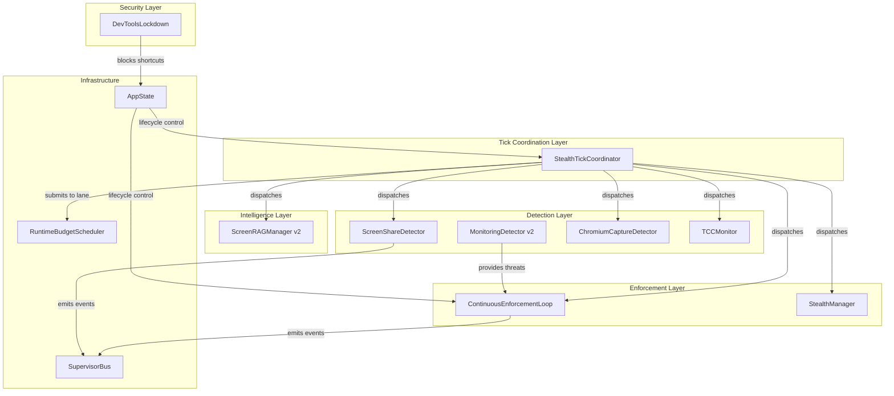
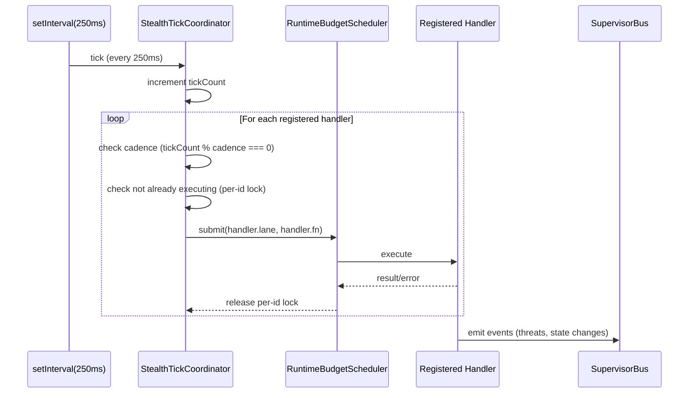
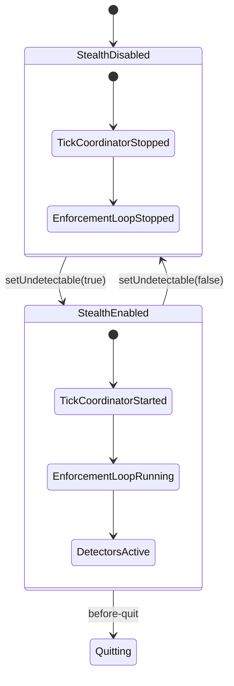

# Design Document: Stealth Hardening Quick Wins

## Overview

This design consolidates 10 coordinated improvements to the Natively stealth subsystem. The central architectural change is a **StealthTickCoordinator** — a single 250ms base-tick scheduler that replaces ~8 independent `setInterval` calls scattered across `StealthManager`, `ContinuousEnforcementLoop`, `ChromiumCaptureDetector`, and `TCCMonitor`. All other work items build on or integrate with this coordinator.

The design follows the existing patterns in the codebase:
- Event-driven architecture via `SupervisorBus`
- Lane-based scheduling via `RuntimeBudgetScheduler`
- Native module integration via `nativeStealthModule`
- Node.js built-in test runner (`node --test`) with `assert/strict`

### Key Design Decisions

1. **Single tick over multiple timers**: A single `setInterval(250ms)` with cadence multipliers eliminates timer drift, reduces GC pressure from timer objects, and makes the stealth subsystem's CPU footprint deterministic.
2. **Lane-aware dispatch**: Handlers declare a target `RuntimeLane`, allowing the tick coordinator to respect the existing budget scheduler's concurrency and memory limits.
3. **Event-driven ScreenRAG**: Rather than a dedicated timer, ScreenRAG activation is threshold-gated (3 screenshots) and runs on intelligence-lane idle ticks, eliminating unnecessary captures.
4. **JSON signature database**: Monitoring tool signatures are externalized to a JSON file, enabling updates without code changes or rebuilds.
5. **Sandbox-first file handling**: Screen capture artifacts use `os.tmpdir()` with immediate unlink, ensuring zero on-disk persistence of sensitive data.

---

## Architecture

### Component Diagram



### Data Flow



### Lifecycle Integration



---

## Components and Interfaces

### 1. StealthTickCoordinator (`electron/stealth/StealthTickCoordinator.ts`)

The central scheduler that replaces all independent `setInterval` calls.

```typescript
import type { RuntimeLane } from '../config/optimizations';
import type { RuntimeBudgetScheduler } from '../runtime/RuntimeBudgetScheduler';

export interface TickHandler {
  /** Unique identifier for this handler */
  id: string;
  /** Cadence as a multiple of 250ms base tick (1-240) */
  cadence: number;
  /** Target lane for execution */
  lane: RuntimeLane;
  /** The function to execute */
  fn: () => Promise<void> | void;
}

export interface StealthTickCoordinatorOptions {
  /** RuntimeBudgetScheduler for lane-aware dispatch */
  budgetScheduler: RuntimeBudgetScheduler;
  /** Base tick interval in ms (default: 250) */
  baseTickMs?: number;
  /** Logger */
  logger?: Pick<Console, 'log' | 'warn' | 'error'>;
}

export class StealthTickCoordinator {
  private timer: NodeJS.Timeout | null;
  private tickCount: number;
  private readonly handlers: Map<string, TickHandler>;
  private readonly executing: Set<string>;
  private readonly pendingRegistrations: TickHandler[];
  private readonly pendingDeregistrations: string[];
  private dispatching: boolean;
  private started: boolean;

  constructor(options: StealthTickCoordinatorOptions);

  /**
   * Register a handler. Rejects if cadence is outside [1, 240].
   * Safe to call during a dispatch cycle.
   */
  register(handler: TickHandler): void;

  /**
   * Deregister a handler by id.
   * Safe to call during a dispatch cycle.
   */
  deregister(id: string): void;

  /** Start the base tick timer. Idempotent. */
  start(): void;

  /** Stop the base tick timer. Idempotent. Completes current dispatch. */
  stop(): void;

  /** Returns true if the coordinator is running */
  isRunning(): boolean;

  /** Returns the current tick count (for testing) */
  getTickCount(): number;

  /** Returns registered handler count (for testing) */
  getHandlerCount(): number;
}
```

### 2. ScreenShareDetector (`electron/stealth/ScreenShareDetector.ts`)

Multi-tier screen-share detection with platform-specific strategies.

```typescript
import { EventEmitter } from 'events';

export type DetectionTier = 1 | 2 | 3 | 4;

export interface ScreenShareState {
  active: boolean;
  confidence: DetectionTier | null;
  detectedBy: DetectionTier[];
  consecutiveNegatives: number;
}

export interface ScreenShareDetectorOptions {
  platform?: string;
  logger?: Pick<Console, 'log' | 'warn' | 'error'>;
  /** Native module for tier-1 detection */
  nativeModule?: {
    detectActiveScreenShare?: () => boolean;
  };
  /** TCC database reader for tier-2 */
  tccReader?: () => Promise<string[]>;
  /** Process list provider for tier-3 */
  getProcessList?: () => Array<{ pid: number; ppid: number; name: string }>;
  /** Window title reader for tier-4 */
  getWindowTitles?: () => string[];
  /** Timeout per tier in ms (default: 2000) */
  tierTimeoutMs?: number;
}

export class ScreenShareDetector extends EventEmitter {
  private state: ScreenShareState;
  private detecting: boolean;
  private sequenceNumber: number;

  constructor(options?: ScreenShareDetectorOptions);

  /** Run a single detection cycle. Returns current state. */
  detect(): Promise<ScreenShareState>;

  /** Get current share state without running detection */
  getState(): ScreenShareState;

  /** Reset state (for testing) */
  reset(): void;
}

// Events:
// 'share-started' → { confidence: DetectionTier, detectedBy: DetectionTier[] }
// 'share-ended' → {}
```

### 3. MonitoringDetector v2 (`electron/stealth/MonitoringDetector.ts`)

Extended with 4 detection layers and JSON signature database.

```typescript
export type DetectionLayer = 'process' | 'window-title' | 'filesystem' | 'launch-agent';

export interface MonitoringSignature {
  name: string;
  bundleId: string;
  category: ThreatCategory;
  /** Process name patterns */
  processPatterns: string[];
  /** Window title patterns (optional) */
  windowTitlePatterns?: string[];
  /** Filesystem artifacts to check (optional) */
  filesystemArtifacts?: string[];
  /** Launch agent plist paths (optional, macOS) */
  launchAgentPaths?: string[];
}

export interface DetectedThreatV2 extends DetectedThreat {
  detectionLayer: DetectionLayer;
  confidence: number; // 0.0 - 1.0
}

export interface MonitoringDetectorV2Options extends MonitoringDetectorOptions {
  /** Path to JSON signature database */
  signatureDatabasePath?: string;
  /** Injected signatures (for testing) */
  signatures?: MonitoringSignature[];
}
```

### 4. CaptureToolPatterns (consolidated regex)

```typescript
/**
 * Single combined regex replacing 50+ individual patterns.
 * Excludes false positives: coreaudiod, chrome, screenshot, airplay.
 * Path-qualified matching for ambiguous patterns.
 */
export interface CaptureToolMatch {
  matched: boolean;
  toolName: string | null;
  requiresPathVerification: boolean;
}

export function matchCaptureToolProcess(
  processName: string,
  executablePath?: string
): CaptureToolMatch;

/**
 * The consolidated regex. Exported for testing.
 */
export const CAPTURE_TOOL_REGEX: RegExp;

/**
 * Patterns that require additional path verification before classifying.
 */
export const AMBIGUOUS_PATTERNS: Map<RegExp, string[]>;
```

### 5. ScreenRAGManager v2 (`electron/rag/ScreenRAGManager.ts`)

Event-driven redesign with threshold activation and sandbox cache.

```typescript
import { EventEmitter } from 'events';
import type { RuntimeBudgetScheduler } from '../runtime/RuntimeBudgetScheduler';

export interface ScreenRAGManagerV2Options {
  /** Budget scheduler for lane-aware OCR */
  budgetScheduler?: RuntimeBudgetScheduler;
  /** Activation threshold (default: 3 screenshots) */
  activationThreshold?: number;
  /** OCR timeout in ms (default: 10000) */
  ocrTimeoutMs?: number;
  /** Logger */
  logger?: Pick<Console, 'log' | 'warn' | 'error'>;
  /** Tmp directory override (for testing) */
  tmpDirOverride?: string;
}

export class ScreenRAGManager extends EventEmitter {
  private screenshotCount: number;
  private activated: boolean;
  private sampling: boolean;
  private readonly activeFiles: Set<string>;
  private disposed: boolean;
  private readonly tmpDir: string;

  constructor(options?: ScreenRAGManagerV2Options);

  /** Increment screenshot counter. Auto-activates at threshold. */
  recordScreenshot(): void;

  /** Called by tick coordinator on intelligence-lane idle ticks */
  onIdleTick(): Promise<void>;

  /** Reset counter and deactivate (meeting end) */
  resetSession(): void;

  /** Check if conditions allow sampling */
  canSample(): boolean;

  /** Set external conditions that suppress sampling */
  setWindowHidden(hidden: boolean): void;
  setScreenLocked(locked: boolean): void;
  setScreenShareActive(active: boolean): void;

  /** Cleanup all temp files */
  dispose(): Promise<void>;

  /** Get context from recent snapshots */
  getContext(maxChars?: number): string;

  /** Whether the manager is currently activated */
  isActivated(): boolean;
}
```

### 6. DevToolsLockdown (`electron/utils/lockdownDevtools.ts`)

```typescript
import type { BrowserWindow, App } from 'electron';

export interface DevToolsLockdownOptions {
  /** Override: allow DevTools regardless of build type */
  forceAllow?: boolean;
  /** Logger */
  logger?: Pick<Console, 'log' | 'warn'>;
}

/**
 * Apply DevTools lockdown to a BrowserWindow.
 * No-op in development mode or when NATIVELY_ALLOW_DEVTOOLS=1.
 */
export function lockdownDevTools(
  win: BrowserWindow,
  app: App,
  options?: DevToolsLockdownOptions
): void;

/**
 * Check if DevTools should be allowed.
 */
export function isDevToolsAllowed(app: App): boolean;
```

### 7. Kill Switch Behavior (updated ContinuousEnforcementLoop)

```typescript
export interface KillSwitchOptions {
  /** If true, quit the app. If false, hide all windows and warn. */
  strictMode: boolean;
  /** Function to hide all windows */
  hideAllWindows: () => void;
  /** Function to show warning to user */
  showWarning: (reason: string) => void;
  /** Function to quit the app */
  quit: (code: number, reason: string) => void;
}
```

---

## Data Models

### Signature Database Schema (`electron/stealth/signatures.json`)

```json
{
  "$schema": "signatures-schema.json",
  "version": 1,
  "tools": [
    {
      "name": "Teramind",
      "bundleId": "com.teramind.agent",
      "category": "monitoring",
      "processPatterns": ["teramind", "tm_agent", "tmicro"],
      "windowTitlePatterns": [],
      "filesystemArtifacts": [
        "/Library/Application Support/Teramind",
        "~/Library/LaunchAgents/com.teramind.agent.plist"
      ],
      "launchAgentPaths": [
        "/Library/LaunchDaemons/com.teramind.agent.plist",
        "~/Library/LaunchAgents/com.teramind.agent.plist"
      ]
    }
  ]
}
```

### Tick Handler Registration Record

```typescript
interface InternalHandlerRecord {
  handler: TickHandler;
  /** Whether this handler is currently executing */
  executing: boolean;
  /** Timestamp of last execution start */
  lastExecutionStart: number;
  /** Count of consecutive errors */
  consecutiveErrors: number;
}
```

### Screen Share Detection State

```typescript
interface InternalShareState {
  active: boolean;
  confidence: DetectionTier | null;
  detectedBy: DetectionTier[];
  consecutiveNegatives: number;
  /** Monotonic sequence for event ordering */
  sequence: number;
  /** Timestamp of last state change */
  lastChangeAt: number;
}
```

---


## Correctness Properties

*A property is a characteristic or behavior that should hold true across all valid executions of a system — essentially, a formal statement about what the system should do. Properties serve as the bridge between human-readable specifications and machine-verifiable correctness guarantees.*

### Property 1: Cadence Dispatch Correctness

*For any* valid handler registration with cadence `c` in [1, 240], after `N` ticks of the coordinator, the handler SHALL have been invoked exactly `floor(N / c)` times (minus any skips due to per-id serialization).

**Validates: Requirements 1.2**

### Property 2: Per-ID Serialization (No Concurrent Execution)

*For any* registered handler, at no point in time SHALL two concurrent executions of that handler (identified by the same ID) be in progress simultaneously, regardless of handler execution duration, tick timing, or async completion order.

**Validates: Requirements 1.3, 1B.4, 1B.5, 5B.2, 5B.3**

### Property 3: Dispatch-Time Mutation Safety

*For any* handler registration or deregistration that occurs during an active dispatch cycle, the handler list SHALL remain consistent — no handlers are lost, duplicated, skipped, or double-invoked within that cycle.

**Validates: Requirements 1B.1, 1B.2**

### Property 4: Error Isolation

*For any* set of registered handlers where a subset throws synchronous exceptions or returns rejected Promises, all non-throwing handlers SHALL continue to be dispatched at their correct cadence without interruption.

**Validates: Requirements 1.6**

### Property 5: Cadence Validation

*For any* integer value `c`, handler registration SHALL succeed if and only if `1 <= c <= 240`. Values outside this range SHALL be rejected.

**Validates: Requirements 1.7**

### Property 6: Idempotent Start/Stop

*For any* sequence of `start()` and `stop()` calls, the coordinator's running state SHALL equal the state implied by the last meaningful transition (first `start()` after a stop, or first `stop()` after a start). Repeated calls to the same method SHALL have no additional effect.

**Validates: Requirements 1.5**

### Property 7: Lifecycle Serialization

*For any* sequence of rapid stealth enable/disable toggles, the ContinuousEnforcementLoop SHALL never be in a double-started state — at most one instance of the loop SHALL be running at any time.

**Validates: Requirements 2B.1**

### Property 8: Kill-Switch Hide Precedence

*For any* interleaving of kill-switch hide-all-windows operations and user-initiated window-show operations, when a kill-switch enforcement epoch is active, the final window visibility state SHALL be hidden.

**Validates: Requirements 2B.3**

### Property 9: Share-Started State Transition

*For any* detection cycle where at least one tier confirms an active screen-sharing session, if the previous state was not-sharing, the detector SHALL emit exactly one `share-started` event with confidence equal to the highest-ranked (lowest tier number) confirming tier.

**Validates: Requirements 3.4, 3.6**

### Property 10: Share-Ended Hysteresis

*For any* sequence of detection cycles, a `share-ended` event SHALL be emitted if and only if exactly 3 consecutive cycles produce all-negative results following a sharing state. Fewer than 3 consecutive negatives SHALL NOT trigger the event.

**Validates: Requirements 3.5**

### Property 11: Detection Result Consistency

*For any* set of detection tier results completing in any order (including concurrent completions and racing start/end events), the final emitted state SHALL be determined by the monotonically highest sequence number, ensuring no stale state overwrites a newer state.

**Validates: Requirements 3B.1, 3B.3**

### Property 12: Monitoring Deduplication

*For any* monitoring tool detected by multiple detection layers simultaneously, the result set SHALL contain exactly one entry for that tool, attributed to the highest-confidence detection layer.

**Validates: Requirements 4.3**

### Property 13: Detection Layer Attribution

*For any* threat detected via the filesystem-artifact or launch-agent detection layer, the threat report SHALL include the `detectionLayer` field set to the correct layer identifier.

**Validates: Requirements 4.5**

### Property 14: Sequential Dispatch Within Tick

*For any* set of handlers scheduled for the same tick (same cadence alignment), the tick coordinator SHALL dispatch them sequentially — no two handlers from the same tick SHALL execute concurrently within that tick's dispatch loop.

**Validates: Requirements 5B.4**

### Property 15: Ambiguous Pattern Path Verification

*For any* process name that matches an ambiguous capture-tool pattern, the match result SHALL require executable path verification. Without a verified path matching a known capture tool location, the process SHALL NOT be classified as a capture tool.

**Validates: Requirements 6.3**

### Property 16: Capture Tool Regex Coverage

*For any* known legitimate capture tool process name (from the previous pattern set, excluding `coreaudiod`, `chrome`, `screenshot`, `airplay`), the consolidated regex SHALL produce a match. For any of the excluded false-positive names, the regex SHALL NOT match.

**Validates: Requirements 6.1, 6.4**

### Property 17: Immediate File Unlink After OCR

*For any* screen capture file that completes OCR processing successfully, the file SHALL not exist on disk after the unlink operation completes.

**Validates: Requirements 7.2**

### Property 18: No Double-Unlink

*For any* temporary file path managed by the ScreenRAGManager, the `unlink` operation SHALL be called at most once, regardless of concurrent OCR completions or racing cleanup operations.

**Validates: Requirements 7B.2, 7B.4**

### Property 19: No Unlink During Active Write

*For any* file currently being written (tracked in the active-files set), a concurrent `dispose()` call SHALL NOT attempt to unlink that file until the write operation completes.

**Validates: Requirements 7B.1**

### Property 20: Dispose Cleans All Files

*For any* set of temporary files created by the ScreenRAGManager, after `dispose()` completes, none of those files SHALL exist on disk (assuming no concurrent writes in progress).

**Validates: Requirements 7.3**

### Property 21: Threshold Activation Exactly Once

*For any* number of screenshot events `N >= 3` arriving in any timing pattern (including rapid bursts), the ScreenRAGManager SHALL activate passive sampling exactly once upon the counter reaching 3, and SHALL NOT activate again until after a session reset.

**Validates: Requirements 8.1, 8B.1**

### Property 22: Sampling Skip on Suppression

*For any* state where `windowHidden` OR `screenLocked` OR `screenShareActive` is true, an `onIdleTick()` call SHALL NOT perform a screen capture or OCR operation.

**Validates: Requirements 8.4**

### Property 23: Idempotent Tick Handling

*For any* tick where an OCR operation is already in progress (sampling flag is true), a subsequent `onIdleTick()` call SHALL be a no-op — no second OCR operation SHALL be started.

**Validates: Requirements 8B.3**

### Property 24: Meeting-End Race Safety

*For any* interleaving of meeting-end (reset) events and screenshot events, the screenshot counter SHALL be in a valid state: either 0 (if reset was the last operation) or a positive integer ≤ threshold (if screenshot was the last operation). The counter SHALL never be negative or exceed the threshold without triggering activation.

**Validates: Requirements 8B.2**

---

## Error Handling

### Tick Coordinator Errors

| Error Condition | Handling Strategy |
|---|---|
| Handler throws/rejects | Log error, mark handler as not-executing, continue dispatch |
| Handler exceeds lane deadline | RuntimeBudgetScheduler handles timeout; coordinator releases per-id lock |
| Invalid cadence on registration | Throw `RangeError` synchronously to caller |
| Duplicate handler ID registration | Overwrite existing registration (last-write-wins) |
| Timer drift (system sleep/resume) | Reset tickCount on resume; handlers fire on next aligned tick |

### Screen Share Detector Errors

| Error Condition | Handling Strategy |
|---|---|
| Native module unavailable | Skip tier 1, proceed with remaining tiers |
| TCC database inaccessible (SIP) | Skip tier 2, log warning, proceed with tiers 3-4 |
| Process enumeration fails | Return empty result for that tier, log warning |
| Detection tier timeout | Proceed with completed tiers after `tierTimeoutMs` |
| All tiers fail | Maintain previous state, emit no event, log error |

### Monitoring Detector Errors

| Error Condition | Handling Strategy |
|---|---|
| Signature JSON parse failure | Fall back to hardcoded `KNOWN_ENTERPRISE_TOOLS` |
| Filesystem access denied | Skip filesystem layer, log warning |
| Launch agent path inaccessible | Skip launch-agent layer for that path |
| Process enumeration timeout | Return partial results from completed layers |

### ScreenRAG Manager Errors

| Error Condition | Handling Strategy |
|---|---|
| Screenshot capture fails | Log error, skip this tick, remain available for next |
| OCR timeout (>10s) | Cancel operation, unlink temp file, discard partial result |
| File unlink fails (ENOENT) | Ignore (file already deleted) |
| File unlink fails (EPERM) | Log warning, remove from tracking set, continue |
| Tmpdir creation fails | Fall back to `app.getPath('temp')`, log warning |

### DevTools Lockdown Errors

| Error Condition | Handling Strategy |
|---|---|
| Shortcut registration fails | Log warning, continue (non-critical) |
| DevTools close fails | Retry once after 100ms, then log and continue |

### Kill Switch Behavior

| Mode | Behavior |
|---|---|
| Default (non-strict) | Hide all windows → emit `stealth:fault` → show user warning |
| Strict (`NATIVELY_STRICT_KILL_SWITCH=1`) | Call `gracefulShutdown.shutdown(1, reason)` |
| Graceful shutdown timeout | Force `process.exit(1)` after 3 seconds |

---

## Testing Strategy

### Test Framework

The project uses Node.js built-in test runner (`node --test`) with `assert/strict`. Tests are TypeScript files compiled to `dist-electron/electron/tests/` and run via:

```bash
node --test --test-force-exit dist-electron/electron/tests/*.test.js
```

### Dual Testing Approach

**Property-Based Tests** (using [fast-check](https://github.com/dubzzz/fast-check)):
- Verify universal properties across generated inputs
- Minimum 100 iterations per property
- Each test tagged with: `Feature: stealth-hardening-quickwins, Property {N}: {title}`
- Focus on: tick coordinator dispatch, serialization, state transitions, file lifecycle

**Example-Based Unit Tests**:
- Verify specific scenarios, lifecycle integration, platform-specific behavior
- Focus on: AppState lifecycle wiring, DevTools lockdown, kill-switch modes, platform fallbacks

### Property-Based Testing Configuration

```typescript
import fc from 'fast-check';

// Minimum 100 iterations per property
const PBT_CONFIG = { numRuns: 100 };

// Generators for common types
const cadenceArb = fc.integer({ min: 1, max: 240 });
const invalidCadenceArb = fc.oneof(
  fc.integer({ min: -1000, max: 0 }),
  fc.integer({ min: 241, max: 10000 })
);
const handlerIdArb = fc.string({ minLength: 1, maxLength: 32 });
const laneArb = fc.constantFrom('realtime', 'local-inference', 'semantic', 'background');
const tierResultArb = fc.record({
  tier1: fc.boolean(),
  tier2: fc.boolean(),
  tier3: fc.boolean(),
  tier4: fc.boolean(),
});
```

### Test Files

| # | File | Type | Covers |
|---|---|---|---|
| 1 | `StealthTickCoordinator.test.ts` | Property + Unit | Properties 1-6, 14 |
| 2 | `ContinuousEnforcementLoopLifecycle.test.ts` | Unit | Req 2.1-2.5, Properties 7-8 |
| 3 | `ScreenShareDetector.test.ts` | Property + Unit | Properties 9-11, Req 3.1-3.7 |
| 4 | `MonitoringDetectorV2.test.ts` | Property + Unit | Properties 12-13, Req 4.1-4.5 |
| 5 | `TickMigration.test.ts` | Integration | Req 5.1-5.6 |
| 6 | `CaptureToolPatterns.test.ts` | Property + Unit | Properties 15-16, Req 6.1-6.4 |
| 7 | `ScreenRAGSandbox.test.ts` | Property + Unit | Properties 17-20, Req 7.1-7.5 |
| 8 | `ScreenRAGThreshold.test.ts` | Property + Unit | Properties 21-24, Req 8.1-8.6 |
| 9 | `DevToolsLockdown.test.ts` | Unit | Req 9.1-9.5 |
| 10 | `KillSwitch.test.ts` | Unit | Req 2.4-2.5 |

### Key Testing Patterns

**Tick Coordinator Testing**: Use fake timers (`node:timers/promises` with manual advancement) to control tick progression deterministically. Generate random handler sets with `fast-check` and verify dispatch counts.

**Concurrency Testing**: Use `Promise.all` with controlled resolution ordering to simulate concurrent handler completions. Verify per-id locks are correctly managed.

**File Lifecycle Testing**: Use `os.tmpdir()` with unique prefixes per test. Verify file existence/absence with `fs.existsSync`. Clean up in `afterEach`.

**State Machine Testing**: Generate random sequences of events (share-started, share-ended, detection results) and verify state transitions follow the specified rules.

### Implementation Order for Tests

Tests should be written alongside their corresponding implementation:
1. `StealthTickCoordinator.test.ts` — first, as it's the foundation
2. `CaptureToolPatterns.test.ts` — simple regex testing, no dependencies
3. `ScreenRAGSandbox.test.ts` — file I/O testing, independent
4. `MonitoringDetectorV2.test.ts` — extends existing detector
5. `ScreenShareDetector.test.ts` — new component
6. `ContinuousEnforcementLoopLifecycle.test.ts` — integration with AppState
7. `TickMigration.test.ts` — requires tick coordinator + all migrated components
8. `ScreenRAGThreshold.test.ts` — requires tick coordinator integration
9. `DevToolsLockdown.test.ts` — simple, independent
10. `KillSwitch.test.ts` — requires enforcement loop
