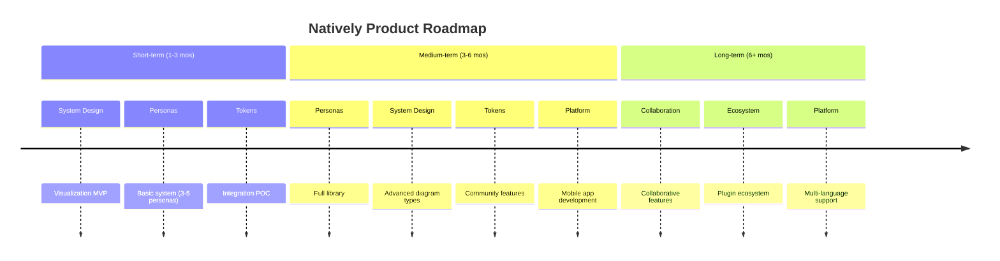
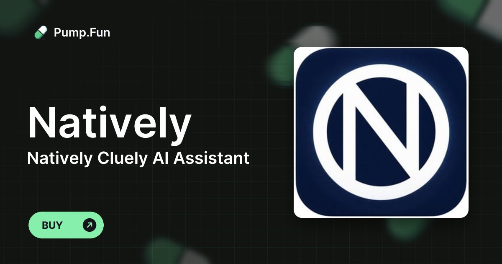

<div align="center">
  

# Natively — Free, Open-Source AI Interview Copilot & Meeting Assistant

**The best free alternative to Cluely, Final Round AI, LockedIn AI, and Interview Coder.**
<br/>
**Same UI as Cluely. More features. $0. Open source. No data breaches.**
<br/>

<a href="#" style="pointer-events: none; cursor: default; color: inherit; text-decoration: none;" title="#1 Cluely clone · Free Cluely alternative · Open-source interview copilot · Free Interview Coder alternative · AI coding interview assistant · LeetCode AI solver · HackerRank AI cheat · Final Round AI free alternative · LockedIn AI alternative · Parakeet AI open source · Undetectable interview AI · Stealth mode interview copilot.Cluely clone · Cluely alternative · Free Cluely · Cluely free version · open source Cluely ·
    Final Round AI clone · Final Round AI alternative · Free Final Round AI · Final Round AI free version ·
    Interview Coder clone · Interview Coder alternative · Free Interview Coder · open source Interview Coder ·
    Parakeet AI clone · Parakeet AI alternative · Free Parakeet AI ·
    Wonsulting AI clone · Wonsulting alternative · Free Wonsulting AI ·
    Metaview clone · Metaview alternative · Free Metaview ·
    Sensei AI clone · Sensei AI alternative · interview copilot ·
    Hirevue AI cheat · Hirevue assistant · Hirevue helper ·
    AI interview assistant · AI interview copilot · AI interview helper · interview cheating tool · interview AI ·
    live coding assistant · real-time coding help · screen overlay AI · invisible AI assistant ·
    coding interview cheat sheet · leetcode helper AI · system design AI assistant ·
    Claude Code alternative · Claude Code clone · free Claude Code ·
    Gemini 3.5 assistant · Gemini 3.5 Pro coding · Google Gemini interview tool ·
    Agent Claw alternative · Agent Claw clone · free Agent Claw ·
    Molt Bot clone · Molt Bot alternative · free Molt Bot ·
    Antigravity AI clone · Antigravity alternative ·
    Devin AI alternative · open source Devin · free Devin AI ·
    Cursor AI alternative · Cursor clone · free Cursor AI ·
    GitHub Copilot alternative · free GitHub Copilot · open source Copilot ·
    Tabnine alternative · free Tabnine · Tabnine clone ·
    Codeium alternative · free Codeium ·
    agentic coding assistant · AI pair programmer · AI coding copilot ·
    real-time interview AI · live interview assistant · hidden interview tool ·
    open source interview copilot · free interview AI tool · best interview AI 2026"></a>

<br/>

[](LICENSE)
[](https://github.com/evinjohnn/natively-cluely-ai-assistant/releases)
[](https://github.com/evinjohnn/natively-cluely-ai-assistant/releases)

[](https://github.com/evinjohnn/natively-cluely-ai-assistant)

[](https://x.com/i/communities/2031398735515693507)

> **Competitors charge $20–$149/month, store your data on their servers, and one already breached 83,000 users.** Natively costs $0, runs locally, and has never had a data breach. Your keys, your models, your machine.

<p align="center">
  <a href="https://natively.software">
    
  </a>
</p>

<p align="center">
  <a href="https://github.com/evinjohnn/natively-cluely-ai-assistant/releases/latest">
    
  </a>
  <a href="https://github.com/evinjohnn/natively-cluely-ai-assistant/releases/tag/v2.0.5">
    
  </a>
</p>

<small>Requires macOS 12+ (Apple Silicon & Intel) or Windows 10/11</small>

<br/>

**<span style="color: #f97316">🔥 49.4k views</span>** &nbsp;·&nbsp; **<span style="color: #22c55e">💸 $0 vs $149/mo rivals</span>** &nbsp;·&nbsp; **<span style="color: #3b82f6">⚡ <500ms latency</span>** &nbsp;·&nbsp; **<span style="color: #a855f7">🛡️ 0 data breaches</span>**

</div>

---

## The Free, Open-Source Cluely Clone

Natively started as a pixel-perfect recreation of Cluely's interface — then kept going. If you've used Cluely, you already know how to use Natively. Same overlay, same workflow, same shortcuts. Except it's free, open-source, runs locally, supports any LLM, and has never breached a single user's data.

> Looking for a **free Cluely alternative**? A **Cluely open-source clone**? You found it.

---

## Free AI Coding Interview Assistant — Undetectable on LeetCode, HackerRank & CoderPad

Natively works as a **free, undetectable AI coding interview assistant** for standard online assessments. It captures your screen, analyzes the problem, and gives you real-time hints, solutions, and explanations — all through an invisible overlay that doesn't interfere with your coding environment.

**Works undetected on:**

- LeetCode (including LeetCode contests)
- HackerRank
- CoderPad
- Codility
- HackerEarth
- Karat
- Any browser-based coding environment

**How it works:**

1. Screenshot the problem with a single shortcut
2. Natively OCRs the question and sends it to your chosen AI (GPT, Claude, Gemini, or local Ollama)
3. Response appears in the invisible overlay — never on screen share

> ⚠️ **Important:** Natively is not designed to bypass dedicated proctoring software like **Pearson VUE**, **ProctorU**, or **Respondus Lockdown Browser** — these run at the OS level and are a different category entirely. For standard online coding assessments without dedicated proctoring software, Natively's stealth mode is not detectable.

---

## 3 things you should know before choosing an interview AI

1. **Cluely** had a data breach in mid-2025 that exposed 83,000 users' personal info, transcripts, and screenshots — Natively stores everything locally with limited basic telemetry and has never had a breach.
2. **Final Round AI** costs $149/month and its taskbar icon is visible to proctoring software — Natively is free, open-source, and has a battle-tested undetectable stealth mode.
3. **LockedIn AI** charges $55–70/month and locks you into their cloud LLM with no local option — Natively lets you use any model (GPT, Claude, Gemini, Llama) or go fully offline with Ollama.

---

<div align="center">

### ⭐ Star this repo — it matters

Every star pushes Natively higher in GitHub search, helping developers and job seekers find a free, private alternative instead of paying $149/month for tools that store their data on someone else's server.

[](https://github.com/evinjohnn/natively-cluely-ai-assistant)

</div>

---

## Demo


This demo shows **a complete live meeting scenario**:

- Real-time transcription as the meeting happens
- Rolling context awareness across multiple speakers
- Screenshot analysis of shared slides
- Instant generation of what to say next
- Follow-up questions and concise responses
- All happening live, without recording or post-processing

---

## Full Comparison: Natively vs Cluely vs Final Round AI vs LockedIn AI vs Interview Coder

| Feature                  | Natively                   | Cluely               | Pluely     | LockedIn AI      | Final Round AI         |
| :----------------------- | :------------------------- | :------------------- | :--------- | :--------------- | :--------------------- |
| **Price**                | ✅ Free (BYOK)             | ⚠️ $20/mo            | ✅ Free    | ❌ $55–70/mo     | ❌ $149/mo             |
| **Open source**          | ✅ AGPL-3.0                | ❌                   | ✅         | ❌               | ❌                     |
| **Local data / private** | ✅ Yes                     | ❌ Cloud servers     | ✅ Yes     | ❌ Cloud servers | ❌ Cloud servers       |
| **Any LLM (BYOK)**       | ✅ Yes                     | ❌ Vendor-locked     | ⚠️ Limited | ❌ Vendor-locked | ❌ Vendor-locked       |
| **Local AI (Ollama)**    | ✅ Yes                     | ❌                   | ❌         | ❌               | ❌                     |
| **Real-time <500ms**     | ✅ Yes                     | ⚠️ 5–90s lag         | ✅ Yes     | ✅ ~116ms        | ⚠️ Slowest             |
| **Dual audio channels**  | ✅ System + Mic            | ❌ Single stream     | ❌         | ❌               | ❌                     |
| **Local RAG memory**     | ✅ SQLite + sqlite-vec     | ❌                   | ❌         | ❌               | ❌                     |
| **Meeting history**      | ✅ Full dashboard          | ⚠️ Limited           | ❌         | ❌               | ⚠️ Limited             |
| **Screenshot OCR**       | ✅ Yes                     | ⚠️ Limited           | ❌         | ✅ Yes           | ⚠️ Limited             |
| **Stealth mode**         | ✅ Undetectable            | ❌                   | ❌         | ❌               | ❌ Visible to proctors |
| **Process Disguise**     | ✅ Terminal, Settings, etc | ❌                   | ❌         | ❌               | ❌                     |
| **Resume & context**     | ✅ Pro                     | ❌                   | ❌         | ✅ Yes           | ✅ Yes                 |
| **Data breach history**  | ✅ None                    | ❌ 83k users exposed | ✅ None    | ✅ None          | ✅ None                |

> **Legend:** ✅ Full support · ⚠️ Partial or limited · ❌ Not available

---

## Why Natively wins

### vs Cluely — breached 83,000 users

The UI is intentionally familiar — if you've used Cluely, there's zero learning curve.

Cluely's mid-2025 data breach exposed personal information, full interview transcripts, and screenshots of 83,000 users. Every word spoken during an interview was stored on their servers — and then leaked. They charge $20/month for this privilege.

Natively has no backend, no servers, and limited telemetry (basic GA4 install tracking, zero user data). Your transcripts, API keys, and screenshots never leave your machine. The entire codebase is open-source (AGPL-3.0) and auditable. Zero breaches, zero data collection — that is the only acceptable standard for a tool that listens to your interviews.

### vs LockedIn AI — $70/month for cloud lock-in

LockedIn AI is the most expensive tool in the category at $55–70/month. It locks you into a single cloud LLM with no option for local inference. Every transcript and response passes through their servers.

Natively supports every major model (Gemini, GPT, Claude, Groq) via bring-your-own-key, and offers 100% offline mode through Ollama. You pay only for the API tokens you actually use — or pay nothing at all by running Llama 3 locally. No subscription, no vendor lock-in.

### vs Final Round AI — $149/month and visible to proctors

Final Round AI is the most expensive option at $149/month, optimized for pre-interview prep and mock interviews but with the slowest live latency in the category. Critically, its taskbar icon is visible to proctoring software, making it detectable during monitored interviews.

Natively delivers <500ms end-to-end latency using Rust-based native audio capture with Zero-Copy ABI Transfers. Its undetectable stealth mode hides from the dock, disguises process names, and syncs state across all windows — battle-tested and hardened across five major releases.

### vs Pluely — lightweight but limited

Pluely is a solid lightweight alternative (~10MB, Tauri-based) and it has Linux support, which Natively does not yet offer. Credit where it is due.

But Pluely is a basic overlay. It has no local RAG, no meeting history, no dual audio channels, and no dashboard. Natively is a complete intelligence system: it remembers your past meetings via local vector search, separates system audio from your microphone, and gives you a full management dashboard with export to Markdown, JSON, and Text.

### vs Interview Coder — More Powerful, Completely Free

Interview Coder is a paid tool focused specifically on coding interview assistance. Natively does everything Interview Coder does — and more — for free:

|                                    |    Natively    | Interview Coder |
| :--------------------------------- | :------------: | :-------------: |
| **Price**                          | ✅ Free (BYOK) |     ❌ Paid     |
| **Open source**                    |       ✅       |       ❌        |
| **Works on LeetCode / HackerRank** |       ✅       |       ✅        |
| **Screenshot + OCR analysis**      |       ✅       |       ✅        |
| **Real-time overlay**              |       ✅       |       ✅        |
| **Local AI / offline mode**        |   ✅ Ollama    |       ❌        |
| **Behavioral interview support**   |       ✅       |       ❌        |
| **System design support**          |       ✅       |       ❌        |
| **Meeting history & RAG**          |       ✅       |       ❌        |
| **Any LLM (BYOK)**                 |       ✅       |    ❌ Locked    |
| **Data stored locally**            |       ✅       |    ❌ Cloud     |

Natively covers the full interview loop — not just the coding round.

### vs Parakeet AI — Memory and History vs Stateless Overlay

Parakeet AI offers basic live meeting assistance but has no persistent memory, no meeting history, and no local vector search. Natively remembers your past meetings via local RAG, lets you ask questions across all your history, and gives you a full dashboard to manage, export, and search everything.

---

### Where we're not there yet

- **No Linux support** — we are actively looking for maintainers to help bring Natively to Linux
- **API key setup overhead** — you need to bring your own API keys (or install Ollama), which adds initial setup friction compared to all-in-one cloud tools
- **No built-in mock interview mode** — Final Round AI has dedicated mock interview practice; Natively focuses on live, real-time assistance

---

## Why Natively?

While other tools act as simple API wrappers, Natively is a complete, native intelligence system designed specifically for high-stakes meetings and interviews.

- **Native Audio Capture (<500ms):** Built with Rust and Zero-Copy ABI transfers, bypassing generic web-audio limitations for ultra-low latency.
- **Dual-Channel Intelligence:** Distinct pipelines for system audio (what they say) and your microphone (what you dictate) ensuring perfect transcription without room noise.
- **Battle-Tested Stealth Mode:** Completely undetectable. Hides from the dock, disables popups, and disguises the process during screen sharing.
- **Rolling Context:** We don't just transcribe; we maintain a "memory window" of the conversation for smarter answers.
- **Local RAG Memory:** We embed your meetings locally using SQLite vector search so you can ask, "What did John say about the API last week?"
- **Rich Dashboard:** A full UI to manage, search, and export your history—not just a floating window.
- **Fully Offline Capable:** Don't trust the cloud? Run Natively 100% offline using local Ollama models with limited basic telemetry.

---

<div align="center">

[](https://evinjohn.vercel.app/)
[](https://www.linkedin.com/in/evinjohn/)
[](https://x.com/evinjohnn)
[](mailto:evinjohnn@gmail.com?subject=Natively%20-%20Hiring%20Inquiry)
[](https://www.buymeacoffee.com/evinjohn)

</div>

---

## Natively Pro

While Natively is **free and open-source forever**, we also offer a **Pro Edition** designed specifically for power users and job seekers. Purchasing a Pro license gives you an edge in the job market, all while directly supporting the continued development of the open-source Natively core!

### Free vs Pro Feature Comparison

| Feature                                             | Natively Free | Natively Pro |
| :-------------------------------------------------- | :-----------: | :----------: |
| **Bring Your Own Key (BYOK) Models**                |      ✅       |      ✅      |
| **Local AI Support (Ollama)**                       |      ✅       |      ✅      |
| **Real-Time Speech-to-Text (<500ms)**               |      ✅       |      ✅      |
| **Live Contextual Assistant**                       |      ✅       |      ✅      |
| **Screenshot & Slide OCR Analysis**                 |      ✅       |      ✅      |
| **Undetectable & Stealth Modes**                    |      ✅       |      ✅      |
| **Meeting Dashboard & Offline RAG History**         |      ✅       |      ✅      |
| **Job Description (JD) & Resume Context Awareness** |      ❌       |      ✅      |
| **Automated Company Research & Dossiers**           |      ❌       |      ✅      |
| **Live Salary & Offer Negotiation Copilot**         |      ❌       |      ✅      |
| **Priority Feature Access & Support**               |      ❌       |      ✅      |

<p align="center">
  <a href="https://evynignatious.gumroad.com/l/natively">
    
  </a>
</p>

---

### What's New in v2.0.6

Version 2.0.6 delivers massive upgrades to vision processing, model rotation stability, and critical bug fixes found during a comprehensive senior engineering audit.

- **Multimodal Groq Support**: Integrated `meta-llama/llama-4-scout-17b-16e-instruct` into the ecosystem for ultra-fast screenshot analysis capability, with increased vision max completion tokens (up to 28672) to properly support full code generation.
- **Model Roster Update**: Updated baseline architecture natively to default to `gpt-5.4-chat`, `gemini-3.1`, and `claude-sonnet-4-6`.
- **Model Rotation Engine**: Fortified the 3-tier fallback mechanisms and auto-upgrade logic for Gemini, Claude, GPT, and Groq models.
- **SQLite-Vec Dimension Fix**: Resolved a critical silent data-corruption bug in vector storage by provisioning per-dimension table pairs (`vec_chunks_768`, `vec_chunks_1536`, `vec_chunks_3072`), directly fixing a bug that dropped 100% of Ollama embeddings in local native search.
- **Thread Safety & Race Conditions**: Eliminated fatal global state mutation risks during API fallback loops and patched `SettingsManager` early-access crashes on boot.
- **Memory Leaks Eliminated**: Patched multiple memory leak vectors including unbounded process disguise timers and dangling opacity shield timers during rapid focus toggles.
- **Cross-Platform Stability**: Resolved unhandled promise rejections on React dev-server drops, corrected hardcoded Windows icon paths, and refined process disguise routing for Windows and macOS contexts.

---

## Table of Contents

- [The free Cluely clone](#the-free-open-source-cluely-clone)
- [3 things to know](#3-things-you-should-know-before-choosing-an-interview-ai)
- [Demo](#demo)
- [Full comparison](#full-comparison-natively-vs-cluely-vs-final-round-ai-vs-lockedin-ai-vs-interview-coder)
- [Why Natively wins](#why-natively-wins)
- [Why Natively?](#why-natively)
- [Natively Pro](#natively-pro)
- [What's New in v2.0.6](#whats-new-in-v206)
- [Privacy & Security](#privacy--security-core-design-principle)
- [Installation](#installation-developers--contributors)
- [AI Providers](#ai-providers)
- [Key Features](#key-features)
- [Meeting Intelligence Dashboard](#meeting-intelligence-dashboard)
- [Roadmap](#roadmap)
- [Use Cases](#use-cases)
- [Technical Details](#technical-details)
- [Known Limitations](#known-limitations)
- [Responsible Use](#responsible-use)
- [Contributing](#contributing)
- [License](#license)
- [FAQ](#faq)
- [Alternatives Natively replaces](#alternatives-natively-replaces)
- [Star History](#star-history)

---

## What Is Natively?

**Natively** is a **desktop AI assistant for live situations**:

- Meetings
- Interviews
- Presentations
- Classes
- Professional conversations

It provides:

- Live answers
- Rolling conversational context
- Screenshot and document understanding
- Real-time speech-to-text
- Instant suggestions for what to say next

All while remaining **invisible, fast, and privacy-first**.

---

## Privacy & Security (Core Design Principle)

- 100% open source (AGPL-3.0)
- Bring Your Own Keys (BYOK)
- Local AI option (Ollama)
- All data stored locally
- Limited telemetry (basic GA4 counts)
- No user data tracking
- No hidden uploads

You explicitly control:

- What runs locally
- What uses cloud AI
- Which providers are enabled

---

## Installation (Developers & Contributors)

> [!NOTE]
> **macOS Users (Both Apple Silicon & Intel Macs supported):**
>
> 1.  **"Unidentified Developer"**: If you see this, Right-click the app > Select **Open** > Click **Open**.
> 2.  **"App is Damaged"**: If you see this, run the command in Terminal based on your download:
>
>     **For .zip downloads:**
>
>     ```bash
>     xattr -cr /Applications/Natively.app
>     ```
>
>     **For .dmg downloads:**
>     1. Open Terminal and run:
>        ```bash
>        xattr -cr ~/Downloads/Natively-2.0.2-arm64.dmg # Or your specific filename
>        ```
>     2. Install the natively.dmg
>     3. Open Terminal and run: `xattr -cr /Applications/Natively.app`

### Prerequisites

- Node.js (v20+ recommended)
- Git
- Rust (required for native audio capture)

### AI Credentials & Speech Providers

**Natively is 100% free to use with your own keys.**  
Connect **any** speech provider and **any** LLM. No subscriptions, no markups, no hidden fees. All keys are stored locally.

### Unlimited Free Transcription (Whisper, Google, Deepgram)

- **Soniox** (API Key) - _Ultra-fast, highly accurate streaming STT_
- **Google Cloud Speech-to-Text** (Service Account)
- **Groq** (API Key)
- **OpenAI Whisper** (API Key)
- **Deepgram** (API Key)
- **ElevenLabs** (API Key)
- **Azure Speech Services** (API Key + Region)
- **IBM Watson** (API Key + Region)

### AI Engine Support (Bring Your Own Key)

Connect Natively to **any** leading model or local inference engine.

| Provider                     | Best For                                                    |
| :--------------------------- | :---------------------------------------------------------- |
| **Gemini 3.1 Series**        | Recommended: Massive context window (2M tokens) & low cost. |
| **OpenAI (GPT-5.4 & o3)**    | High reasoning capabilities.                                |
| **Anthropic (Claude 4.6)**   | Coding & complex nuanced tasks.                             |
| **Groq (Llama 3.3/Scout 4)** | Insane speed (near-instant answers) & screenshot analysis.  |
| **Ollama / LocalAI**         | 100% Offline & Private (No API keys needed).                |
| **OpenAI-Compatible**        | Connect to _any_ custom endpoint (vLLM, LM Studio, etc.)    |

> **Note:** You only need ONE speech provider to get started. We recommend **Google STT** ,**Groq** or **Deepgram** for the fastest real-time performance.

---

#### To Use Google Speech-to-Text (Optional)

Your credentials:

- Never leave your machine
- Are not logged, proxied, or stored remotely
- Are used only locally by the app

What You Need:

- Google Cloud account
- Billing enabled
- Speech-to-Text API enabled
- Service Account JSON key

Setup Summary:

1. Create or select a Google Cloud project
2. Enable Speech-to-Text API
3. Create a Service Account
4. Assign role: `roles/speech.client`
5. Generate and download a JSON key
6. Point Natively to the JSON file in settings

---

## Development Setup

### Clone the Repository

```bash
git clone https://github.com/evinjohnn/natively-cluely-ai-assistant.git
cd natively-cluely-ai-assistant
```

### Install Dependencies

```bash
npm install
```

### Environment Variables

Create a `.env` file:

```env
# Cloud AI
GEMINI_API_KEY=your_key
GROQ_API_KEY=your_key
OPENAI_API_KEY=your_key
CLAUDE_API_KEY=your_key
GOOGLE_APPLICATION_CREDENTIALS=/absolute/path/to/service-account.json

# Speech Providers (Optional - only one needed)
DEEPGRAM_API_KEY=your_key
ELEVENLABS_API_KEY=your_key
AZURE_SPEECH_KEY=your_key
AZURE_SPEECH_REGION=eastus
IBM_WATSON_API_KEY=your_key
IBM_WATSON_REGION=us-south

# Local AI (Ollama)
USE_OLLAMA=true
OLLAMA_MODEL=llama3.2
OLLAMA_URL=http://localhost:11434

# Default Model Configuration
DEFAULT_MODEL=gemini-3.1-flash-lite-preview
```

### Run (Development)

```bash
npm start
```

### Build (Production)

```bash
npm run dist
```

---

### AI Providers

- **Custom (BYO Endpoint):** Paste any cURL command to use OpenRouter, DeepSeek, or private endpoints.
- **Ollama (Local):** Zero-setup detection of local models (Llama 3, Mistral, Gemma).
- **Dynamic Model Selection:** Preferred models (OpenAI, Anthropic, Google) now automatically appear across the app.
- **Google Gemini:** First-class support for the Gemini 3.1 series.
- **OpenAI:** GPT-5.4 and o3 series support with optimized system prompts.
- **Anthropic:** Claude 4.6 series support with corrected max_tokens.
- **Groq:** Ultra-fast text inference with Llama 3.3, and screenshot analysis using Llama 4 Scout.

---

## Key Features

### Invisible Desktop Assistant

- Always-on-top translucent overlay
- Instantly hide/show with shortcuts
- Works across all applications

### Real-time Interview Copilot & Coding Help

- Real-time speech-to-text (**<500ms latency**)
- **Fast Response Mode**: Ultra-fast text responses using Groq Llama 3.3.
- **Multilingual Support**: Choose from various response languages, and set speech recognition matching specific accents and dialects.
- **Anti-Chatbot / Human Persona System**: Refined system prompts and negative constraints ensure responses are concise, conversational, and indistinguishable from a real candidate (no robotic preambles or lectures).
- Context-aware Memory (RAG) for Past Meetings
- Instant answers as questions are asked
- **Interim/Final Bridging**: Manual transcript finalization and interim bridging during recordings for higher accuracy.
- Smart recap and summaries

### Instant Screen & Slide Analysis (OCR) — AI Coding Interview Assistant

- Works on **LeetCode, HackerRank, CoderPad, Codility, HackerEarth** and any browser-based coding environment
- Capture a coding problem with one shortcut — get a full solution, explanation, and complexity analysis instantly
- Invisible overlay never appears on screen share or recordings
- Multiple screenshot support for multi-part problems
- Smart fallback to Groq Llama 4 Scout if primary vision model fails

### Premium Profile Intelligence

- **Job Description & Resume Context**: Natively understands your background and the role you're applying for to provide highly tailored, context-aware answers.
- **Company Research**: Get instant intelligence and dossiers on the company you are interviewing with.
- **Negotiation Assistance**: Real-time guidance and strategy during offer and salary negotiations.

### Contextual Actions

- What should I answer?
- Shorten response
- Recap conversation
- Suggest follow-up questions
- Manual or voice-triggered prompts

### Dual-Channel Audio Intelligence

Natively understands that _listening_ to a meeting and _talking_ to an AI are different tasks. We treat them separately:

- **System Audio (The Meeting):** Captures high-fidelity audio directly from your OS (fully supported on both macOS and Windows). It "hears" what your colleagues are saying without interference from your room noise.
- **Sample Rate Auto-Detection**: Dynamically detects and syncs true hardware sample rates (e.g., automatically handling 48kHz audio interfaces or external microphones without distortion or downsampling artifacts).
- **Two-Stage Silence Processing**: Combines adaptive RMS thresholds with **WebRTC Machine Learning VAD** to reject typing and fan noise.
- **Microphone Input (Your Voice):** A dedicated channel for your voice commands and dictation. Toggle it instantly to ask Natively a private question without muting your meeting software.

### Spotlight Search & Customization

- Global activation shortcut (`Cmd+K` / `Ctrl+K`)
- **Custom Key Bindings**: Customize global shortcuts for easier control.
- Instant answer overlay
- Upcoming meeting readiness

### Local RAG & Long-Term Memory

- **Full Offline RAG:** All vector embeddings and retrieval happen locally (SQLite + `sqlite-vec`).
- **Semantic Search:** innovative "Smart Scope" detects if you are asking about the current meeting or a past one.
- **Sliding-Window RAG**: 50-token semantic overlap to prevent context loss across chunk boundaries.
- **Epoch Summarization**: Smarter transcript memory management instead of hard truncation — no more losing early meeting context.
- **Global Knowledge:** Ask questions across _all_ your past meetings ("What did we decide about the API last month?").
- **Automatic Indexing:** Meetings are automatically chunked, embedded, and indexed in the background.

### Advanced Privacy & Stealth

- **Undetectable Mode:** Instantly hide from dock/taskbar with visually locked selector to prevent state mismatches.
- **Cross-Window State Sync**: Real-time state synchronization across Settings, Launcher, and Overlay windows.
- **Process Disguise (Masquerading):** Instantly change the app to look like Terminal, System Settings, Activity Monitor, or other harmless utilities to completely evade detection during screen sharing.
- **Security Hardening**: API keys are scrubbed from memory on app quit and credentials manager overwrites key data before disposal.
- **API Rate Limiting**: Token-bucket algorithm (burst/refill) to prevent 429 errors on free-tier providers.
- **Local-Only Processing:** All data stays on your machine.

---

## Meeting Intelligence Dashboard

Natively includes a powerful, local-first meeting management system to review, search, and manage your entire conversation history.


- **Meeting Archives:** Access full transcripts of every past meeting, searchable by keywords or dates.
- **Smart Export:** One-click export of transcripts and AI summaries to **Markdown, JSON, or Text**—perfect for pasting into Notion, Obsidian, or Slack.
- **Usage Statistics:** Track your token usage and API costs in real-time. Know exactly how much you are spending on Gemini, OpenAI, or Claude.
- **Audio Separation:** Distinct controls for **System Audio** (what they say) vs. **Microphone** (what you dictate).
- **Session Management:** Rename, organize, or delete past sessions to keep your workspace clean.

---

## Roadmap



<div align="center">
  <em>For detailed feature descriptions, see our full <a href="ROADMAP.md">ROADMAP.md</a>.</em>
</div>

---

## Use Cases

### Academic & Learning

- **Live Assistance:** Get explanations for complex lecture topics in real-time.
- **Translation:** Instant language translation during international classes.
- **Problem Solving:** Immediate help with coding or mathematical problems.

### Professional Meetings

- **Interview Support:** Context-aware prompts to help you navigate technical questions.
- **Sales & Client Calls:** Real-time clarification of technical specs or previous discussion points.
- **Meeting Summaries:** Automatically extract action items and core decisions.

### Development & Technical Work

- **Code Insight:** Explain unfamiliar blocks of code or logic on your screen.
- **Debugging:** Context-aware assistance for resolving logs or terminal errors.
- **Architecture:** Guidance on system design and integration patterns.

---

## Architecture Overview

Natively processes audio, screen context, and user input locally, maintains a rolling context window, and sends only the required prompt data to the selected AI provider (local or cloud).

No raw audio, screenshots, or transcripts are stored or transmitted unless explicitly enabled by the user.

---

## Technical Details

### Tech Stack

- **React, Vite, TypeScript, TailwindCSS**
- **Electron**
- **Rust** (native audio with **Zero-Copy ABI Transfers** via `napi::Buffer` — enabling continuous audio capture without V8 garbage collection pressure, achieving significantly lower latency and CPU usage than typical Electron-based competitors)
- **SQLite** (local storage with `sqlite-vec`)

### Supported Models

- **Gemini 3.1 Series**
- **OpenAI** (GPT-5.4, o3 series)
- **Claude** (4.6 series)
- **Ollama** (Llama, Mistral, CodeLlama)
- **Groq** (Llama 3.3 for text, Llama 4 Scout for OCR)

### System Requirements

- **Minimum:** 4GB RAM
- **Recommended:** 8GB+ RAM
- **Optimal:** 16GB+ RAM for local AI

---

## Responsible Use

Natively is intended for:

- Learning
- Productivity
- Accessibility
- Professional assistance

Users are responsible for complying with:

- Workplace policies
- Academic rules
- Local laws and regulations

This project does not encourage misuse or deception.

---

## Known Limitations

- Linux support is limited and actively looking for maintainers
- Initial setup requires bringing your own API keys or installing Ollama
- No built-in mock interview mode (focus is on live, real-time assistance)

---

## Contributing

Contributions are welcome! Please see our [CONTRIBUTING.md](CONTRIBUTING.md) for full guidelines on how to get started.

- Bug fixes
- Feature improvements
- Documentation
- UI/UX enhancements
- New AI integrations

Quality pull requests will be reviewed and merged.

### Maintainers

| Maintainer                                 | Role          | Support                                                                                                                                                                     |
| ------------------------------------------ | ------------- | --------------------------------------------------------------------------------------------------------------------------------------------------------------------------- |
| [@evinjohnn](https://github.com/evinjohnn) | macOS Build   | [](https://www.buymeacoffee.com/evinjohnn) |
| [@razllivan](https://github.com/razllivan) | Windows Build | [](https://app.lava.top/razllivan)         |

---

## License

Licensed under the GNU Affero General Public License v3.0 (AGPL-3.0).

If you run or modify this software over a network, you must provide the full source code under the same license.

This repository contains the open-source core of the project.

Some features available in official releases are part of the
commercial Premium Edition and are not included in this repository.

> **Note:** This project is available for sponsorships, ads, or partnerships – perfect for companies in the AI, productivity, or developer tools space.

---

**Star this repo if Natively helps you succeed in meetings, interviews, or presentations!**

---

## FAQ

#### Is Natively really free?

Yes. Natively is an open-source project. You only pay for what you use by bringing your own API keys (Gemini, OpenAI, Anthropic, etc.), or use it **100% free** by connecting to a local Ollama instance.

#### Does Natively work with Zoom, Teams, and Google Meet?

Yes. Natively uses a Rust-based system audio capture that works universally across any desktop application, including Zoom, Microsoft Teams, Google Meet, Slack, and Discord.

#### Is my data safe?

Natively is built on **Privacy-by-Design**. All transcripts, vector embeddings (Local RAG), and keys are stored locally on your machine. We have no backend and collect only limited basic telemetry (no user data).

#### Can I use it for technical interviews?

Natively is a powerful assistant for any professional situation. However, users are responsible for complying with their company policies and interview guidelines.

#### How do I use local models?

Simply install **Ollama**, run a model (e.g., `ollama run llama3`), and Natively will automatically detect it. Enable "Ollama" in the AI Providers settings to switch to offline mode.

#### How does Natively compare to Cluely?

Cluely is a $20/month cloud-based tool that stores all data on their servers. In mid-2025, Cluely suffered a data breach that exposed personal information, transcripts, and screenshots of 83,000 users. Natively is free, open-source, and stores everything locally. It supports any LLM (not just one vendor), offers local AI via Ollama, and has battle-tested stealth mode. Natively has never had a data breach because there is no server to breach.

#### Is stealth mode actually undetectable?

Yes. Natively hides from the dock, disguises process names as harmless system utilities (Terminal, Activity Monitor, System Settings), and syncs state across all windows. It has been hardened across five major releases and tested against screen share detection in Zoom, Teams, and Google Meet.

#### Does Natively work on LeetCode and HackerRank?

Yes. Natively's screenshot + OCR captures any visible coding problem and returns a full solution through the invisible overlay. It works on LeetCode, HackerRank, CoderPad, Codility, HackerEarth, Karat, and any browser-based coding environment.

#### Is Natively detectable during coding interviews?

For standard online assessments (LeetCode, HackerRank, CoderPad, etc.), Natively is not detectable — it runs as a disguised system process and the overlay never appears in screen recordings or screen shares. It is **not** designed to bypass dedicated proctoring software like Pearson VUE, ProctorU, or Respondus Lockdown Browser, which operate at the OS level.

#### Is Natively a free alternative to Interview Coder?

Yes. Natively does everything Interview Coder does — screenshot OCR, real-time coding assistance, invisible overlay — and adds behavioral interview support, system design help, local RAG memory, and any-LLM BYOK. All for free.

---

## Alternatives Natively Replaces

Natively is a free, open-source alternative to:

| Tool                | What Natively replaces                                                              |
| :------------------ | :---------------------------------------------------------------------------------- |
| **Cluely**          | Real-time AI meeting copilot — without the $20/mo fee or data breach risk           |
| **Final Round AI**  | Live AI interview copilot — without the $149/mo fee or proctor-visible taskbar icon |
| **LockedIn AI**     | Real-time interview assistant — without cloud lock-in or $70/mo                     |
| **Interview Coder** | AI coding interview helper — with full meeting context, not just coding rounds      |
| **Parakeet AI**     | Live meeting assistant — with local RAG memory and full history dashboard           |
| **Metaview**        | Automated meeting notes — open-source and locally stored                            |
| **Otter.ai**        | Transcription and meeting summaries — without cloud storage                         |
| **Fireflies.ai**    | Meeting recorder and AI notetaker — fully local storage                             |
| **Teal**            | Job search and interview assistant — fully local and free                           |

---

`ai-assistant` · `meeting-notes` · `interview-helper` · `cluely-alternative` · `cluely` · `lockhead-ai` · `lockheed-ai` · `parakeet-ai` · `interview-coder` · `final-round-ai` · `metaview-alternative` · `otter-ai-alternative` · `fireflies-alternative` · `local-ai` · `ollama` · `electron` · `privacy-first` · `open-source` · `real-time-transcription` · `interview-copilot` · `ai-meeting-assistant` · `moltbot`

---

## Support Natively

The community around **Natively** created a Pump.fun token to support the project.

Creator rewards help cover **AI/API bills** and ongoing development costs.

<p align="center">
  <a href="https://pump.fun/coin/B5opQ9euCVcJALeeCQbrFv5kePG8cCcoYqnXfx4Ppump">
    
  </a>
</p>

---

## Star History

<a href="https://star-history.com/#evinjohnn/natively-cluely-ai-assistant&Date">
 <picture>
   <source media="(prefers-color-scheme: dark)" srcset="https://api.star-history.com/svg?repos=evinjohnn/natively-cluely-ai-assistant&type=Date&theme=dark" />
   <source media="(prefers-color-scheme: light)" srcset="https://api.star-history.com/svg?repos=evinjohnn/natively-cluely-ai-assistant&type=Date" />
   
 </picture>
</a>

<!-- SEO: free ai interview copilot · cluely clone · cluely alternative · open source cluely · cluely free version · cluely github · interview coder alternative · interview coder free · interview coder open source · free interview coder · leetcode ai assistant · hackerrank ai helper · coding interview ai · undetectable coding interview ai · ai for leetcode · ai coding interview assistant · final round ai alternative · lockedin ai alternative · parakeet ai alternative · free interview cheating tool · ai interview assistant · real-time interview ai · undetectable interview ai · best ai interview tool 2025 2026 · open source interview ai · stealth interview ai · interview cheating software · ai copilot interview · free interview ai · cluely open source clone · leetcode cheating tool · hackerrank cheat · coding interview cheat sheet ai -->

<sub>
free-ai-interview-copilot · open-source-cluely · cluely-alternative · cluely-clone · interview-coder-alternative · final-round-ai-alternative · lockedin-ai-alternative · ai-interview-assistant · real-time-interview-ai · undetectable-interview-ai · stealth-mode · local-ai · ollama · byok · rag · electron · rust · privacy-first · meeting-assistant · interview-helper · open-source-interview-ai
</sub>
