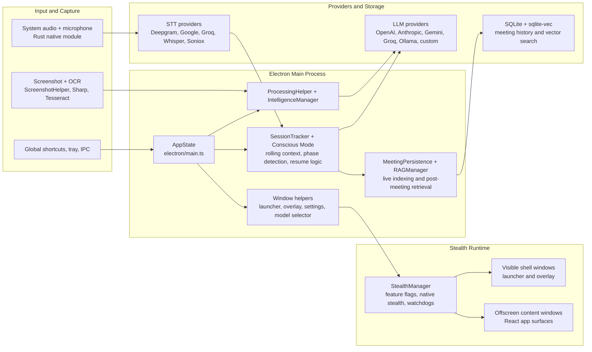
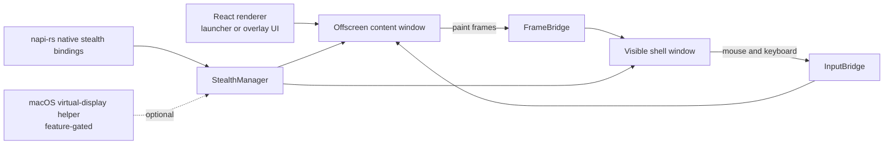
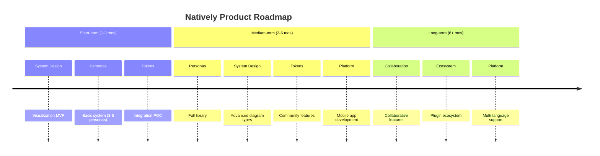

<div align="center">
  

# Natively — Free, Open-Source AI Interview Copilot & Meeting Assistant

**The best free alternative to Cluely, Final Round AI, LockedIn AI, and Interview Coder.**
<br/>
**Same UI as Cluely. More features. $0. Open source. No data breaches.**
<br/>

<br/>

[](LICENSE)
[](https://github.com/evinjohnn/natively-cluely-ai-assistant/releases)
[](https://github.com/evinjohnn/natively-cluely-ai-assistant/releases)

[](https://github.com/evinjohnn/natively-cluely-ai-assistant)

[](https://x.com/i/communities/2031398735515693507)

> **Competitors charge $20–$149/month, store your data on their servers, and one already breached 83,000 users.** Natively costs $0, runs locally, and has never had a data breach. Your keys, your models, your machine.

<p align="center">
  <a href="https://natively.software">
    
  </a>
</p>

<p align="center">
  <a href="https://github.com/evinjohnn/natively-cluely-ai-assistant/releases/latest">
    
  </a>
  <a href="https://github.com/evinjohnn/natively-cluely-ai-assistant/releases/tag/v2.0.5">
    
  </a>
</p>

<small>Requires macOS 12+ (Apple Silicon & Intel) or Windows 10/11</small>

<br/>

**🔥 49.4k views** · **💸 $0 vs $149/mo rivals** · **⚡ <500ms latency** · **🛡️ 0 data breaches**

</div>

---

## Table of Contents

- [Overview](#overview)
- [Demo](#demo)
- [Key Features](#key-features)
- [How It Works](#how-it-works)
- [Supported AI Providers](#supported-ai-providers)
- [Supported Speech Providers](#supported-speech-providers)
- [Full Comparison](#full-comparison)
- [Why Natively Wins](#why-natively-wins)
- [Privacy & Security](#privacy--security)
- [Architecture](#architecture)
- [Installation — Pre-built Binaries](#installation--pre-built-binaries)
  - [macOS Install](#macos-install--apple-silicon--intel)
  - [Windows Install](#windows-install--windows-1011)
- [Building From Source](#building-from-source)
  - [macOS — Build From Source](#macos--build-from-source)
  - [Windows — Build From Source](#windows--build-from-source)
  - [Quick Reference & Troubleshooting](#build-from-source--both-platforms-quick-reference)
- [Configuration](#configuration)
- [Meeting Intelligence Dashboard](#meeting-intelligence-dashboard)
- [Use Cases](#use-cases)
- [Technical Details](#technical-details)
- [Roadmap](#roadmap)
- [Known Limitations](#known-limitations)
- [Responsible Use](#responsible-use)
- [Contributing](#contributing)
- [FAQ](#faq)
- [Alternatives Natively Replaces](#alternatives-natively-replaces)
- [License](#license)

---

## Overview

**Natively** is a free, open-source desktop AI assistant for live situations — meetings, interviews, presentations, classes, and professional conversations. It provides real-time answers, rolling conversational context, screenshot and document understanding, speech-to-text transcription, and instant suggestions for what to say next — all while remaining invisible, fast, and privacy-first.

Natively started as a pixel-perfect recreation of Cluely's interface — then kept going. If you've used Cluely, you already know how to use Natively. Same overlay, same workflow, same shortcuts. Except it's free, open-source, runs locally, supports any LLM, and has never breached a single user's data.

---

## Demo


This demo shows **a complete live meeting scenario**:

- Real-time transcription as the meeting happens
- Rolling context awareness across multiple speakers
- Screenshot analysis of shared slides
- Instant generation of what to say next
- Follow-up questions and concise responses
- All happening live, without recording or post-processing

---

## Key Features

### Invisible Desktop Assistant

- Always-on-top translucent overlay with adjustable opacity
- Instantly hide/show with global shortcuts
- Works across all applications (Zoom, Teams, Meet, Slack, Discord)
- Click-through mode for non-interactive transparency

### Real-time Interview Copilot & Coding Help

- Real-time speech-to-text with **<500ms latency**
- **Fast Response Mode**: Ultra-fast text responses using Groq Llama 3.3
- **Multilingual Support**: Choose from various response languages and set speech recognition matching specific accents and dialects
- **Anti-Chatbot / Human Persona System**: Refined system prompts ensure responses are concise, conversational, and indistinguishable from a real candidate
- Context-aware Memory (RAG) for past meetings
- Instant answers as questions are asked
- **Interim/Final Bridging**: Manual transcript finalization and interim bridging during recordings for higher accuracy
- Smart recap and summaries

### Undetectable AI Coding Interview Assistant

Works undetected on:

- LeetCode (including contests)
- HackerRank
- CoderPad
- Codility
- HackerEarth
- Karat
- Any browser-based coding environment

**How it works:**

1. Screenshot the problem with a single shortcut
2. Natively OCRs the question and sends it to your chosen AI
3. Response appears in the invisible overlay, with the strongest protection in window-share and browser tab-share flows
4. Multiple screenshot support for multi-part problems
5. Smart fallback to Groq Llama 4 Scout if primary vision model fails

### Dual-Channel Audio Intelligence

Natively treats listening and speaking as separate tasks:

- **System Audio (The Meeting):** Captures high-fidelity audio directly from your OS. It "hears" what your colleagues are saying without interference from your room noise.
- **Sample Rate Auto-Detection:** Dynamically detects and syncs true hardware sample rates (e.g., automatically handling 48kHz audio interfaces or external microphones without distortion).
- **Two-Stage Silence Processing:** Combines adaptive RMS thresholds with WebRTC Machine Learning VAD to reject typing and fan noise.
- **Microphone Input (Your Voice):** A dedicated channel for your voice commands and dictation. Toggle it instantly to ask Natively a private question without muting your meeting software.

### Local RAG & Long-Term Memory

- **Full Offline RAG:** All vector embeddings and retrieval happen locally (SQLite + `sqlite-vec`)
- **Semantic Search:** Innovative "Smart Scope" detects if you are asking about the current meeting or a past one
- **Sliding-Window RAG:** 50-token semantic overlap to prevent context loss across chunk boundaries
- **Epoch Summarization:** Smarter transcript memory management instead of hard truncation
- **Global Knowledge:** Ask questions across all your past meetings ("What did we decide about the API last month?")
- **Automatic Indexing:** Meetings are automatically chunked, embedded, and indexed in the background

### Advanced Privacy & Stealth

- **Undetectable Mode:** Instantly hide from dock/taskbar with visually locked selector to prevent state mismatches
- **Cross-Window State Sync:** Real-time state synchronization across Settings, Launcher, and Overlay windows
- **Process Disguise (Masquerading):** Instantly change the app to look like Terminal, System Settings, Activity Monitor, or other harmless utilities to completely evade detection during screen sharing
- **Security Hardening:** API keys are scrubbed from memory on app quit and credentials manager overwrites key data before disposal
- **API Rate Limiting:** Token-bucket algorithm (burst/refill) to prevent 429 errors on free-tier providers

### Contextual Actions

- What should I answer?
- Shorten response
- Recap conversation
- Suggest follow-up questions
- Manual or voice-triggered prompts

### Spotlight Search & Customization

- Low-interference global shortcuts with alternate fallback bindings for screenshot and clickthrough controls
- **Custom Key Bindings:** Customize global shortcuts for easier control
- Instant answer overlay
- Upcoming meeting readiness

### Profile Intelligence

- **Job Description & Resume Context:** Natively understands your background and the role you're applying for to provide highly tailored, context-aware answers
- **Company Research:** Get instant intelligence and dossiers on the company you are interviewing with
- **Negotiation Assistance:** Real-time guidance and strategy during offer and salary negotiations

---

## How It Works

Natively is a desktop Electron application with a Rust native audio backend. The flow is:

1. **Audio Capture** — Rust-based native module captures system audio and microphone input using Zero-Copy ABI Transfers via `napi::Buffer`, bypassing V8 garbage collection pressure for ultra-low latency
2. **Speech-to-Text** — Audio streams are sent to your chosen speech provider (Google STT, Deepgram, Groq, Whisper, etc.) for real-time transcription
3. **Rolling Context Window** — Transcripts are maintained in a sliding context window with epoch summarization, keeping the AI aware of the full conversation without token overflow
4. **AI Processing** — The context + your action (question, screenshot, prompt) is sent to your chosen LLM (Gemini, GPT, Claude, Groq, or local Ollama)
5. **Response Delivery** — The AI response appears instantly in the invisible overlay. Protection is strongest for window share and browser tab share; full desktop share and advanced OS-level capture remain best-effort.
6. **Local RAG Indexing** — After the meeting, transcripts are chunked, embedded, and stored locally in SQLite with `sqlite-vec` for future semantic search

### Default Global Shortcuts (macOS)

| Action | Shortcut | Alternate |
|--------|----------|-----------|
| Toggle visibility | `Cmd+Option+Shift+V` | `F13` |
| Full screenshot | `Cmd+Option+Shift+S` | `F14` |
| Selective screenshot | `Cmd+Option+Shift+A` | `F15` |
| Toggle clickthrough | `Cmd+Shift+M` | `Cmd+Option+Shift+M` |

These defaults are intentionally chosen to reduce collisions with Zoom, Teams, Meet, Chime, HackerRank, and browser shortcuts.

---

## Supported AI Providers

Connect Natively to **any** leading model or local inference engine. All keys are stored locally on your machine.

| Provider | Models | Best For |
| :--- | :--- | :--- |
| **Google Gemini** | Gemini 3.1 series | Massive context window (2M tokens) & low cost |
| **OpenAI** | GPT-5.4, o3 series | High reasoning capabilities |
| **Anthropic** | Claude 4.6 series | Coding & complex nuanced tasks |
| **Groq** | Llama 3.3 (text), Llama 4 Scout (vision) | Insane speed (near-instant answers) & screenshot analysis |
| **Ollama / LocalAI** | Llama 3, Mistral, CodeLlama, Gemma | 100% offline & private (no API keys needed) |
| **OpenAI-Compatible** | Any custom endpoint (vLLM, LM Studio, etc.) | Custom deployments |
| **Custom (BYO Endpoint)** | Paste any cURL command | OpenRouter, DeepSeek, or private endpoints |

> **Note:** You only need ONE provider to get started. We recommend **Gemini 3.1 Flash Lite** for the best balance of speed, quality, and cost.

---

## Supported Speech Providers

**Natively is 100% free to use with your own keys.** Connect any speech provider. No subscriptions, no markups, no hidden fees.

| Provider | Key Type | Notes |
| :--- | :--- | :--- |
| **Soniox** | API Key | Ultra-fast, highly accurate streaming STT |
| **Google Cloud Speech-to-Text** | Service Account JSON | Recommended for real-time performance |
| **Groq** | API Key | Fastest inference |
| **OpenAI Whisper** | API Key | High accuracy |
| **Deepgram** | API Key | Recommended for real-time performance |
| **ElevenLabs** | API Key | Voice-grade accuracy |
| **Azure Speech Services** | API Key + Region | Enterprise-grade |
| **IBM Watson** | API Key + Region | Enterprise-grade |

> **Note:** You only need ONE speech provider to get started. We recommend **Google STT**, **Groq**, or **Deepgram** for the fastest real-time performance.

---

## Full Comparison

| Feature | Natively | Cluely | Pluely | LockedIn AI | Final Round AI |
| :--- | :--- | :--- | :--- | :--- | :--- |
| **Price** | ✅ Free (BYOK) | ⚠️ $20/mo | ✅ Free | ❌ $55–70/mo | ❌ $149/mo |
| **Open source** | ✅ AGPL-3.0 | ❌ | ✅ | ❌ | ❌ |
| **Local data / private** | ✅ Yes | ❌ Cloud servers | ✅ Yes | ❌ Cloud servers | ❌ Cloud servers |
| **Any LLM (BYOK)** | ✅ Yes | ❌ Vendor-locked | ⚠️ Limited | ❌ Vendor-locked | ❌ Vendor-locked |
| **Local AI (Ollama)** | ✅ Yes | ❌ | ❌ | ❌ | ❌ |
| **Real-time <500ms** | ✅ Yes | ⚠️ 5–90s lag | ✅ Yes | ✅ ~116ms | ⚠️ Slowest |
| **Dual audio channels** | ✅ System + Mic | ❌ Single stream | ❌ | ❌ | ❌ |
| **Local RAG memory** | ✅ SQLite + sqlite-vec | ❌ | ❌ | ❌ | ❌ |
| **Meeting history** | ✅ Full dashboard | ⚠️ Limited | ❌ | ❌ | ⚠️ Limited |
| **Screenshot OCR** | ✅ Yes | ⚠️ Limited | ❌ | ✅ Yes | ⚠️ Limited |
| **Stealth mode** | ✅ Undetectable | ❌ | ❌ | ❌ | ❌ Visible to proctors |
| **Process Disguise** | ✅ Terminal, Settings, etc | ❌ | ❌ | ❌ | ❌ |
| **Resume & context** | ✅ Pro | ❌ | ❌ | ✅ Yes | ✅ Yes |
| **Data breach history** | ✅ None | ❌ 83k users exposed | ✅ None | ✅ None | ✅ None |

> **Legend:** ✅ Full support · ⚠️ Partial or limited · ❌ Not available

---

## Why Natively Wins

### vs Cluely — breached 83,000 users

The UI is intentionally familiar — if you've used Cluely, there's zero learning curve.

Cluely's mid-2025 data breach exposed personal information, full interview transcripts, and screenshots of 83,000 users. Every word spoken during an interview was stored on their servers — and then leaked. They charge $20/month for this privilege.

Natively has no backend, no servers, and limited telemetry (basic GA4 install tracking, zero user data). Your transcripts, API keys, and screenshots never leave your machine. The entire codebase is open-source (AGPL-3.0) and auditable. Zero breaches, zero data collection.

### vs LockedIn AI — $70/month for cloud lock-in

LockedIn AI charges $55–70/month and locks you into a single cloud LLM with no option for local inference. Every transcript and response passes through their servers.

Natively supports every major model (Gemini, GPT, Claude, Groq) via bring-your-own-key, and offers 100% offline mode through Ollama. You pay only for the API tokens you actually use — or pay nothing at all by running Llama 3 locally. No subscription, no vendor lock-in.

### vs Final Round AI — $149/month and visible to proctors

Final Round AI is the most expensive option at $149/month. Its taskbar icon is visible to proctoring software, making it detectable during monitored interviews.

Natively delivers <500ms end-to-end latency using Rust-based native audio capture with Zero-Copy ABI Transfers. Its undetectable stealth mode hides from the dock, disguises process names, and syncs state across all windows — battle-tested and hardened across five major releases.

### vs Pluely — lightweight but limited

Pluely is a solid lightweight alternative (~10MB, Tauri-based) with Linux support, which Natively does not yet offer.

But Pluely is a basic overlay. It has no local RAG, no meeting history, no dual audio channels, and no dashboard. Natively is a complete intelligence system: it remembers your past meetings via local vector search, separates system audio from your microphone, and gives you a full management dashboard with export to Markdown, JSON, and Text.

### vs Interview Coder — More Powerful, Completely Free

| | Natively | Interview Coder |
| :--- | :---: | :---: |
| **Price** | ✅ Free (BYOK) | ❌ Paid |
| **Open source** | ✅ | ❌ |
| **Works on LeetCode / HackerRank** | ✅ | ✅ |
| **Screenshot + OCR analysis** | ✅ | ✅ |
| **Real-time overlay** | ✅ | ✅ |
| **Local AI / offline mode** | ✅ Ollama | ❌ |
| **Behavioral interview support** | ✅ | ❌ |
| **System design support** | ✅ | ❌ |
| **Meeting history & RAG** | ✅ | ❌ |
| **Any LLM (BYOK)** | ✅ | ❌ Locked |
| **Data stored locally** | ✅ | ❌ Cloud |

Natively covers the full interview loop — not just the coding round.

### vs Parakeet AI — Memory and History vs Stateless Overlay

Parakeet AI offers basic live meeting assistance but has no persistent memory, no meeting history, and no local vector search. Natively remembers your past meetings via local RAG, lets you ask questions across all your history, and gives you a full dashboard to manage, export, and search everything.

---

## Privacy & Security

Privacy is a core design principle, not an afterthought.

- **100% open source** (AGPL-3.0) — the entire codebase is auditable
- **Bring Your Own Keys (BYOK)** — your API keys never leave your machine
- **Local AI option (Ollama)** — run 100% offline with zero network calls
- **All data stored locally** — SQLite database on your machine, no cloud servers
- **Limited telemetry** — basic GA4 install counts only, zero user data tracking
- **No hidden uploads** — no raw audio, screenshots, or transcripts transmitted unless explicitly enabled
- **API key scrubbing** — keys are scrubbed from memory on app quit
- **Credentials overwrite** — credential manager overwrites key data before disposal
- **Zero breach history** — no server to breach

You explicitly control:

- What runs locally
- What uses cloud AI
- Which providers are enabled

> **Compared to Cluely's 2025 breach of 83,000 users:** Natively has no backend, no servers, and has never had a data breach.

For security vulnerability reporting, see [SECURITY.md](SECURITY.md).

---

## Architecture

Natively is now organized around four cooperating layers: native capture, Electron main-process orchestration, a stealth window runtime, and a local-first memory plus provider pipeline. Audio, screenshots, transcript state, and window state are coordinated locally, and only the prompt data needed for a given answer is sent to the selected provider.

### System Topology



### Stealth Window Runtime

The biggest architectural change is the stealth surface runtime. The visible Electron window is no longer the same renderer that owns the React UI. Instead, `StealthRuntime` creates a paired surface:

- a visible shell window that the local user sees
- an offscreen content window that runs the real React UI
- a `FrameBridge` that forwards offscreen paint frames into the shell
- an `InputBridge` that routes shell mouse and keyboard input back into the content window
- a centralized `StealthManager` that applies Layer 0, Layer 1, feature-gated Layer 1B and Layer 2 boundary behavior, plus watchdogs and lifecycle re-application



### Component Breakdown

| Component | Technology | Location |
| :--- | :--- | :--- |
| **Frontend (Renderer)** | React, Vite, TypeScript, TailwindCSS | `src/` |
| **Main Orchestrator** | `AppState`, IPC wiring, feature flags, lifecycle control | `electron/main.ts`, `electron/ipc/` |
| **Window System** | Launcher, overlay, settings, model selector window helpers | `electron/WindowHelper.ts`, `electron/SettingsWindowHelper.ts`, `electron/ModelSelectorWindowHelper.ts` |
| **Stealth Runtime** | `StealthRuntime`, `FrameBridge`, `InputBridge`, shell preload | `electron/stealth/` |
| **Stealth Enforcement** | `StealthManager`, native platform bindings, feature-gated virtual-display control plane | `electron/stealth/`, `native-module/src/stealth.rs` |
| **Native Audio** | Rust `napi-rs` capture with zero-copy buffers | `native-module/` |
| **Live Reasoning** | `ProcessingHelper`, `IntelligenceManager`, `IntelligenceEngine`, provider routing | `electron/`, `electron/llm/` |
| **Conscious Mode** | Rolling context, confidence scoring, interview phase detection, thread resume | `electron/conscious/`, `electron/SessionTracker.ts` |
| **Memory and Retrieval** | Meeting persistence, SQLite, `sqlite-vec`, semantic chunking, live indexing | `electron/rag/`, `electron/db/`, `electron/MeetingPersistence.ts` |
| **Settings and Persistence** | Local config, credentials, provider configuration | `electron/services/SettingsManager.ts`, `electron/services/CredentialsManager.ts` |

---

## Installation — Pre-built Binaries

<p align="center">
  <a href="https://github.com/evinjohnn/natively-cluely-ai-assistant/releases/latest">
    
  </a>
  <a href="https://github.com/evinjohnn/natively-cluely-ai-assistant/releases/tag/v2.0.5">
    
  </a>
</p>

### macOS Install (Apple Silicon & Intel)

1. Download the `.dmg` for your architecture (`arm64` for Apple Silicon, `x64` for Intel)
2. Open the DMG and drag **Natively** into the **Applications** folder
3. Eject the DMG

**First launch — bypass Gatekeeper:**

The app is ad-hoc signed (no Apple Developer account needed). macOS will block it on first launch. Choose one method:

| Method | Steps |
| :--- | :--- |
| **Right-click → Open** (easiest) | Finder → Applications → Right-click **Natively.app** → **Open** → Click **Open** again |
| **System Settings** | Try to open the app → System Settings → Privacy & Security → Scroll down → **Open Anyway** |
| **Terminal** (most reliable) | `xattr -cr /Applications/Natively.app` then `open /Applications/Natively.app` |

> [!CAUTION]
> If you see `"Natively.app" is damaged and can't be opened` — this is a false positive from Gatekeeper:
> ```bash
> xattr -cr /Applications/Natively.app
> codesign --force --deep --sign - /Applications/Natively.app
> ```

**Grant permissions on first launch:**

| Permission | Purpose | Where to Enable |
| :--- | :--- | :--- |
| **Microphone** | Live meeting transcription | System Settings → Privacy → Microphone |
| **Screen Recording** | Screenshot capture & system audio | System Settings → Privacy → Screen Recording |
| **Accessibility** | Keyboard shortcuts & overlay | System Settings → Privacy → Accessibility |

> [!TIP]
> If permission dialogs don't appear, manually add Natively in **System Settings → Privacy & Security → [Permission Type] → + → Select Natively.app**

### Windows Install (Windows 10/11)

1. Download the `.exe` NSIS installer (or `.exe` portable build)
2. **Installer:** Run the `.exe` → follow the setup wizard → choose install directory → launch
3. **Portable:** Double-click the `.exe` — no installation needed, runs directly

> [!NOTE]
> **Windows SmartScreen:** If SmartScreen blocks the app, click **More info** → **Run anyway**. This happens because the app isn't signed with a paid Windows code signing certificate.

**Windows permissions:**

| Permission | Prompt | Notes |
| :--- | :--- | :--- |
| **Microphone** | Windows will prompt on first use | Grant access for transcription |
| **Screen Capture** | Handled automatically | No explicit prompt needed |

**Build outputs (Windows):**

```
release/
├── Natively Setup 2.0.6.exe          # NSIS installer
├── Natively 2.0.6.exe                # Portable (single file)
└── win-unpacked/                     # Unpacked app directory
```

---

## Building From Source

### Prerequisites

| Requirement | macOS | Windows |
| :--- | :--- | :--- |
| **OS** | macOS 12+ (Monterey) | Windows 10/11 |
| **Node.js** | v20+ (`brew install node@20`) | v20+ ([nodejs.org](https://nodejs.org)) |
| **npm** | 9.x (bundled with Node) | 9.x (bundled with Node) |
| **Git** | Latest (`xcode-select --install`) | Latest ([git-scm.com](https://git-scm.com)) |
| **Rust** | Latest stable (optional) | Latest stable (optional) |
| **Python** | 3.x for node-gyp (`python3`) | 3.x for node-gyp ([python.org](https://python.org)) |
| **C++ Build Tools** | Xcode CLI Tools | Visual Studio Build Tools |

> [!NOTE]
> **Rust is optional.** The native audio module has pre-built binaries for macOS (arm64/x64) and Windows (x64). You only need Rust if you want to modify or rebuild the native audio capture code. The app falls back to JavaScript audio processing if the native module is unavailable.

### macOS — Build From Source

#### 1. Install Prerequisites

```bash
# Xcode Command Line Tools (required for native compilation)
xcode-select --install

# Node.js via Homebrew
brew install node@20

# Rust (only needed if rebuilding native audio module)
curl --proto '=https' --tlsv1.2 -sSf https://sh.rustup.rs | sh
source "$HOME/.cargo/env"

# Verify installations
node -v       # Should be v20+
npm -v        # Should be 9.x+
rustc --version  # Only if Rust installed
```

#### 2. Clone & Install Dependencies

```bash
git clone https://github.com/evinjohnn/natively-cluely-ai-assistant.git
cd natively-cluely-ai-assistant

# Install all dependencies (also rebuilds native modules, downloads ML models)
npm install
```

> [!WARNING]
> If `npm install` fails on `better-sqlite3` or `sharp`:
> ```bash
> npm rebuild better-sqlite3 --build-from-source
> SHARP_IGNORE_GLOBAL_LIBVIPS=1 npm rebuild sharp
> ```

#### 3. Configure Environment

```bash
# Create .env file (at least one AI provider key is required)
cat > .env << 'EOF'
GEMINI_API_KEY=your_key_here
DEEPGRAM_API_KEY=your_key_here
DEFAULT_MODEL=gemini-3.1-flash-lite-preview
EOF
```

See [Configuration](#configuration) for all options.

#### 4. Run in Development Mode

```bash
npm start
```

This starts the Vite dev server on `http://localhost:5180` and launches Electron.

#### 5. Build for Production

```bash
# Full production build → outputs to ./release/
npm run dist
```

This executes:
```
npm run clean         → Removes dist/ and dist-electron/
tsc                   → Compiles TypeScript (React frontend)
vite build            → Bundles frontend into dist/
tsc -p electron/      → Compiles Electron main process into dist-electron/
electron-builder      → Packages → signs → creates DMG + ZIP
```

**Build output:**

```
release/
├── Natively-2.0.6-arm64.dmg        # Apple Silicon installer
├── Natively-2.0.6-x64.dmg          # Intel Mac installer
├── Natively-2.0.6-arm64-mac.zip    # Apple Silicon portable
├── Natively-2.0.6-x64-mac.zip      # Intel Mac portable
└── mac-arm64/                       # Unpackaged .app
    └── Natively.app
```

**Single-architecture build:**

```bash
# Apple Silicon only
npx electron-builder --mac --arm64

# Intel only
npx electron-builder --mac --x64
```

#### 6. Install the Built App

```bash
# Remove quarantine (bypass Gatekeeper)
xattr -cr release/mac-arm64/Natively.app

# Copy to Applications
cp -R release/mac-arm64/Natively.app /Applications/

# Launch
open /Applications/Natively.app
```

#### One-Click Build (macOS)

Skip all manual steps with the automated build script:

```bash
chmod +x build-and-install.sh
./build-and-install.sh
```

This handles: clean build → install dependencies → run quality gates → build → sign → install to `/Applications` → verify manifest → offer to launch.

#### Code Signing Details (macOS)

The build automatically runs `scripts/ad-hoc-sign.js` as an `afterPack` hook:

```bash
codesign --force --deep --entitlements assets/entitlements.mac.plist --sign - "Natively.app"
```

| Entitlement | Purpose |
| :--- | :--- |
| `allow-jit` | V8 JavaScript engine on Apple Silicon |
| `allow-unsigned-executable-memory` | Native module execution |
| `disable-library-validation` | Load `better-sqlite3`, `sharp` .node files |
| `device.audio-input` | Microphone access for transcription |
| `automation.apple-events` | System automation for stealth features |

You do **not** need an Apple Developer account ($99/year) for personal use. Ad-hoc signing works for running on your own Mac.

---

### Windows — Build From Source

#### 1. Install Prerequisites

```powershell
# Install Node.js v20+ from https://nodejs.org
# Install Git from https://git-scm.com

# Install Visual Studio Build Tools (required for native module compilation)
# Download from: https://visualstudio.microsoft.com/visual-cpp-build-tools/
# Select "Desktop development with C++" workload during install

# Install Python 3.x (required for node-gyp)
# Download from: https://python.org
# Check "Add Python to PATH" during install

# Install Rust (only needed if rebuilding native audio module)
# Download from: https://rustup.rs and run rustup-init.exe

# Verify installations
node -v       # Should be v20+
npm -v        # Should be 9.x+
python --version  # Should be 3.x
rustc --version   # Only if Rust installed
```

#### 2. Clone & Install Dependencies

```powershell
git clone https://github.com/evinjohnn/natively-cluely-ai-assistant.git
cd natively-cluely-ai-assistant

# Install all dependencies
npm install
```

> [!WARNING]
> If `npm install` fails on native modules:
> ```powershell
> npm rebuild better-sqlite3 --build-from-source
> npm rebuild sharp
> ```
>
> If you see errors about `windows-build-tools`, install them:
> ```powershell
> npm install --global windows-build-tools
> ```

#### 3. Configure Environment

```powershell
# Create .env file
@"
GEMINI_API_KEY=your_key_here
DEEPGRAM_API_KEY=your_key_here
DEFAULT_MODEL=gemini-3.1-flash-lite-preview
"@ | Out-File -FilePath .env -Encoding utf8
```

See [Configuration](#configuration) for all options.

#### 4. Run in Development Mode

```powershell
npm start
```

This starts the Vite dev server on `http://localhost:5180` and launches Electron.

#### 5. Build for Production

```powershell
# Full production build → outputs to ./release/
npm run dist
```

**Build output:**

```
release/
├── Natively Setup 2.0.6.exe          # NSIS installer
├── Natively 2.0.6.exe                # Portable executable
└── win-unpacked/                     # Unpacked application
    ├── Natively.exe
    └── resources/
```

**Architectures:** The Windows build targets `x64` and `ia32` by default. To build for a specific arch:

```powershell
# x64 only
npx electron-builder --win --x64

# ia32 only
npx electron-builder --win --ia32
```

#### 6. Install the Built App

**Option A — NSIS installer (recommended):**
```powershell
# Run the installer
.\release\"Natively Setup 2.0.6.exe"
```

**Option B — Portable:**
```powershell
# Copy the portable exe anywhere and run directly
copy release\"Natively 2.0.6.exe" "%USERPROFILE%\Desktop\"
```

**Option C — From unpacked directory:**
```powershell
# Run directly from the build output
.\release\win-unpacked\Natively.exe
```

---

### Build From Source — Both Platforms Quick Reference

| Step | Command |
| :--- | :--- |
| **Clone** | `git clone https://github.com/evinjohnn/natively-cluely-ai-assistant.git && cd natively-cluely-ai-assistant` |
| **Install** | `npm install` |
| **Configure** | Create `.env` with your API keys |
| **Dev mode** | `npm start` |
| **Typecheck** | `npm run typecheck` |
| **Run tests** | `npm test` |
| **Full build** | `npm run dist` |
| **Quality gates** | `npm run verify:production` |

### Troubleshooting Build Issues

| Issue | Fix |
| :--- | :--- |
| `better-sqlite3` compilation error | `npm rebuild better-sqlite3 --build-from-source` |
| `sharp` error (macOS) | `SHARP_IGNORE_GLOBAL_LIBVIPS=1 npm rebuild sharp` |
| `sharp` error (Windows) | `npm rebuild sharp` |
| Rust/native module build fails | Skip with `npm install --ignore-scripts` then `node scripts/download-models.js` — app falls back to JS audio |
| `node-gyp` errors (Windows) | `npm install --global windows-build-tools` or install Visual Studio Build Tools |
| Permission denied (macOS) | `xattr -cr /Applications/Natively.app` |
| "Damaged" error (macOS) | `xattr -cr /Applications/Natively.app && codesign --force --deep --sign - /Applications/Natively.app` |
| SmartScreen block (Windows) | Click **More info** → **Run anyway** |
| Model download fails | `node scripts/download-models.js` |

---

## Configuration

### Google Speech-to-Text Setup (Optional)

Your credentials never leave your machine and are not logged, proxied, or stored remotely.

1. Create or select a Google Cloud project
2. Enable Speech-to-Text API
3. Create a Service Account
4. Assign role: `roles/speech.client`
5. Generate and download a JSON key
6. Point Natively to the JSON file in settings

### Ollama Setup (100% Offline)

1. Install [Ollama](https://ollama.ai)
2. Run a model:
   ```bash
   ollama run llama3.2
   ```
3. Natively will automatically detect running Ollama models
4. Enable "Ollama" in AI Providers settings

### Custom Endpoint (OpenRouter, vLLM, LM Studio)

1. Open Settings > AI Providers
2. Select "Custom (BYO Endpoint)"
3. Paste your cURL command
4. Natively will parse and use your custom endpoint

---

## Meeting Intelligence Dashboard

Natively includes a powerful, local-first meeting management system to review, search, and manage your entire conversation history.


- **Meeting Archives:** Access full transcripts of every past meeting, searchable by keywords or dates
- **Smart Export:** One-click export of transcripts and AI summaries to **Markdown, JSON, or Text** — perfect for pasting into Notion, Obsidian, or Slack
- **Usage Statistics:** Track your token usage and API costs in real-time
- **Audio Separation:** Distinct controls for System Audio (what they say) vs. Microphone (what you dictate)
- **Session Management:** Rename, organize, or delete past sessions

---

## Use Cases

### Academic & Learning

- **Live Assistance:** Get explanations for complex lecture topics in real-time
- **Translation:** Instant language translation during international classes
- **Problem Solving:** Immediate help with coding or mathematical problems

### Professional Meetings

- **Interview Support:** Context-aware prompts to help you navigate technical questions
- **Sales & Client Calls:** Real-time clarification of technical specs or previous discussion points
- **Meeting Summaries:** Automatically extract action items and core decisions

### Development & Technical Work

- **Code Insight:** Explain unfamiliar blocks of code or logic on your screen
- **Debugging:** Context-aware assistance for resolving logs or terminal errors
- **Architecture:** Guidance on system design and integration patterns

### Coding Interviews

- Works undetected on LeetCode, HackerRank, CoderPad, Codility, HackerEarth, and Karat
- Capture any visible coding problem and get full solutions, explanations, and complexity analysis
- Overlay protection is strongest in window-share and browser tab-share flows; do not assume invisibility during full desktop share, display capture, or proctoring tools

---

## Technical Details

### Tech Stack

| Layer | Technology |
| :--- | :--- |
| **Frontend** | React 18, Vite, TypeScript, TailwindCSS |
| **Desktop** | Electron 41 |
| **Native Audio** | Rust (`napi-rs` with Zero-Copy ABI Transfers via `napi::Buffer`) |
| **Database** | SQLite (via `better-sqlite3`) + `sqlite-vec` for vector search |
| **OCR** | Tesseract.js + Sharp |
| **UI Components** | Radix UI, Framer Motion, Lucide React |
| **Markdown** | react-markdown, remark-gfm, rehype-katex |
| **State** | React Query, electron-store |

### Supported Models

| Provider | Models |
| :--- | :--- |
| **Google Gemini** | Gemini 3.1 series (Flash Lite, Flash, Pro) |
| **OpenAI** | GPT-5.4, o3 series |
| **Anthropic** | Claude 4.6 series (Sonnet, Opus) |
| **Groq** | Llama 3.3 (text), Llama 4 Scout (vision/OCR) |
| **Ollama** | Llama 3, Mistral, CodeLlama, Gemma, any local model |
| **Custom** | Any OpenAI-compatible endpoint |

### System Requirements

| Requirement | Minimum | Recommended | Optimal |
| :--- | :--- | :--- | :--- |
| **RAM** | 4GB | 8GB+ | 16GB+ (for local AI) |
| **OS** | macOS 12+ or Windows 10/11 | Latest stable | Latest stable |
| **Storage** | 500MB | 2GB+ | 5GB+ (with local models) |

### Project Structure

```
natively-cluely-ai-assistant/
├── assets/                    # App icons, images, demo GIFs
├── electron/                  # Electron main process
│   ├── audio/                 # Audio pipeline management
│   ├── cache/                 # Response caching
│   ├── config/                # Settings & optimization flags
│   ├── conscious/             # Rolling context, confidence scoring, interview phases
│   ├── db/                    # SQLite database layer
│   ├── ipc/                   # IPC handlers (renderer <-> main)
│   ├── llm/                   # LLM provider integrations
│   ├── premium/               # Pro features (JD, company research)
│   ├── rag/                   # RAG system (chunking, embedding, vector search)
│   ├── services/              # Calendar, Ollama, telemetry managers
│   ├── stealth/               # Process disguise, dock hiding
│   ├── tests/                 # Electron-side tests
│   ├── main.ts                # Electron entry point (2336 lines)
│   ├── preload.ts             # Preload script (context bridge)
│   ├── LLMHelper.ts           # Multi-provider LLM with 3-tier fallback
│   ├── ProcessingHelper.ts    # Screenshot + transcript processing
│   ├── ScreenshotHelper.ts    # Screen capture & OCR
│   ├── SessionTracker.ts      # Meeting session lifecycle
│   └── WindowHelper.ts        # Window management (overlay, launcher, settings)
├── native-module/             # Rust native audio capture (napi-rs)
│   └── src/                   # Rust source code
├── premium/                   # Premium UI components
├── renderer/                  # Renderer-side tests
├── scripts/                   # Build scripts, verification, model download
├── shared/                    # Shared types/utilities
├── src/                       # React frontend (renderer process)
│   ├── components/            # UI components
│   ├── hooks/                 # React hooks
│   ├── lib/                   # Utilities, analytics, feature flags
│   ├── premium/               # Premium UI features
│   └── types/                 # TypeScript type definitions
├── worker-script/             # Background worker scripts
├── package.json               # Dependencies & scripts
├── tsconfig.json              # TypeScript config (renderer)
├── vite.config.mts            # Vite build config
└── tailwind.config.js         # TailwindCSS config
```

### Available Scripts

| Script | Description |
| :--- | :--- |
| `npm start` | Start dev server + Electron (concurrent) |
| `npm run dev` | Start Vite dev server only |
| `npm run dist` | Build production app (enforces all gates) |
| `npm run typecheck` | Run TypeScript type checking |
| `npm run test` | Run Electron + Rust tests |
| `npm run test:electron` | Run Electron tests only |
| `npm run test:renderer` | Run renderer tests only |
| `npm run verify:production` | Run all production gates |
| `npm run build:native` | Build Rust native module for all platforms |
| `npm run build:native:current` | Build Rust native module for current platform |

---

## Roadmap



<div align="center">
  <em>For detailed feature descriptions, see our full <a href="ROADMAP.md">ROADMAP.md</a>.</em>
</div>

---

## Known Limitations

- **No Linux support** — actively looking for maintainers to help bring Natively to Linux
- **API key setup overhead** — you need to bring your own API keys (or install Ollama), which adds initial setup friction compared to all-in-one cloud tools
- **No built-in mock interview mode** — focus is on live, real-time assistance
- **Full desktop share remains best-effort** — if stealth matters, prefer browser tab share or window share instead of sharing your entire screen
- **Not designed to bypass dedicated proctoring software** (Pearson VUE, ProctorU, Respondus Lockdown Browser) — these run at the OS level and are a different category entirely

---

## Responsible Use

Natively is intended for:

- Learning
- Productivity
- Accessibility
- Professional assistance

Users are responsible for complying with:

- Workplace policies
- Academic rules
- Local laws and regulations

This project does not encourage misuse or deception.

---

## Contributing

Contributions are welcome! Please see [CONTRIBUTING.md](CONTRIBUTING.md) for full guidelines.

- Bug fixes
- Feature improvements
- Documentation
- UI/UX enhancements
- New AI integrations

### Development Workflow

1. Fork the repo and create your branch from `main`
2. Clone your fork: `git clone https://github.com/YOUR_USERNAME/natively-cluely-ai-assistant.git`
3. Install dependencies: `npm install`
4. Set up your `.env` file
5. Start development: `npm start`

### Maintainers

| Maintainer | Role |
| :--- | :--- |
| [@evinjohnn](https://github.com/evinjohnn) | macOS Build |
| [@razllivan](https://github.com/razllivan) | Windows Build |

---

## FAQ

#### Is Natively really free?

Yes. Natively is open-source. You only pay for what you use by bringing your own API keys, or use it **100% free** by connecting to a local Ollama instance.

#### Does Natively work with Zoom, Teams, and Google Meet?

Yes. Natively uses a Rust-based system audio capture that works across desktop applications, including Zoom, Microsoft Teams, Google Meet, Slack, and Discord. Stealth coverage depends on how the app is being shared or captured.

#### Is my data safe?

Natively is built on **Privacy-by-Design**. All transcripts, vector embeddings, and keys are stored locally. No backend, no servers, limited basic telemetry only.

#### Can I use it for technical interviews?

Natively is a powerful assistant for any professional situation. Users are responsible for complying with their company policies and interview guidelines.

#### How do I use local models?

Install **Ollama**, run a model (`ollama run llama3`), and Natively automatically detects it. Enable "Ollama" in AI Providers settings to switch to offline mode.

#### How does Natively compare to Cluely?

Cluely is $20/month, cloud-based, and suffered a data breach exposing 83,000 users in 2025. Natively is free, open-source, stores everything locally, supports any LLM, and has never had a breach.

#### Is stealth mode actually undetectable?

Not universally. Undetectable Mode hides from the dock, disguises process names as harmless system utilities, and hardens protected windows across the app, but the strongest coverage is in window-share and browser tab-share flows. Full desktop share, display capture, and enterprise/proctoring tools are not covered with a hard guarantee.

For the strongest coverage, enable both **Undetectable Mode** and **Acceleration Mode**, then prefer browser tab share or window share over sharing your entire screen.

Assuming **Undetectable Mode** is enabled, the current guidance is:

| Scenario | macOS | Windows | Recommended setting |
| :--- | :--- | :--- | :--- |
| Google Meet in Chrome: Share tab | Strong target | Strong target | Safest Meet option |
| Google Meet in Chrome: Share window | Strong target | Strong target | Also preferred over entire screen |
| Google Meet in Chrome: Share entire screen | Experimental | Best-effort only | Do not assume hidden |
| Zoom or Teams: Share window | Strong target | Strong target | Preferred share mode |
| Zoom or Teams: Share entire screen | Experimental | Best-effort only | Do not assume hidden |
| QuickTime recording of a protected window | Strong target | n/a | Verify on your own machine |
| OBS or Loom display capture | Experimental | Best-effort only | Treat like full-display capture |
| Proctoring or enterprise monitoring tools | No guarantee | No guarantee | Out of scope for stealth guarantees |

#### Does Natively work on LeetCode and HackerRank?

Yes. Screenshot + OCR captures any visible coding problem and returns a full solution through the invisible overlay. Works on LeetCode, HackerRank, CoderPad, Codility, HackerEarth, Karat, and any browser-based coding environment.

#### Is Natively a free alternative to Interview Coder?

Yes. Natively does everything Interview Coder does — screenshot OCR, real-time coding assistance, invisible overlay — and adds behavioral interview support, system design help, local RAG memory, and any-LLM BYOK. All for free.

---

## Alternatives Natively Replaces

| Tool | What Natively replaces |
| :--- | :--- |
| **Cluely** | Real-time AI meeting copilot — without the $20/mo fee or data breach risk |
| **Final Round AI** | Live AI interview copilot — without the $149/mo fee or proctor-visible taskbar icon |
| **LockedIn AI** | Real-time interview assistant — without cloud lock-in or $70/mo |
| **Interview Coder** | AI coding interview helper — with full meeting context, not just coding rounds |
| **Parakeet AI** | Live meeting assistant — with local RAG memory and full history dashboard |
| **Metaview** | Automated meeting notes — open-source and locally stored |
| **Otter.ai** | Transcription and meeting summaries — without cloud storage |
| **Fireflies.ai** | Meeting recorder and AI notetaker — fully local storage |
| **Teal** | Job search and interview assistant — fully local and free |

---

## License

Licensed under the [GNU Affero General Public License v3.0](LICENSE) (AGPL-3.0).

If you run or modify this software over a network, you must provide the full source code under the same license.

This repository contains the full open-source project. All features are included.

---

## Support Natively

<div align="center">

[](https://evinjohn.vercel.app/)
[](https://www.linkedin.com/in/evinjohn/)
[](https://x.com/evinjohnn)

</div>

Star the repo, share it with others, and contribute to help Natively grow.

---

## Star History

<a href="https://star-history.com/#evinjohnn/natively-cluely-ai-assistant&Date">
 <picture>
   <source media="(prefers-color-scheme: dark)" srcset="https://api.star-history.com/svg?repos=evinjohnn/natively-cluely-ai-assistant&type=Date&theme=dark" />
   <source media="(prefers-color-scheme: light)" srcset="https://api.star-history.com/svg?repos=evinjohnn/natively-cluely-ai-assistant&type=Date" />
   
 </picture>
</a>

---

**Star this repo if Natively helps you succeed in meetings, interviews, or presentations!**
