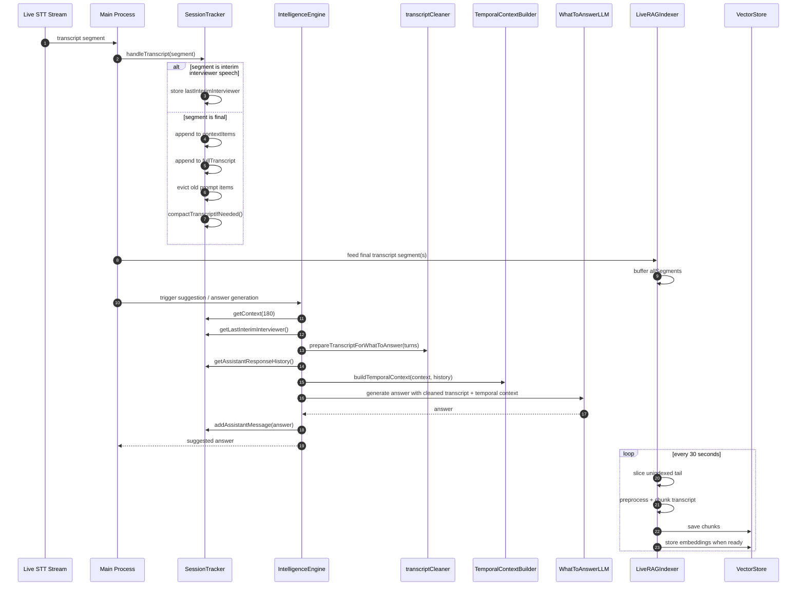
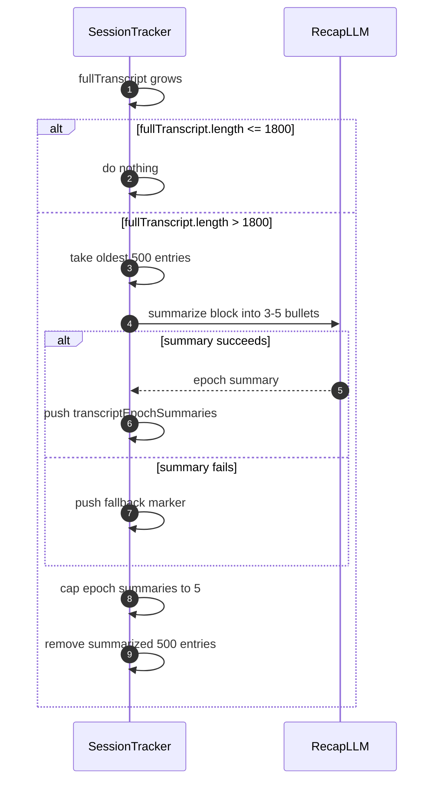
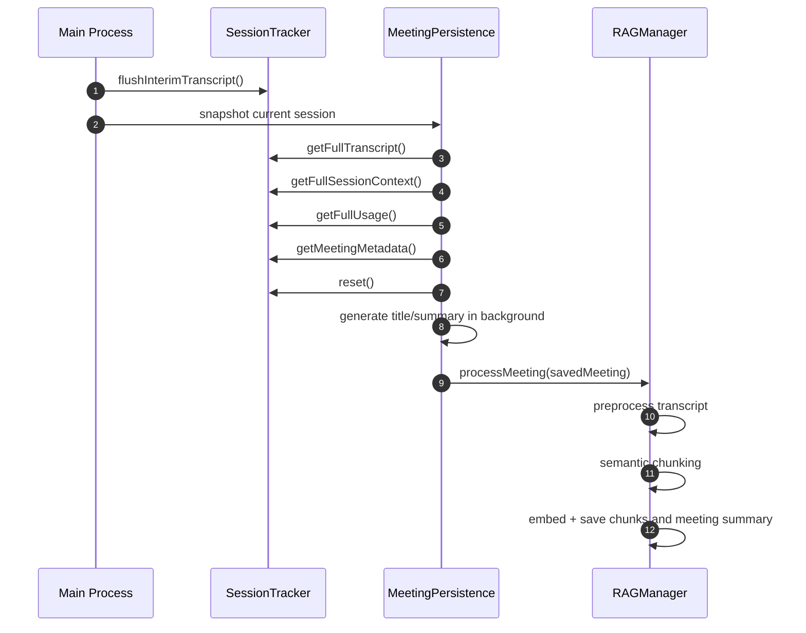

# Rolling Context Window Sequence Diagram

## Live Session Flow

## Transcript Compaction Flow

## Meeting End Flow

## Practical Porting Notes

- The prompt-time window and retrieval-time window are separate pipelines
- Final transcript should feed both pipelines; interim transcript should only influence low-latency prompt generation
- Compaction should summarize fixed historical blocks, not the current active prompt window
- Meeting end should snapshot first, reset live state second, and index in background third
