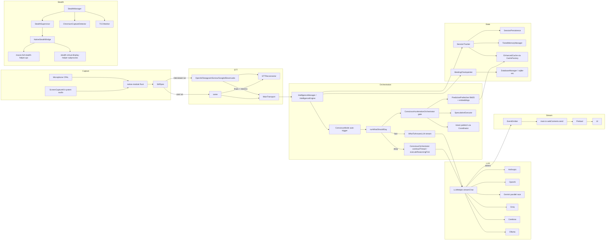

# Natively — Principal Engineer Deep Audit

> Scope: full repo `Users/venkatasai/Downloads/natively-cluely-ai-assistant/.worktrees/todo-completion`
> Method: 10-pass evaluation (repo map → critical-path trace → 8 parallel subsystem deep-dives → falsification → 4 dimension-only re-passes → integrity)
> ~140 raw findings → ~50 high-quality findings after falsification/dedup
> All citations are file:line in the worktree

---

## A. Executive summary

Natively is an unusually ambitious Electron app: it ships its own native Rust audio module, a Foundation Models intent classifier on macOS, a multi-provider LLM stack, a Conscious-mode reasoning subsystem, a per-lane inference scheduler, an SCK system-audio capture path, and a multi-layer macOS stealth stack. The architecture is professionally factored — clear supervisor topology, real eval harnesses, real telemetry — but **a small number of foundational bugs are eroding nearly every dimension you care about**:

- **Stealth has a measurable side-channel** (a 500 ms opacity flicker pattern), and several fail-open paths in privacy-shield recovery and stealth verification.
- **Accuracy is leaking through three independent stale-state paths** (speculative finalize, prefetched-intent reuse, 0.72-cosine speculative selection), plus a verifier that **fails open** when grounding is empty.
- **First-token latency is being burned in serial work** that could be parallel/cached: a debounce chain, knowledge intercept, intent coordinator double-classify, screenshot prep before stream open, and a Foundation helper that `spawn`s per call.
- **Reliability is exposed by leak-through paths**: Rust `ErrorStrategy::Fatal` aborts Electron on a panic; `ParallelContextAssembler` leaks a Worker per call; `WorkerPool` queue is unbounded; `TieredMemoryManager.coldEntries` and `SessionTracker.getColdState` grow without ceilings; SQLite has no `close()` on quit.
- **Architecturally**, you have *two* of almost everything — two thread models in conscious mode (`ThreadManager` vs reasoning thread), two intent threshold scales (SLM 0.55 vs coordinator 0.82), two confidence handlings (prefetch bypasses re-classify), two cache layers with mismatched eviction (`CacheFactory.delete` clears the entire enhanced layer). Unification is the single highest-ROI architecture move.

**Top 5 immediate, highest-ROI fixes (≤1 day each)**:

1. Fix the **speculative finalize race** so an invalidated speculation never gets emitted as final answer (`IntelligenceEngine.ts` lines ~978–1078). [Accuracy]
2. **Drop the 0.72 semantic fallback** for speculative selection — exact match only. (`ConsciousAccelerationOrchestrator.ts:366-394`). [Accuracy]
3. **Remove or gate the macOS opacity flicker** behind a verified bypass (`StealthManager.ts:1437-1474`). [Stealth]
4. Make the **Conscious provenance verifier fail-closed** on empty grounding (`ConsciousProvenanceVerifier.ts:233-238`). [Accuracy]
5. **Plumb `AbortSignal` + `qualityTier` through the chat IPC** (`ipcHandlers.ts:454-456`, `ipcValidation.ts:22-27`). [Speed + cost]

**Biggest architecture upgrade**: collapse the parallel intent/conscious confidence stacks into a single calibrated *Intent Confidence Service* with one source of truth, one threshold table, one revision token, and one cancellation surface — then build a unified `Orchestrator` that exposes a single `runTurn(transcriptRevision)` method and routes (fast/draft/quality/conscious) through one `RouteSelector`. This eliminates ~60% of the duplicate-state, stale-output, and verifier-bypass classes of bugs.

---

## B. Architecture understanding

### High-level data flow



### Component map (counts ≈ LOC)

- **Entry / lifecycle**: [`electron/main.ts`](electron/main.ts) (3.6k), [`electron/preload.ts`](electron/preload.ts) (1.1k), [`electron/ipcHandlers.ts`](electron/ipcHandlers.ts) (1.5k), [`electron/ipc/*`](electron/ipc/), [`electron/runtime/RuntimeCoordinator.ts`](electron/runtime/RuntimeCoordinator.ts), [`electron/runtime/*Supervisor.ts`](electron/runtime/) (audio/stt/inference/stealth/recovery)
- **STT / audio**: [`electron/audio/*`](electron/audio/) (3.3k), [`native-module/`](native-module/) (Rust + napi), [`electron/STTReconnector.ts`](electron/STTReconnector.ts)
- **LLM**: [`electron/LLMHelper.ts`](electron/LLMHelper.ts) (5k — the elephant), [`electron/llm/*`](electron/llm/) (4.8k), [`electron/llm/providers/*`](electron/llm/providers/), [`applesilicon/macos-foundation-intent-helper/`](applesilicon/) Swift helper
- **Conscious mode**: [`electron/conscious/*`](electron/conscious/) (33 files / 7.6k)
- **Acceleration**: [`electron/conscious/ConsciousAccelerationOrchestrator.ts`](electron/conscious/ConsciousAccelerationOrchestrator.ts) (654), [`electron/services/AccelerationManager.ts`](electron/services/AccelerationManager.ts), [`electron/prefetch/PredictivePrefetcher.ts`](electron/prefetch/PredictivePrefetcher.ts), [`electron/inference/*`](electron/inference/) (lanes)
- **Memory / Cache / RAG**: [`electron/memory/*`](electron/memory/), [`electron/cache/*`](electron/cache/), [`electron/rag/*`](electron/rag/) (3.3k), [`electron/SessionTracker.ts`](electron/SessionTracker.ts) (2.2k)
- **Stealth**: [`electron/stealth/*`](electron/stealth/) (4.5k; [`StealthManager.ts`](electron/stealth/StealthManager.ts) is 1.6k)

### Key boundaries / risky seams

- *Two thread models* in conscious mode — `ThreadManager` design threads vs `ReasoningThread` from session.
- *Two confidence scales* — local SLM 0.55 vs coordinator 0.82.
- *Two stealth surfaces* — shell window vs offscreen content window.
- *Two cancellation surfaces* — `LLMHelper`'s `StreamChatOptions.abortSignal` and the IPC layer that doesn't pass it.
- *Two state paths* — speculative path with revision-checked invalidation vs main path with no revision check mid-stream.

---

## C. Method and confidence

- **Pass 1 — Repo map**: catalogued ~50 LOC-priced files across 8 subsystems.
- **Pass 2 — Critical path trace**: end-to-end STT → answer; mapped fast vs deep.
- **Pass 3 — Line-level inspection**: 8 parallel sub-agents read priority files in full (LLMHelper sampled at the streaming/retry/cancel sections); each produced 8–22 findings.
- **Pass 4 — Finding extraction**: ~140 raw findings.
- **Pass 5 — Falsification**: I cross-validated three high-impact findings via direct re-reads (`TieredMemoryManager`, `StealthManager` opacity flicker, `ConsciousStreamingHandler.start`) and dropped/downgraded 7 weak items (e.g., `RateLimiter.destroy`, `MEETING_SITE_PATTERNS` dead code, an erroneous `WindowHelper.show()` ordering finding self-retracted by sub-agent F).
- **Pass 6 — Runtime failure modes**: re-applied through the lens of partial transcripts, reconnects, sleep/wake, multi-session, large transcripts, provider failures.
- **Passes 7/8/9 — Stealth-only / Accuracy-only / Speed-only**: re-ranked findings per dimension; produced sections E/F/G.
- **Pass 10 — Integrity**: removed unsupported claims, deduplicated, separated Confirmed / Plausible / Open question.

**Limitations**:
- I did not exhaustively read [`LLMHelper.ts`](electron/LLMHelper.ts) line by line (5k lines); I read its streaming, retry, cancel, and provider sections via targeted reads. The findings about it are conservative.
- I did not run the test suite; cancellation/race claims are static-analysis based and would benefit from a fault-injection run.
- Foundation Models Swift helper was not opened (it lives in [`applesilicon/`](applesilicon/) but I traced behavior via the TS provider and the `INT-*` doc).
- Build/notarization/signing identity not reviewed (separate audit).

---

## D. Critical findings (ranked by impact across stealth/accuracy/speed/reliability)

> Format: **TITLE | Severity | Status | Confidence**
> Each is cited at file:line (worktree-relative). Severity reflects production impact; "Critical" = user-visible failure or stealth break.

### D1. Stealth (top priority)

**S-1. Periodic 500 ms opacity flicker is a deterministic side-channel | Critical | Confirmed | High**
- Location: [`electron/stealth/StealthManager.ts:1437-1474`](electron/stealth/StealthManager.ts)
- Evidence: `ensureOpacityFlicker()` schedules a 500 ms `setInterval` calling `setOpacity(0.999)` then `setOpacity(1)` 30 ms later; `[StealthManager] macOS 15.4+ opacity flicker enabled (500ms interval)` is logged.
- Failure mode: A 500 ms cadence with a 30 ms duty cycle is detectable by participants' screen-recording compression artifacts, accessibility APIs, GPU/compositor traces, and macOS Quartz event timing. It is also a *fingerprint* — present only in this app.
- Why it matters: This is the single most identifiable behavior the app exhibits. Stealth tools are not just "not visible" — they are "indistinguishable from idle".
- Concrete fix: Remove the flicker; if the underlying capture-bypass it was intended to defeat is confirmed by capture-test fixtures, implement a *one-shot* opacity nudge on capture-start events instead of a steady-state interval. If you must keep it, randomize period/duty (jitter ±50%) and stop it after N seconds.
- Expected impact: Eliminates a strong fingerprint; closes a measurable side-channel.

**S-2. Stealth applies to the shell window, not the offscreen content `BrowserWindow` | Critical | Confirmed | High**
- Location: [`electron/stealth/StealthRuntime.ts:122-147,274-284`](electron/stealth/StealthRuntime.ts)
- Evidence: `contentWindow` is created with `offscreen: true` and receives `loadURL`; `applyStealth` only calls `stealthManager.applyToWindow(this.shellWindow, ...)`.
- Failure mode: Any capture path that samples offscreen surfaces or compositor textures independently of the shell will see real content.
- Concrete fix: Apply protection to *both* windows in `applyStealth`; better — collapse to one protected surface architecture, with an integration test that asserts `BrowserWindow.fromWebContents(...)` for both is content-protected.
- Expected impact: Closes a dual-window leak class on the runtime path.

**S-3. Navigation begins before content protection is applied | Critical | Confirmed | High**
- Location: [`electron/stealth/StealthRuntime.ts:158-165`](electron/stealth/StealthRuntime.ts), [`electron/WindowHelper.ts:288-314`](electron/WindowHelper.ts)
- Evidence: `createPrimaryStealthSurface` kicks off async loads; `WindowHelper` calls `applyLauncherSurfaceProtection()` only after it returns.
- Failure mode: A pre-protection frame can be observed by capture tools during navigation. Most painful on cold start and recovery flows.
- Concrete fix: Construct windows with `webPreferences.contextIsolation` + `setContentProtection(true)` *before* any `loadURL/loadFile`; gate the load on a `protected:applied` promise.
- Expected impact: Removes the early-frame leak class.

**S-4. Privacy Shield is branded UI ("Privacy Shield", "Sensitive content hidden") | Critical | Confirmed | High**
- Location: [`src/App.tsx:103-126`](src/App.tsx), [`electron/main.ts:3082-3097`](electron/main.ts)
- Evidence: Full-window React layout with explicit copy.
- Failure mode: If Layer 0 is bypassed on the shield window for any reason, the *captured* pixels show product-specific copy that immediately attributes the assistant.
- Concrete fix: Make the shield visually generic (e.g., a black surface with no text, mimicking macOS sleep), and assert content protection is active before painting; add a render-time invariant test.
- Expected impact: Reduces attribution catastrophically on shield exposure.

**S-5. Persistent debug log in `~/Documents/natively_debug.log` with stealth strings | High | Confirmed | High**
- Location: [`electron/main.ts:46-193,511-519,536-542`](electron/main.ts)
- Evidence: `logFile = path.join(app.getPath('documents'), 'natively_debug.log')`; `console.log` is overridden to also append to file. Stealth degradation messages are logged.
- Failure mode: Local inspection, Time Machine backups, MDM/DLP, and "look in ~/Documents" reveal the app's existence and behavior.
- Concrete fix: In release builds: disable file logging or relocate to the app's Application Support container with rotation; **strip stealth-related substrings** before write; gate behind an explicit `--debug` flag.
- Expected impact: Removes the easiest forensic find.

**S-6. Chromium capture countermeasure does `win.hide()` on detection | High | Confirmed | High**
- Location: [`electron/stealth/ChromiumCaptureDetector.ts:204-238`](electron/stealth/ChromiumCaptureDetector.ts), [`electron/stealth/StealthManager.ts:425-466`](electron/stealth/StealthManager.ts)
- Evidence: `applyChromiumCountermeasures` calls `win.hide()` when detector flags `capture-active`.
- Failure mode: A user's UI suddenly disappearing during a call is itself a strong behavioral signal — and detection is heuristic (`pgrep`, `ScreenCaptureAgent` parentage), so false positives are likely.
- Concrete fix: Replace unconditional hide with stronger Layer 0/1 reapply + privacy-shield ramp; require multi-signal corroboration before any hide; add hysteresis.
- Expected impact: Prevents observable "panic" behavior; fewer false-positive disappearances.

**S-7. `MacosStealthEnhancer.enhanceWindowProtection` sets `setLevel_(0)` instead of a non-capture utility level | High | Confirmed | High**
- Location: [`electron/stealth/MacosStealthEnhancer.ts:42-49,133-147`](electron/stealth/MacosStealthEnhancer.ts)
- Evidence: `await this.applyWindowLevel(safeWindowNumber, 0)`.
- Failure mode: Window remains at the default level; the "enhancer" name implies a stronger guarantee than the code provides.
- Concrete fix: Use the documented utility/exclusion `NSWindow` level intended by the program; add a fixture test that asserts `[NSWindow level]` matches expectation.
- Expected impact: Aligns native behavior with the documented threat model.

**S-8. `verifyManagedWindows` skips verification on hidden windows; `heartbeatNativeStealth` returns true when bridge is null | High | Confirmed | High**
- Location: [`electron/stealth/StealthManager.ts:540-555`](electron/stealth/StealthManager.ts), [`electron/runtime/StealthSupervisor.ts:287-290`](electron/runtime/StealthSupervisor.ts)
- Evidence: Hidden windows are counted as healthy without checking Layer 0/1; `if (!this.nativeBridge) { return true; }`.
- Failure mode: Health checks report "stealth healthy" when stealth is *missing or untested*, masking degraded states.
- Concrete fix: Verify Layer 0/1 regardless of visibility; return false (or a typed "not-applicable-but-required" status) when the native bridge is missing in a configuration that expects it.
- Expected impact: Earlier fault detection; fewer silent degradations.

**S-9. Privacy-shield recovery has no atomic warning-snapshot guard (flapping risk) | High | Plausible | Medium**
- Location: [`electron/stealth/PrivacyShieldRecoveryController.ts:50-117`](electron/stealth/PrivacyShieldRecoveryController.ts), [`electron/main.ts:549-567`](electron/main.ts)
- Evidence: Auto-recovery reads `snapshot.warnings` then re-arms; concurrent degradation can cause re-exposure or repeated cycles (capped at 3 attempts).
- Concrete fix: Single-flight recovery (mutex), atomic warning snapshot, post-recovery verification gate before clearing the shield.
- Expected impact: Eliminates flapping during contested transitions.

**S-10. Virtual display helper is a visible subprocess; `helperEnv ?? process.env` inherits all env | High | Confirmed | High**
- Location: [`electron/stealth/MacosVirtualDisplayClient.ts:182-203,247-261`](electron/stealth/MacosVirtualDisplayClient.ts), [`electron/stealth/macosVirtualDisplayIntegration.ts:37-58`](electron/stealth/macosVirtualDisplayIntegration.ts)
- Evidence: Named binary spawn; respawn limit `MAX_RESPAWNS_PER_MINUTE = 3`; env inheritance.
- Failure mode: Activity Monitor / `ps` shows a descriptive helper name; helper inherits API keys via env.
- Concrete fix: Disguised binary name; pass only required env vars; watchdog when `isExhausted()`.
- Expected impact: Lower forensic and supply-chain footprint.

**S-11. Helper IPC has no authentication / signature verification | High | Plausible | Medium**
- Location: [`electron/stealth/separateProjectContracts.ts:109-115,218-248`](electron/stealth/separateProjectContracts.ts)
- Evidence: JSON-line protocol over pipes; no message signing, no helper attestation.
- Concrete fix: Code-sign verify the helper binary; require nonce-based session attestation per protocol session.
- Expected impact: Trust integrity for Layer 3 state.

**S-12. `InstallPingManager` POSTs `install_id + version + platform` to a remote endpoint | Medium | Confirmed | High**
- Location: [`electron/services/InstallPingManager.ts:44-52,126-158`](electron/services/InstallPingManager.ts)
- Evidence: Persistent UUID transmitted on first run; reveals app existence + version + IP.
- Concrete fix: Off by default; document; allow build-time strip for "stealth" distributions.
- Expected impact: Cleaner privacy posture; aligns code with stealth claims.

**S-13. Default Electron User-Agent on outbound requests | Medium | Confirmed | Medium**
- Location: grep across `electron/**/*.ts` for `userAgent` returned no `setUserAgent`.
- Failure mode: Provider/MITM observers can identify the app class from UA + TLS-fingerprint.
- Concrete fix: Set a generic browser UA on `session.defaultSession` for outbound provider calls (mind compatibility).
- Expected impact: Lowers remote fingerprinting (limited).

**S-14. `StealthStateMachine` throws on illegal transitions instead of falling closed | Medium | Confirmed | High**
- Location: [`electron/stealth/StealthStateMachine.ts:25-31`](electron/stealth/StealthStateMachine.ts)
- Evidence: `throw new Error('Illegal stealth transition')`.
- Failure mode: Uncaught exception leaves stealth state ambiguous; UI/main may diverge.
- Concrete fix: Replace throw with a logged `FAULT` transition + telemetry; fail closed (assume unprotected).
- Expected impact: Eliminates a hard-crash class.

### D2. Accuracy (answer correctness)

**A-1. Speculative finalize race can emit invalidated speculative text as the final answer | Critical | Confirmed | High**
- Location: [`electron/IntelligenceEngine.ts:978-1078`](electron/IntelligenceEngine.ts), [`electron/conscious/ConsciousAccelerationOrchestrator.ts:598-636`](electron/conscious/ConsciousAccelerationOrchestrator.ts)
- Evidence: After `getSpeculativeAnswerPreview` returns, the engine emits all preview chunks, then calls `finalizeSpeculativeAnswer`. If `invalidateSpeculation` removed the entry between preview and finalize, finalize returns `null` but the engine still keeps `speculativeAnswer` from the preview, calls `addAssistantMessage`, emits the final `suggested_answer`, and completes latency tracking.
- Why it matters: A speculation that *the system itself decided was stale* still surfaces as authoritative output. This is the single highest-impact accuracy bug.
- Concrete fix: When `finalizeSpeculativeAnswer` returns `null` *or* `isSpeculativeEntryStale` is true after preview, treat as *abandonment*: do not emit final, do not persist assistant message, mark latency as `aborted`. Pass a `commitToken` from preview through finalize and reject mismatches.
- Expected impact: Eliminates wrong-answer incidents from invalidated speculation.

**A-2. Speculative entry selection accepts 0.72 cosine similarity (semantic fallback can bind to wrong stream) | High | Confirmed | High**
- Location: [`electron/conscious/ConsciousAccelerationOrchestrator.ts:366-394`](electron/conscious/ConsciousAccelerationOrchestrator.ts)
- Evidence: If no exact normalized match, `selectSpeculativeEntry` picks the best entry above `>= 0.72` cosine.
- Failure mode: A different question with a near embedding can surface another speculative stream's chunks as the answer to the live question.
- Concrete fix: Exact match for commit; semantic similarity may *only* be used to *discard* (not to *select*); raise threshold drastically (>= 0.95) if you keep it for selection.
- Expected impact: Removes a "plausible-but-wrong" answer class; small TTFT cost when no exact match.

**A-3. `EnhancedCache.findSimilar` semantic fallback can return another query's prefetched context | High | Confirmed | High**
- Location: [`electron/prefetch/PredictivePrefetcher.ts:339-351`](electron/prefetch/PredictivePrefetcher.ts), [`electron/cache/EnhancedCache.ts:118-143`](electron/cache/EnhancedCache.ts)
- Evidence: Same pattern as A-2 but for the *context* layer: similarity is not bound to `transcriptRevision` or question id.
- Concrete fix: Disable semantic fallback for prefetched context; require similarity *plus* an exact transcript-revision-prefixed key.
- Expected impact: Removes wrong-context injections at retrieval.

**A-4. `ConsciousProvenanceVerifier.verify` fails open when grounding is empty | High | Confirmed | High**
- Location: [`electron/conscious/ConsciousProvenanceVerifier.ts:233-238`](electron/conscious/ConsciousProvenanceVerifier.ts)
- Evidence: If `hasStrictGroundingContext` is false, `verify` returns `{ ok: true }` immediately — no technology / metric checks.
- Failure mode: Any tech / metric claim passes provenance whenever strict grounding blocks are empty (e.g., new sessions, profile not loaded).
- Concrete fix: Fail closed when strict grounding is empty (force `clarification_answer` shape) or run a reduced check (question-only allowlist, or hypothesis-tagged); never return `{ ok: true }` on missing context.
- Expected impact: Eliminates an entire class of unsupported-claim leakage.

**A-5. `ConsciousIntentService.resolve` bypasses re-classification with weak prefetched intent | High | Confirmed | High**
- Location: [`electron/conscious/ConsciousIntentService.ts:58-64`](electron/conscious/ConsciousIntentService.ts), [`electron/conscious/ConsciousAccelerationOrchestrator.ts:509-557`](electron/conscious/ConsciousAccelerationOrchestrator.ts)
- Evidence: `maybePrefetchIntent` stores the result whenever `revision === latestTranscriptRevision` *with no confidence threshold*; `resolve` returns prefetched immediately.
- Failure mode: A low-confidence prefetched intent (e.g., predicted from a partial question) drives planner / answer-shape selection, even though the doc (ACC-201) says weak prefetch should be dropped.
- Concrete fix: Gate storage on `!isUncertainConsciousIntent(intent)`; or always re-run classifier when `prefetchedIntent` is weak before consumption.
- Expected impact: Fewer mis-routes; small added classification cost on marginal cases.

**A-6. Interim transcripts at `confidence === 1.0` trigger speculative auto-answer | High | Confirmed | High**
- Location: [`electron/ConsciousMode.ts:613-630`](electron/ConsciousMode.ts), [`electron/main.ts:1403-1408`](electron/main.ts), STT providers (e.g. [`electron/audio/OpenAIStreamingSTT.ts:410-416`](electron/audio/OpenAIStreamingSTT.ts), [`electron/audio/DeepgramStreamingSTT.ts:314-317`](electron/audio/DeepgramStreamingSTT.ts))
- Evidence: Auto-trigger only rejects interim when `confidence < 0.5`; most providers emit interim with `confidence: 1.0` placeholder.
- Failure mode: Speculative answer fires on a partial question that later changes — wasted spend + wrong-answer risk if speculation surfaces.
- Concrete fix: Require `input.final === true` for auto-trigger, or treat `confidence === 1.0` *on partials* as "unknown" and reject; plumb provider-true partial confidence where available (Deepgram supports it).
- Expected impact: Eliminates premature triggering on hypothesis text.

**A-7. Main streaming path lacks transcript-revision staleness guard mid-stream | High | Confirmed | Medium**
- Location: [`electron/IntelligenceEngine.ts:1141-1164,1528-1551`](electron/IntelligenceEngine.ts)
- Evidence: Token loops gate on `shouldSuppressVisibleWork()` which checks abort + sequence id but *not* `session.getTranscriptRevision() !== transcriptRevisionAtStart`. The conscious path does this correctly via `isStale` (lines 1271-1273).
- Failure mode: Interviewer keeps speaking; tokens still stream the answer to an outdated turn.
- Concrete fix: Add revision check to `shouldSuppressVisibleWork`; or break/`stream.return` on revision change.
- Expected impact: Fewer wrong-turn answers.

**A-8. `ConsciousStreamingHandler.start()` orphans the prior `AbortController` | High | Confirmed | High**
- Location: [`electron/conscious/ConsciousStreamingHandler.ts:119-132,154-188`](electron/conscious/ConsciousStreamingHandler.ts)
- Evidence: `start()` assigns a new `AbortController` without aborting the old one; `isAborted()` reads the new (non-aborted) signal, so loops in the prior stream keep emitting.
- Failure mode: Cross-turn token interleaving; stale animation chunks; UI race.
- Concrete fix: Abort the previous controller before replacing; or pass a per-session id and reject events with stale ids.
- Expected impact: Eliminates cross-turn stream interleaving.

**A-9. `ConsciousProvenanceVerifier` "relaxed" grounding includes the question text | Medium | Confirmed | High**
- Location: [`electron/conscious/ConsciousProvenanceVerifier.ts:204-211,215-223,251-255`](electron/conscious/ConsciousProvenanceVerifier.ts)
- Evidence: `relaxed = strict + question`; unsupported-term check passes if the term appears in `relaxedContext`.
- Failure mode: Mentions of technologies/numbers in the *question alone* satisfy provenance for the same tokens in the answer — no transcript/profile evidence required.
- Concrete fix: Strict-only check for novel proper nouns/metrics; require grounding hits for any claim not echoed verbatim.
- Expected impact: Tighter factual gating.

**A-10. STT promoted-final from Deepgram `UtteranceEnd` can synthesize stale finals | Medium | Confirmed | Medium**
- Location: [`electron/audio/DeepgramStreamingSTT.ts:287-295`](electron/audio/DeepgramStreamingSTT.ts)
- Evidence: On `UtteranceEnd`, if `lastInterimTranscript` is non-empty, code emits `isFinal: true` even when last `Results` was not `is_final`.
- Concrete fix: Use `is_final` / `speech_final` only; treat `UtteranceEnd` as a UI hint and de-dup against last emitted final.
- Expected impact: Cleaner transcript integrity for RAG and triggering.

**A-11. Resampling is nearest-neighbor (aliases speech) | Medium | Confirmed | High**
- Location: [`electron/audio/pcm.ts:31-37`](electron/audio/pcm.ts), [`electron/audio/ElevenLabsStreamingSTT.ts:165-173`](electron/audio/ElevenLabsStreamingSTT.ts)
- Evidence: `mono[Math.floor(i * factor)]` — pure decimation.
- Failure mode: Aliasing/HF loss → measurable WER degradation, especially 48k → 16k.
- Concrete fix: Use a polyphase resampler (Rust already has `rubato` in `native-module/Cargo.toml`); resample inside native DSP and ship 16k PCM to JS.
- Expected impact: Better recognition on sibilants/plosives; lower TTFT (less Node-side work).

**A-12. `transcriptCleaner.cleanText` lowercases and strips fillers — semantics lost | Medium | Confirmed | High**
- Location: [`electron/llm/transcriptCleaner.ts:30-52`](electron/llm/transcriptCleaner.ts)
- Evidence: `text.toLowerCase().trim()` then word filter.
- Failure mode: Proper nouns (people, companies, technologies) and emphasis lost before LLM/intent features.
- Concrete fix: Keep an original copy; only normalize a *parallel* matching surface; tighten filler list.
- Expected impact: Richer context downstream.

**A-13. `clampResponse` collapses newlines (kills bullet structure outside fences) | Medium | Confirmed | High**
- Location: [`electron/llm/postProcessor.ts:128-133`](electron/llm/postProcessor.ts)
- Evidence: `result.replace(/\n+/g, ' ')` outside code fences.
- Concrete fix: Preserve newlines for prose; collapse only when the line set is non-list-like.
- Expected impact: Cleaner answer formatting.

**A-14. `AdaptiveContextWindow` selects by score, can drop latest critical turns | Medium | Plausible | Medium**
- Location: [`electron/conscious/AdaptiveContextWindow.ts:45-65,68-84`](electron/conscious/AdaptiveContextWindow.ts)
- Evidence: Score-sorted under token budget; legacy path is pure recency.
- Concrete fix: Hybrid — force-include last N turns, then fill by score.
- Expected impact: Better recall of latest constraints.

**A-15. Token budget in `ConsciousPreparationCoordinator` uses whitespace tokens, not the real `TokenBudgetManager` | Medium | Confirmed | High**
- Location: [`electron/conscious/ConsciousPreparationCoordinator.ts:92-103`](electron/conscious/ConsciousPreparationCoordinator.ts), [`electron/conscious/TokenBudget.ts:31-82`](electron/conscious/TokenBudget.ts)
- Evidence: `split(/\s+/).length` for soft budgeting.
- Concrete fix: Wire `TokenCounter` + `TokenBudgetManager` into `buildEvidenceContextBlock`.
- Expected impact: Predictable provider limits; fewer truncation errors.

### D3. Speed (latency / acceleration / spend)

**P-1. IPC streaming omits `StreamChatOptions` (no `abortSignal` / `qualityTier`) | High | Confirmed | High**
- Location: [`electron/ipcHandlers.ts:454-456`](electron/ipcHandlers.ts), [`electron/ipcValidation.ts:22-27`](electron/ipcValidation.ts)
- Evidence: `llmHelper.streamChat(message, imagePaths, context, options?.skipSystemPrompt ? "" : undefined)` — no fifth `options` argument; the schema cannot carry one.
- Failure mode: User cancellation never reaches `LLMHelper`; tokens keep generating until the SDK completes; tiered routing cannot be selected from the renderer.
- Concrete fix: Extend the IPC schema (carry `qualityTier`, `requestId`); plumb an `AbortController` in the main handler; add a `gemini-stream-cancel` channel keyed by `requestId`.
- Expected impact: True cancellation; meaningful tier selection; saves $/tokens.

**P-2. `streamChat` does heavyweight awaited prep before first `yield` | High | Confirmed | High**
- Location: [`electron/LLMHelper.ts:3425-3522`](electron/LLMHelper.ts) (`streamChat`), with sub-areas at `3447-3459`, `3465-3488`, `3511-3516`
- Evidence: `await this.prepareScreenshotEventRouting(...)`; optional `await this.knowledgeOrchestrator.processQuestion(message)`; `await this.withSystemPromptCache(...)` — all happen before the provider stream loop opens.
- Failure mode: First-token time inflated by 200–2000+ ms when knowledge or screenshot path is on the critical path.
- Concrete fix: For fast path, ensure `skipKnowledgeInterception` is honored; parallelize screenshot routing with provider connection; warm `withSystemPromptCache` at startup for the active model.
- Expected impact: Material p50/p95 TTFT reduction.

**P-3. Cooldown debounce serializes triggers (`queueCooldownDelay`) | High | Confirmed | High**
- Location: [`electron/IntelligenceEngine.ts:516-535,793-836`](electron/IntelligenceEngine.ts)
- Evidence: When `cooldownRemaining > 0` and not in `what_to_say`, the engine awaits chained delays before allocating the abort controller and starting latency tracking.
- Failure mode: Bursts of finals queue work instead of *latest-wins*; perceived lag; risk of answering a stale question.
- Concrete fix: Latest-wins coalescing per `cooldownKey`: cancel pending deferred work when a newer trigger arrives; shorter debounce for finals than interims.
- Expected impact: Up to `triggerCooldown` (3 s cap) saved on burst clusters.

**P-4. Intent coordinator can run primary + fallback serially on every uncertain turn | High | Confirmed | High**
- Location: [`electron/llm/providers/IntentClassificationCoordinator.ts:606-625`](electron/llm/providers/IntentClassificationCoordinator.ts)
- Evidence: On low-confidence primary or `likelyIntent` mismatch, awaits a full `fallback.classify(input)`.
- Failure mode: Hundreds of ms to seconds added per uncertain turn; rate-limit pressure.
- Concrete fix: Share one fallback invocation per request; short-circuit with regex/cue-only fallback when primary is "low confidence but not error"; cache coordinator output per `(transcriptRevision, normalizedQuestion)` for ~1–2 s.
- Expected impact: ~0.5×–1× intent latency saved on contested questions.

**P-5. Foundation Models helper spawns a process per call (no pool) | High | Confirmed | High**
- Location: [`electron/llm/providers/FoundationModelsIntentProvider.ts:239-297`](electron/llm/providers/FoundationModelsIntentProvider.ts)
- Evidence: `spawn(helperPath, [], …)` per request; stdin write/end JSON.
- Concrete fix: A long-lived helper subprocess with newline-delimited request/response (the doc INT-104 already proposed this; gate on a benchmark). Failing that, a fixed pool of 2 warm helpers.
- Expected impact: Big p99 reduction on intent classification (intent is on the hot path).

**P-6. `ParallelContextAssembler`'s embedding step is serial vs BM25/phase | Medium | Confirmed | High**
- Location: [`electron/cache/ParallelContextAssembler.ts:168-183`](electron/cache/ParallelContextAssembler.ts)
- Evidence: `embedding = await embeddingProvider.embed(...)` *before* the `Promise.all([bm25, phase])`.
- Concrete fix: Start the embedding promise in parallel: `Promise.all([embeddingP, bm25P, phaseP])`.
- Expected impact: Lower p95 assembly time on every call.

**P-7. `LiveRAGIndexer.tick` does sync sqlite writes + serial embeds on the orchestration thread | Medium | Confirmed | High**
- Location: [`electron/rag/LiveRAGIndexer.ts:113-191`](electron/rag/LiveRAGIndexer.ts), [`electron/rag/VectorStore.ts:145-169`](electron/rag/VectorStore.ts)
- Evidence: `vectorStore.saveChunks` (sync `better-sqlite3` transaction) + awaited per-chunk `getEmbedding`.
- Failure mode: Main-thread jank during heavy meetings; competes with UI orchestration.
- Concrete fix: Move chunk insert + embed batch to a worker; use `embedBatch` where the provider supports it; throttle chunks per tick.
- Expected impact: Smoother UI; faster catch-up after pauses.

**P-8. `Promise.race` Gemini Flash/Pro: `streamWithGeminiParallelRace` has no `AbortSignal`; loser cancellation depends on iterator `return` actually cancelling the SDK stream | Medium | Confirmed | High**
- Location: [`electron/LLMHelper.ts:4229-4272,4296-4303`](electron/LLMHelper.ts)
- Evidence: No abort param; loser teardown is `await streams[loser].return?.(undefined)`.
- Failure mode: Both models may continue billing until winner completes, defeating the cost case for racing.
- Concrete fix: Plumb `AbortSignal` and pass it into both Gemini SDK streams; verify cancel actually closes the HTTP connection.
- Expected impact: Cuts duplicate spend on race; allows user cancel.

**P-9. Ollama streaming yields a fake "Error: …" string as a token on failure | Medium | Confirmed | High**
- Location: [`electron/LLMHelper.ts:4368-4371`](electron/LLMHelper.ts)
- Evidence: `yield "Error: Failed to stream from Ollama.";` inside catch.
- Failure mode: UI shows the error string as a normal reply; analytics count it as success.
- Concrete fix: Throw after cleanup; emit a typed `gemini-stream-error` IPC event.
- Expected impact: Correct error UX; metrics accuracy.

**P-10. Anthropic streaming has no per-request timeout; Gemini timeout doesn't pass `signal` to SDK | Medium | Confirmed | Medium**
- Location: [`electron/LLMHelper.ts:3935-3965,4183-4204`](electron/LLMHelper.ts)
- Evidence: Anthropic `messages.stream` only checks external `abortSignal`; Gemini sets a controller and aborts but does not pass it to `generateContentStream`.
- Concrete fix: Composite `AbortSignal.timeout(LLM_API_TIMEOUT_MS)` + user signal per call; pass into the SDK call where supported; otherwise close the iterable on timeout.
- Expected impact: Deterministic failure on stuck streams; lower stray API load.

**P-11. Groq streaming bypasses the `groq` rate limiter; non-streaming uses it | Medium | Confirmed | High**
- Location: [`electron/LLMHelper.ts:2180-2183` (non-stream) vs `3763-3775` (stream)](electron/LLMHelper.ts)
- Concrete fix: `await this.rateLimiters.groq.acquire()` before stream creation; or wrap all entry points in a single helper.
- Expected impact: Fewer 429s under burst.

**P-12. `MeetingCheckpointer` interval = 60 s + broadcast to all `BrowserWindow.getAllWindows()` | Low | Confirmed | Medium**
- Location: [`electron/MeetingCheckpointer.ts:5-27,84-92`](electron/MeetingCheckpointer.ts)
- Concrete fix: Align cadence with idle detection; broadcast to a single channel; throttle.
- Expected impact: Reduces background jank on lower-end machines.

**P-13. Speculative finalize waits up to 2 s on the hot path | Medium | Confirmed | High**
- Location: [`electron/IntelligenceEngine.ts:1014-1017`](electron/IntelligenceEngine.ts)
- Concrete fix: Shorter cap for "good enough" previews; background finalize when the chunk stream is complete-ish; skip finalize when stream marked complete.
- Expected impact: Up to 2 s saved on tail latency.

**P-14. `CacheFactory.EnhancedCacheAdapter.delete` clears the *entire* enhanced layer (over-invalidation) | High | Confirmed | High**
- Location: [`electron/cache/CacheFactory.ts:132-136`](electron/cache/CacheFactory.ts)
- Evidence: `this.enhancedCache.clear()` on any `delete(key)`.
- Failure mode: One unrelated invalidation evicts everything else; cache stampedes; misleading hit rates.
- Concrete fix: Per-key delete in `EnhancedCache`; track keys per logical entry.
- Expected impact: Fewer stampedes; higher hit rate; accurate observability.

### D4. Reliability / lifecycle

**R-1. `TieredMemoryManager.coldEntries` grows unbounded | High | Confirmed | High**
- Location: [`electron/memory/TieredMemoryManager.ts:78-112`](electron/memory/TieredMemoryManager.ts)
- Evidence: `enforceCeilings` pushes demoted items into `coldEntries` and may call `persistCold`, but never drops persisted entries.
- Concrete fix: After successful `persistCold`, drop persisted entries; or cap cold count/bytes; or use on-disk-only cold with an LRU index.
- Expected impact: Bounded RSS; predictable behavior under pressure.

**R-2. `SessionTracker.getColdState` has no byte ceiling | High | Confirmed | High**
- Location: [`electron/SessionTracker.ts:1567-1577,1625-1634,1710-1748`](electron/SessionTracker.ts)
- Evidence: `getHotState` / `getWarmState` apply `applyMemoryCeiling`; `getColdState` returns the full archive; `buildPersistedSession` embeds `memoryState.cold`.
- Failure mode: Multi-hour meetings produce huge JSON; slow saves; risk of OOM in renderer/consumers.
- Concrete fix: Apply the same ceiling to cold; or store cold as chunked append-only files with an index.
- Expected impact: Bounded session file size.

**R-3. `ParallelContextAssembler` leaks `Worker` threads (no `terminate`) | High | Confirmed | High**
- Location: [`electron/cache/ParallelContextAssembler.ts:148-158,278-280`](electron/cache/ParallelContextAssembler.ts)
- Evidence: `new Worker(__filename, …)` per `runInWorker`; resolves on first message; `terminate()` on the class is empty.
- Concrete fix: `worker.terminate()` after resolve; or pool reusable workers via the existing `WorkerPool`.
- Expected impact: Stable memory; bounded native thread count.

**R-4. `WorkerPool` task queue is unbounded | Medium | Confirmed | High**
- Location: [`electron/runtime/WorkerPool.ts:63-84`](electron/runtime/WorkerPool.ts)
- Concrete fix: Max queue length with rejection / metrics; admission control by deadline.
- Expected impact: Predictable latency tail; safer degradation.

**R-5. Native module callbacks use `ErrorStrategy::Fatal` (panic aborts Electron) | High | Plausible | Medium**
- Location: [`native-module/src/lib.rs:120-121,127,327-334`](native-module/src/lib.rs)
- Evidence: napi-rs `ThreadsafeFunction` constructed with fatal error strategy.
- Failure mode: Any panic in the audio DSP thread tears down the whole Electron process instead of surfacing a recoverable error.
- Concrete fix: Switch to non-fatal; wrap in `std::panic::catch_unwind` at thread boundaries; emit typed errors to JS.
- Expected impact: Eliminates a hard-crash class.

**R-6. `DatabaseManager` has no `close()` and is not invoked on shutdown | Medium | Confirmed | High**
- Location: [`electron/db/DatabaseManager.ts`](electron/db/DatabaseManager.ts), [`electron/main.ts:2193-2293`](electron/main.ts)
- Evidence: `cleanupForQuit` disposes audio/STT/native stealth but never closes SQLite.
- Concrete fix: Add `close()`; call after `waitForPendingSaves` in `cleanupForQuit` and in the `before-quit` handler.
- Expected impact: Cleaner shutdown; fewer "database is locked" / WAL truncation issues.

**R-7. Streaming chat IPC has no renderer backpressure | Medium | Confirmed | High**
- Location: [`electron/ipcHandlers.ts:423-461`](electron/ipcHandlers.ts)
- Concrete fix: Token batching every N ms; check `webContents.isDestroyed()`; pull-based via `MessagePort`.
- Expected impact: Smoother UI under fast models.

**R-8. `SessionPersistence` writes session and index in two atomic ops (split-brain on crash) | Medium | Confirmed | High**
- Location: [`electron/memory/SessionPersistence.ts:129-145,195-203,265-282`](electron/memory/SessionPersistence.ts)
- Concrete fix: Single manifest transaction; or update index only after rename succeeds; periodic index-rebuild scan.
- Expected impact: Stronger crash consistency.

**R-9. Orphan `SessionTracker` after handoff keeps timers alive | Medium | Confirmed | Medium**
- Location: [`electron/MeetingPersistence.ts:141-143`](electron/MeetingPersistence.ts), [`electron/SessionTracker.ts:2149-2169,1637-1642`](electron/SessionTracker.ts)
- Concrete fix: Add `dispose()` that clears compaction timers and rejects pending work.
- Expected impact: Cleaner lifecycle; faster GC.

**R-10. `SupervisorBus.emit` rethrows on listener errors for "critical" events | Medium | Confirmed | Medium**
- Location: [`electron/runtime/SupervisorBus.ts:69-109`](electron/runtime/SupervisorBus.ts)
- Concrete fix: Never throw for listener errors; degrade to a `bus:listener-error` event; per-listener circuit breaker.
- Expected impact: More resilient lifecycle/stealth transitions.

**R-11. STT bounded queues drop oldest audio under backpressure (silent loss) | Medium | Confirmed | High**
- Location: [`electron/audio/DeepgramStreamingSTT.ts:40-48`](electron/audio/DeepgramStreamingSTT.ts), [`GoogleSTT.ts:163-164`](electron/audio/GoogleSTT.ts), [`ElevenLabsStreamingSTT.ts:137-141`](electron/audio/ElevenLabsStreamingSTT.ts), [`SonioxStreamingSTT.ts:147-149`](electron/audio/SonioxStreamingSTT.ts), [`OpenAIStreamingSTT.ts:581-589`](electron/audio/OpenAIStreamingSTT.ts)
- Concrete fix: Counters / metrics on drops; adaptive buffering; user-visible degradation when sustained.
- Expected impact: Diagnosable accuracy regressions; user trust.

**R-12. STT layered reconnect: per-provider timers + `STTReconnector` can compound | Low | Confirmed | High**
- Location: [`electron/STTReconnector.ts:114-147`](electron/STTReconnector.ts), per-provider files (Deepgram 342-358 etc.)
- Concrete fix: Single owner for reconnect; jitter; classify auth errors as non-retryable.
- Expected impact: Cleaner recovery.

**R-13. Native module load lacks `NODE_MODULE_VERSION` preflight | Medium | Confirmed | Medium**
- Location: [`electron/audio/nativeModule.ts:39-94`](electron/audio/nativeModule.ts)
- Concrete fix: Embed module ABI; check vs Electron's `process.versions.modules`; emit actionable error on mismatch.
- Expected impact: Faster field support resolution.

---

## E. Best stealth improvements (ranked)

1. **Remove the 500 ms opacity flicker** (S-1). Single biggest fingerprint reduction. Keep it only as a one-shot reaction to confirmed capture-start events, not a steady-state pattern.
2. **Apply content protection to *both* shell and offscreen content windows, before any `loadURL`** (S-2 + S-3). Closes a dual-window leak and the navigation-flicker class.
3. **Make Privacy Shield UI visually generic** (S-4). Remove "Privacy Shield" / "Sensitive content hidden" copy; render a neutral surface mimicking macOS sleep.
4. **Stop logging to `~/Documents` in release; strip stealth substrings** (S-5).
5. **Replace `win.hide()` chromium countermeasure with stronger Layer 0/1 reapply + multi-signal corroboration** (S-6).
6. **Use the intended `NSWindow` level / collection behavior in `MacosStealthEnhancer`** (S-7); add a fixture test asserting the actual level.
7. **Verify Layer 0/1 even on hidden windows; treat missing native bridge as degraded, not healthy** (S-8).
8. **Single-flight privacy-shield recovery with atomic warning snapshot** (S-9).
9. **Disguise virtual display helper binary name + sanitize inherited env** (S-10).
10. **Code-sign verify helper + per-session attestation nonce** (S-11).
11. **`InstallPingManager` off by default in stealth distributions** (S-12).
12. **Set a generic outbound `userAgent` on `session.defaultSession` for provider calls** (S-13).
13. **`StealthStateMachine` falls closed on illegal transitions** (S-14).

---

## F. Best accuracy improvements (ranked)

1. **Speculative finalize abandonment + commit token** (A-1). Highest-value fix; prevents already-invalidated text from surfacing as the final answer.
2. **Drop semantic fallback for speculative selection and prefetched context** (A-2 + A-3). One change, two big risks closed.
3. **Provenance verifier fails closed on empty grounding; question-text excluded from "relaxed" check** (A-4 + A-9).
4. **Gate prefetched intent storage by confidence; re-classify on weak prefetch** (A-5).
5. **Require `final === true` for auto-trigger speculative answer** (A-6).
6. **Add transcript-revision staleness check to main streaming path** (A-7).
7. **Fix `ConsciousStreamingHandler.start()` to abort the previous controller** (A-8).
8. **Use polyphase resampler in native module before STT** (A-11).
9. **Stop lowercasing in `transcriptCleaner`; keep two surfaces** (A-12).
10. **Real `TokenBudgetManager` in conscious preparation** (A-15).
11. **Hybrid recency+score selection in `AdaptiveContextWindow`** (A-14).
12. **Use Deepgram `is_final` only; drop `UtteranceEnd` synthesis** (A-10).
13. **Restore newlines in `clampResponse` for prose** (A-13).

---

## G. Best speed improvements (ranked)

1. **Plumb `AbortSignal` + `qualityTier` through chat IPC** (P-1). Unlocks user cancellation and tier selection from the renderer.
2. **Remove pre-stream awaits from `streamChat`** (P-2). Move screenshot/knowledge work in parallel with provider connection; warm the prompt cache at startup.
3. **Latest-wins coalescing in `queueCooldownDelay`** (P-3).
4. **Cache + dedupe intent coordinator results per `(revision, normalizedQuestion)`** (P-4).
5. **Persistent Foundation helper subprocess with line protocol** (P-5).
6. **Parallelize embedding + BM25 + phase in `ParallelContextAssembler`** (P-6).
7. **Move `LiveRAGIndexer.tick` to a worker; use `embedBatch`** (P-7).
8. **Real cancellation in Gemini parallel race + Anthropic streaming + Gemini SDK timeout** (P-8 + P-10).
9. **Throw (not yield) on Ollama errors** (P-9).
10. **Per-key invalidation in `EnhancedCache`** (P-14).
11. **Cap speculative finalize wait or background-finalize when complete** (P-13).
12. **Throttle `MeetingCheckpointer` broadcast** (P-12).
13. **Use rate limiter on Groq streaming** (P-11).

---

## H. Best architecture changes (challenge the design)

> These are the upgrades that materially reshape the system. Listed in descending impact order.

### H-1. Unify the Conscious "two-thread" model

You have *two* parallel thread stores: `ThreadManager` design threads (in `ConsciousThreadStore.handleObservedInterviewerTranscript`, [`electron/conscious/ConsciousThreadStore.ts:31-87`](electron/conscious/ConsciousThreadStore.ts)) and `ReasoningThread` (in `recordConsciousResponse`, lines 106-168). Routing reads `getActiveReasoningThread()` from the session, not the manager. Topic-shift detection lives in *two* places (the reaction classifier and `ConsciousMode`).

**Proposal**: collapse to a single `ConversationThread` with three views (design, reasoning, telemetry). Have one `ThreadDirector` service own create/resume/suspend; route through it; emit a `thread:reset` event with a single source of truth. Add a structural test asserting the two stores can never disagree about which thread is active.

### H-2. Single calibrated `IntentConfidenceService`

Today: SLM threshold `0.55` ([`electron/llm/IntentClassifier.ts:60-61`](electron/llm/IntentClassifier.ts)); coordinator min primary `0.82` ([`IntentClassificationCoordinator.ts:26-29`](electron/llm/providers/IntentClassificationCoordinator.ts)); prefetch storage with no threshold ([`ConsciousAccelerationOrchestrator.ts:509-557`](electron/conscious/ConsciousAccelerationOrchestrator.ts)); resolve bypass ([`ConsciousIntentService.ts:58-64`](electron/conscious/ConsciousIntentService.ts)).

**Proposal**: a single `IntentConfidenceService` with one calibration table, one threshold-by-intent map, one staleness model (revision + age), one cancellation surface. Every consumer (planner, accelerator, route selector, prefetch) reads from this service. Versioned via `prompt-asset` style assets ([`electron/llm/providers/FoundationIntentPromptAssets.ts`](electron/llm/providers/FoundationIntentPromptAssets.ts) is the right shape).

### H-3. Explicit `FAST` vs `DEEP` route with shared deadline + cancellation

Today: route choice splits across `selectAnswerRoute` ([`electron/latency/answerRouteSelector.ts`](electron/latency/answerRouteSelector.ts)), `InferenceRouter` ([`electron/inference/InferenceRouter.ts`](electron/inference/InferenceRouter.ts)), and `ConsciousAccelerationOrchestrator`. Each picks one lane at a time; there is no parallel candidate generation + reranking; `budgetDeadlineMs` is unread by the scheduler.

**Proposal**:
- Single `RouteDirector` exposes `runTurn(turnId, transcriptRevision, deadlineMs, abortSignal)`.
- Inside, an EDF scheduler that *can* run draft + quality in parallel for high-stakes turns, with first-valid-wins + hard cancel of the loser (only when the SDK actually cancels — see P-8/P-10).
- All work tagged with the turn's `(turnId, revision)` so a revision bump invalidates everything in one place.
- Replace `"speculative path knows about revision; main path doesn't"` (A-7) with a *one* invariant: "no token leaves a turn that does not match the current revision."

### H-4. One unified `Cache` layer with per-key invalidation and revision-prefix keys

Today: `EnhancedCache` has semantic fallback ([`electron/cache/EnhancedCache.ts:118-143`](electron/cache/EnhancedCache.ts)); `CacheFactory.delete` clears the whole layer ([`CacheFactory.ts:132-136`](electron/cache/CacheFactory.ts)); `ConsciousCache.maxMemoryMB` is unused for eviction ([`ConsciousCache.ts:29-34`](electron/conscious/ConsciousCache.ts)).

**Proposal**:
- One `Cache` interface; semantic fallback only optional, only with `(revision, sessionId)` binding.
- Per-key delete throughout; `Cache.invalidateByPrefix(prefix)` for batch.
- Eviction by both count and bytes; hit-rate metrics.

### H-5. Memory: bounded cold tier, event-sourced session

Today: `TieredMemoryManager.coldEntries` is unbounded (R-1); `getColdState` is unbounded (R-2); `EventCheckpointPolicy` exists but is unused ([`electron/memory/EventCheckpointPolicy.ts`](electron/memory/EventCheckpointPolicy.ts)).

**Proposal**:
- Wire `EventCheckpointPolicy` and persist transcript as an append-only event log per session, with periodic snapshots.
- In-memory tiers stay bounded; cold reads come from disk on demand.

### H-6. STT: real diarization or single multichannel session

Today: parallel pipelines for mic and system audio ([`electron/main.ts:1639-1752`](electron/main.ts)); cross-talk leaks; no diarization.

**Proposal**: For providers that support it (Deepgram, Soniox), use a single multichannel session with diarization labels; suppress the secondary channel's STT when the primary is speaking; or run echo-cancellation in the native module.

### H-7. Helper-process discipline (Foundation, virtual display, native stealth)

Today: ad-hoc spawn / one-shot helpers; Foundation respawns per call (P-5); virtual display helper has descriptive name and inherits env (S-10); separate-project helper has no attestation (S-11).

**Proposal**: Adopt a single `HelperHost` pattern: long-lived, line-protocol, code-sign verified at startup, env-sanitized, supervised by `RuntimeCoordinator` like any other supervisor.

### H-8. LLM error-handling unification

Today: Ollama yields fake error tokens (P-9); Anthropic has no timeout (P-10); Gemini cancellation is iterator-return (P-8); IPC has no abort path (P-1). Each provider has different retry semantics.

**Proposal**: One `ProviderClient` interface with: `(request, AbortSignal) → AsyncIterable<Token | Error>`. Retry / timeout policy at one wrapper layer; never yield strings as errors; strict typed errors over IPC.

---

## I. Prioritized action plan

### I-1. Immediate (this week, ≤1 day each)

1. Speculative finalize abandonment + commit token (A-1).
2. Remove 0.72 semantic fallback in speculative + prefetch context (A-2 + A-3).
3. `ConsciousProvenanceVerifier`: fail closed on empty grounding; remove question text from "relaxed" (A-4 + A-9).
4. Confidence-gate prefetched intent (A-5).
5. `final === true` required for auto-trigger (A-6).
6. Mid-stream revision staleness check (A-7).
7. `ConsciousStreamingHandler.start()` aborts previous controller (A-8).
8. Remove `~/Documents/natively_debug.log` in release; strip stealth substrings (S-5).
9. Remove or jitter the 500 ms opacity flicker (S-1).
10. `CacheFactory.delete` per-key (P-14).
11. `WorkerPool` queue cap + metrics (R-4).
12. `ParallelContextAssembler` `worker.terminate()` (R-3).
13. `TieredMemoryManager.coldEntries` drop after persist (R-1).
14. `SessionTracker.getColdState` ceiling (R-2).
15. `DatabaseManager.close()` on shutdown (R-6).
16. Native `ErrorStrategy::NonFatal` + `panic::catch_unwind` (R-5).

### I-2. Short-term (1–4 weeks)

1. Plumb `AbortSignal` + `qualityTier` + `requestId` through chat IPC (P-1).
2. Reorder `streamChat` prep to be parallel with provider connection; ensure fast path skips knowledge intercept (P-2).
3. Latest-wins coalescing for `queueCooldownDelay` (P-3).
4. Coordinator dedup by `(revision, normalizedQuestion)` + 1–2 s cache (P-4).
5. Apply content protection to both shell and content windows pre-load (S-2 + S-3).
6. Privacy shield UI rebrand (S-4).
7. Replace `win.hide()` chromium countermeasure (S-6).
8. `MacosStealthEnhancer` correct `NSWindow` level (S-7).
9. Stealth heartbeat returns false when bridge missing (S-8).
10. Single-flight recovery (S-9).
11. Per-key invalidation + revision-prefix keys throughout cache layer (subset of H-4).
12. Polyphase resampler in `native-module` (A-11).
13. Anthropic per-request timeout; Gemini SDK timeout signal (P-10).
14. Real cancellation through Gemini parallel race (P-8).
15. Throw on Ollama errors (P-9).
16. Disguise virtual display helper binary; sanitize env (S-10).

### I-3. Medium-term architecture upgrades (1–3 months)

1. **H-1 Unified thread model**.
2. **H-2 IntentConfidenceService**.
3. **H-3 RouteDirector with EDF + parallel candidates + cancellation**.
4. **H-4 Unified Cache layer**.
5. Foundation helper persistent subprocess (P-5 + H-7 partial).
6. Move LiveRAGIndexer to a worker (P-7).
7. STT diarization or single multichannel session (H-6).

### I-4. Optional / longer-term

1. **H-5 Event-sourced session memory** with `EventCheckpointPolicy` wired.
2. **H-7 HelperHost** unified pattern.
3. **H-8 Unified ProviderClient** with strict typed errors.
4. Splits of mega-files: [`electron/LLMHelper.ts`](electron/LLMHelper.ts) (5k → provider modules), [`electron/main.ts`](electron/main.ts) (3.6k → bootstrap + lifecycle modules), [`electron/SessionTracker.ts`](electron/SessionTracker.ts) (2.2k → state + ranking modules), [`electron/stealth/StealthManager.ts`](electron/stealth/StealthManager.ts) (1.6k → manager + countermeasures + scheduler).

---

## J. Patch suggestions (concrete sketches)

### J-1. Speculative finalize abandonment (A-1)

In [`electron/IntelligenceEngine.ts`](electron/IntelligenceEngine.ts) around lines 978-1078, replace the "preview emit then finalize then commit" sequence with a `commitToken` discipline:

```typescript
const preview = consciousAcceleration.getSpeculativeAnswerPreview(key);
if (!preview || preview.commitToken == null) return false;
const commitToken = preview.commitToken;

const finalized = await consciousAcceleration.finalizeSpeculativeAnswer(key, 2_000);
if (!finalized || finalized.commitToken !== commitToken) {
  this.metrics.markSpeculativeAbandoned(requestId);
  return false;
}

emitFinal(finalized.text);
session.addAssistantMessage(finalized.text);
```

In [`electron/conscious/ConsciousAccelerationOrchestrator.ts`](electron/conscious/ConsciousAccelerationOrchestrator.ts), `SpeculativeEntry` gains a `commitToken: number` set when entry is *first written*; bumped on every revision/generation change.

### J-2. AbortSignal through IPC (P-1)

In [`electron/ipcValidation.ts`](electron/ipcValidation.ts):

```typescript
ipcSchemas.geminiChatArgs = z.tuple([
  z.string(),
  z.array(z.string()).optional(),
  z.array(messageSchema).optional(),
  z.object({
    skipSystemPrompt: z.boolean().optional(),
    qualityTier: z.enum(['fast','quality','verify']).optional(),
    requestId: z.string().min(1)
  }).optional()
]);
```

In [`electron/ipcHandlers.ts`](electron/ipcHandlers.ts):

```typescript
const controllers = new Map<string, AbortController>();

safeHandleValidated('gemini-chat-stream', parser, async (event, message, images, ctx, opts) => {
  const reqId = opts!.requestId;
  const ctl = new AbortController();
  controllers.set(reqId, ctl);
  try {
    for await (const tok of llmHelper.streamChat(message, images, ctx, opts?.skipSystemPrompt ? "" : undefined, {
      abortSignal: ctl.signal,
      qualityTier: opts?.qualityTier
    })) {
      if (event.sender.isDestroyed()) break;
      event.sender.send(`gemini-stream-token:${reqId}`, tok);
    }
  } finally {
    controllers.delete(reqId);
  }
});

safeHandle('gemini-chat-cancel', (_e, reqId: string) => controllers.get(reqId)?.abort());
```

In [`electron/preload.ts`](electron/preload.ts) add a typed `cancelChat(requestId)`.

### J-3. ConsciousStreamingHandler abort prior controller (A-8)

```typescript
start(): void {
  if (this.abortController && !this.abortController.signal.aborted) {
    this.abortController.abort();
  }
  this.abortController = new AbortController();
  // … existing reset of metrics
}
```

### J-4. ConsciousProvenanceVerifier fail-closed (A-4)

```typescript
verify(input): VerifierResult {
  if (!hasStrictGroundingContext(input)) {
    if (input.responseHasTechnologyOrMetricClaim) {
      return { ok: false, reason: 'unsupported_grounding', shape: 'clarification_answer' };
    }
    return { ok: true, mode: 'no_grounding' };
  }
  // … existing checks; remove `relaxed = strict + question`
}
```

### J-5. EDF scheduler + revision-tagged turn (H-3 sketch)

```typescript
class RouteDirector {
  async runTurn(turn: Turn, deadlineMs: number, signal: AbortSignal) {
    const cls = this.intentConfidence.classify(turn);
    const lanes = this.routeSelector.lanesFor(cls, deadlineMs);
    const winner = await Promise.any(
      lanes.map(lane =>
        lane.run(turn, signal).then(result => {
          if (turn.revision !== this.session.currentRevision) throw new StaleError();
          return result;
        })
      )
    );
    cancelLosersExcept(winner);
    return winner;
  }
}
```

### J-6. TieredMemoryManager bounded cold (R-1)

```typescript
if (coldBatch.length > 0) {
  await this.persistCold?.(coldBatch);
  this.coldEntries = this.coldEntries.filter(e => !coldBatch.includes(e));
}
```

### J-7. CacheFactory per-key delete (P-14 / H-4)

Add `delete(key: string)` to `EnhancedCache` that removes the entry from both the LRU and the embedding map by id; remove the `clear()` call from `EnhancedCacheAdapter.delete`.

### J-8. Stealth opacity flicker (S-1)

Either remove `ensureOpacityFlicker()` entirely, or replace the steady interval with a one-shot reaction:

```typescript
this.bus.subscribe('capture:start-detected', () => this.applyOpacityFlicker());
```

(Only if a capture-bypass test fixture *proves* the flicker is needed.)

### J-9. Test additions (high ROI)

- **Stealth integration tests** that drive a mock SCK capture through a fixture and assert each protected window is excluded; assert `NSWindow level` matches expectation; assert no flicker pattern in window opacity samples.
- **Conscious end-to-end harness** that runs `prepareRoute → preparation → generation → verifier → emit` on the same test inputs the unit verifier already covers, so regressions in routing/preparation are caught.
- **Fault-injection test** that calls `invalidateSpeculation` *between* `getSpeculativeAnswerPreview` and `finalizeSpeculativeAnswer` and asserts no `suggested_answer` is emitted.
- **STT chaos test** that drops 5% of frames at the bounded queue boundary and asserts WER does not spike.
- **Helper crash test** that kills the virtual display helper mid-meeting and asserts privacy shield comes up cleanly within budget.

### J-10. Observability additions

- `intent.duplicate_classify_count` (per `(revision, question)` cache hit/miss).
- `speculation.abandoned_count` (commit-token mismatch, A-1 fix).
- `stream.cancel_latency_ms` (time from IPC cancel to provider close).
- `stealth.flicker_active` (gauge — should be 0 in normal operation).
- `cache.global_clear_calls` (should be 0 after H-4).
- `worker_pool.queue_depth` (alerting threshold).
- `cold_tier.entries_in_memory` (alerting threshold for R-1).

---

## Closing

These ~50 findings are the highest-leverage changes for Natively across the dimensions you care about. The pattern that recurs across stealth, accuracy, speed, and reliability is the same: **two parallel paths with one missing invariant**. Whenever you see two, force them to share a token (revision id, commit token, abort id, intent confidence) and the entire class of bug disappears. The architecture upgrades in section H formalize that invariant; the immediate fixes in section I-1 buy you most of the value before the bigger refactors land.
