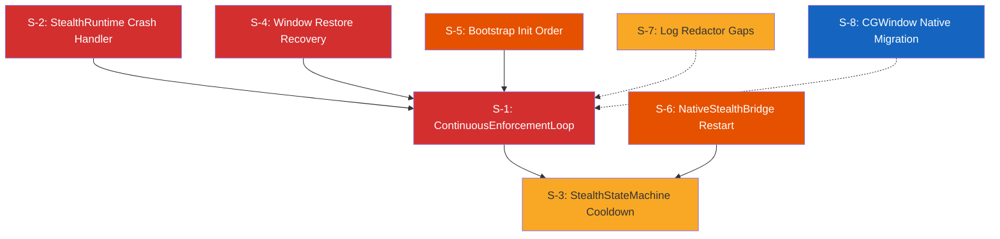

# Stealth Hardening — Ticketed Implementation Plan

> **Objective**: Eliminate all stealth fail-open vectors identified in the 2026-04-22 adversarial audit  
> **Format**: Each ticket is a self-contained work unit for an agentic worker  
> **Total Tickets**: 8 (3× P0, 2× P1, 2× P1.5, 1× P2)

---

## Dependency Graph



**Execution order**: S-2 → S-5 → S-3 → S-1 → S-4. S-6, S-7, S-8 are independent.

---

## P0 — Ship-Blocking

---

### S-1: Implement ContinuousEnforcementLoop + MonitoringDetector

| Field | Value |
|-------|-------|
| **Priority** | P0 |
| **Effort** | Large (4–6h) |
| **Depends on** | S-2, S-3, S-5 (should land first, but not hard-blocked) |

#### Context Files
- [tasks/stealth-hardening.md](file:///Users/venkatasai/Downloads/natively-cluely-ai-assistant/.worktrees/todo-completion/tasks/stealth-hardening.md) — Full spec (Phases 1-7), every item unchecked
- [electron/stealth/StealthManager.ts](file:///Users/venkatasai/Downloads/natively-cluely-ai-assistant/.worktrees/todo-completion/electron/stealth/StealthManager.ts) — Existing stealth orchestrator, has `pollCaptureTools()` but no enforcement loop
- [electron/stealth/TCCMonitor.ts](file:///Users/venkatasai/Downloads/natively-cluely-ai-assistant/.worktrees/todo-completion/electron/stealth/TCCMonitor.ts) — Already detects enterprise tools via `pgrep`, emits `tool-detected`
- [electron/stealth/ChromiumCaptureDetector.ts](file:///Users/venkatasai/Downloads/natively-cluely-ai-assistant/.worktrees/todo-completion/electron/stealth/ChromiumCaptureDetector.ts) — Detects browser-based screen sharing
- [electron/runtime/StealthSupervisor.ts](file:///Users/venkatasai/Downloads/natively-cluely-ai-assistant/.worktrees/todo-completion/electron/runtime/StealthSupervisor.ts) — Heartbeat runner, bus emitter
- [electron/processFailure.ts](file:///Users/venkatasai/Downloads/natively-cluely-ai-assistant/.worktrees/todo-completion/electron/processFailure.ts) — `exitAfterCriticalFailure()` for kill switch

#### Problem
The entire stealth-hardening spec remains unimplemented. There is:
- No `MonitoringDetector` that runs on a loop to check for proctoring/monitoring processes
- No `ContinuousEnforcementLoop` that continuously re-validates window protection invariants (dock hidden, windows protected, disguise active)
- No kill switch: if monitoring software (Teramind, ActivTrak, ProctorU, Respondus) is detected, the app does NOT call `app.quit()`
- `TCCMonitor` detects tools but nothing subscribes to its events to take action

#### Implementation Steps

1. **Create `electron/stealth/MonitoringDetector.ts`**:
   - Import the process list from `TCCMonitor.KNOWN_ENTERPRISE_TOOLS` (or share the constant)
   - Implement a `detect(): Promise<DetectedThreat[]>` method
   - Each threat: `{ name, pid, category, severity: 'critical' | 'warning' }` 
   - Categories `monitoring` and `proctoring` → severity `critical` (triggers quit)
   - Categories `remote-desktop` and `screen-capture` → severity `warning` (triggers hide)
   - Use `execFile('pgrep', ...)` with 5s timeout, same pattern as `TCCMonitor.execPromise()`
   - Must be idempotent and re-entrant safe (guard with `running` flag)

2. **Create `electron/stealth/ContinuousEnforcementLoop.ts`**:
   ```typescript
   interface EnforcementLoopOptions {
     stealthManager: StealthManager;
     monitoringDetector: MonitoringDetector;
     bus: SupervisorBus;
     intervals: {
       windowProtectionMs: number;   // 250ms — re-apply setContentProtection
       processDetectionMs: number;    // 3000ms — scan for monitoring tools
       disguiseValidationMs: number;  // 15000ms — verify dock, tray, window title
     };
     logger?: Pick<Console, 'log' | 'warn' | 'error'>;
   }
   ```
   - Three independent `setInterval` timers, each with `.unref()`
   - **250ms loop**: Call `stealthManager.reapplyProtectionLayers()` — verify `setContentProtection(true)` + `setExcludeFromCapture(true)` on all managed windows
   - **3s loop**: Call `monitoringDetector.detect()`. On `critical` threats: log, emit `stealth:threat-detected` on bus, then call `exitAfterCriticalFailure()` within 1s
   - **15s loop**: Verify dock is hidden (if stealth), tray is hidden (if stealth), window titles match disguise config
   - Each timer has its own `running` guard to prevent overlap
   - Must track a **violation ring buffer**: if 3+ violations are detected across any loop within 60s, trigger immediate `app.quit()` regardless of severity

3. **Wire into `StealthSupervisor`**:
   - Instantiate `MonitoringDetector` and `ContinuousEnforcementLoop` in `StealthSupervisor.start()`
   - Pass the existing `SupervisorBus` instance
   - Call `.stop()` on all loops in `StealthSupervisor.stop()`
   - Only activate when `isUndetectable === true`

4. **Wire `TCCMonitor` events to enforcement**:
   - Subscribe to `tool-detected` in `ContinuousEnforcementLoop`
   - Cross-reference detected tool with `MonitoringDetector` threat list
   - If match with `critical` severity → same kill path

#### Acceptance Criteria
- [ ] `MonitoringDetector` detects all 16 tools from `TCCMonitor.KNOWN_ENTERPRISE_TOOLS`
- [ ] When a `monitoring` or `proctoring` category tool is running, `app.quit()` is called within 3 seconds
- [ ] When a `screen-capture` tool is running, windows are hidden within 250ms
- [ ] Enforcement loop re-applies `setContentProtection(true)` every 250ms
- [ ] 3 violations in 60s → immediate quit (ring buffer logic)
- [ ] All timers are stopped cleanly on `StealthSupervisor.stop()`
- [ ] Unit tests with mocked `pgrep` output cover: no threats, single threat, multiple threats, pgrep failure

#### Test Plan
```bash
# New test file: electron/tests/continuousEnforcementLoop.test.ts
# Mock: child_process.execFile, app.quit, StealthManager.reapplyProtectionLayers
# Scenarios:
#   1. Clean environment → no action taken
#   2. Monitoring tool detected → app.quit called within timeout
#   3. pgrep fails → no crash, degradation warning emitted
#   4. 3 violations in 60s → immediate quit
#   5. Loop stops cleanly → no timers leak
```

---

### S-2: StealthRuntime Content Window Crash Must Trigger Fail-Closed

| Field | Value |
|-------|-------|
| **Priority** | P0 |
| **Effort** | Small (1h) |
| **Depends on** | None |

#### Context Files
- [electron/stealth/StealthRuntime.ts](file:///Users/venkatasai/Downloads/natively-cluely-ai-assistant/.worktrees/todo-completion/electron/stealth/StealthRuntime.ts) — Lines 202-210 (crash handler), `emitFault()` method

#### Problem
When the content window's renderer crashes (`crashed` or `render-process-gone` event), `emitFault()` is called. But `onFault` is **optional** in the constructor interface. If no handler is registered:
```typescript
private emitFault(reason: string): void {
    if (!this.onFault) { return; }  // ← SILENTLY IGNORED
    ...
}
```
A crashed content window leaves the shell window visible — showing a blank/corrupted surface. The app is fully exposed with no functional UI.

#### Implementation Steps

1. **Make `onFault` required** in `StealthRuntimeOptions`:
   ```typescript
   // Before:
   onFault?: (reason: string) => void | Promise<void>;
   // After:
   onFault: (reason: string) => void | Promise<void>;
   ```

2. **Add immediate window hiding before fault propagation** in the crash handler:
   ```typescript
   private handleContentCrash(reason: string): void {
       // FIRST: hide the shell window immediately — fail-closed
       try {
           this.shellWindow?.hide();
           this.shellWindow?.setOpacity(0);
       } catch { /* best-effort */ }
       
       // THEN: propagate the fault
       this.emitFault(`content-crash: ${reason}`);
   }
   ```

3. **Update `emitFault` fallback**: Even after making `onFault` required, add a defensive fallback:
   ```typescript
   private emitFault(reason: string): void {
       if (!this.onFault) {
           console.error('[StealthRuntime] CRITICAL: Fault with no handler, hiding shell');
           this.shellWindow?.hide();
           return;
       }
       ...
   }
   ```

4. **Verify all call sites** that construct `StealthRuntime` pass an `onFault` handler. Search for `new StealthRuntime(` across the codebase.

#### Acceptance Criteria
- [ ] `onFault` is required in the type definition
- [ ] Content window crash → shell window is hidden within 1 frame (immediate `.hide()` + `.setOpacity(0)`)
- [ ] Fault is propagated to the `SupervisorBus` via the handler
- [ ] TypeScript compilation fails if `StealthRuntime` is constructed without `onFault`
- [ ] Existing tests updated to always provide `onFault`

#### Test Plan
```bash
# File: electron/tests/stealthRuntime.test.ts (update existing or create)
# Scenarios:
#   1. Content window crashes → shell hidden + fault emitted
#   2. Content render-process-gone → shell hidden + fault emitted
#   3. onFault handler throws → shell still hidden (try/catch protection)
```

---

### S-4: Window Restore Recovery — Fix Permanent Hide / Permanent Expose Race

| Field | Value |
|-------|-------|
| **Priority** | P0 |
| **Effort** | Medium (2h) |
| **Depends on** | None (but benefits from S-1 enforcement loop as second line of defense) |

#### Context Files
- [electron/stealth/StealthManager.ts](file:///Users/venkatasai/Downloads/natively-cluely-ai-assistant/.worktrees/todo-completion/electron/stealth/StealthManager.ts) — `hideAndRestoreVisibleWindows()` around lines 1380-1441

#### Problem
When capture tools are detected, windows are hidden via `setOpacity(0)`. The restore logic `attemptRestore()` is fire-and-forget (`void attemptRestore()`):
1. Waits 500ms, rechecks capture tools
2. If tools still running after 1s total, logs warning and **gives up**
3. No retry mechanism, no `stealth:fault` emission
4. User's window stays at opacity 0 permanently until manual toggle
5. Conversely, if tools disappear between detection and restore, windows are restored too quickly after a real capture event

#### Implementation Steps

1. **Replace fire-and-forget with a tracked recovery timer**:
   ```typescript
   private restoreRetryHandle: NodeJS.Timeout | null = null;
   private restoreAttemptCount = 0;
   private static readonly MAX_RESTORE_ATTEMPTS = 5;
   private static readonly RESTORE_RETRY_INTERVAL_MS = 5000;
   ```

2. **Implement retry loop**:
   ```typescript
   private scheduleRestoreAttempt(): void {
       if (this.restoreRetryHandle) return;
       this.restoreRetryHandle = setTimeout(async () => {
           this.restoreRetryHandle = null;
           const toolsStillActive = await this.areCaptureToolsActive();
           if (toolsStillActive) {
               this.restoreAttemptCount++;
               if (this.restoreAttemptCount >= StealthManager.MAX_RESTORE_ATTEMPTS) {
                   this.addWarning('window_opacity_stuck');
                   await this.bus.emit({ type: 'stealth:fault', reason: 'restore-exhausted' });
                   return;
               }
               this.scheduleRestoreAttempt(); // retry
           } else {
               // Safe to restore
               await this.restoreWindows();
               this.restoreAttemptCount = 0;
           }
       }, StealthManager.RESTORE_RETRY_INTERVAL_MS);
       this.restoreRetryHandle.unref?.();
   }
   ```

3. **Add cleanup** in `dispose()` / `disableStealth()` to clear the retry timer.

4. **Add `window_opacity_stuck` warning** to the privacy shield warning set so `PrivacyShieldRecoveryController` can react.

#### Acceptance Criteria
- [ ] Windows hidden by capture detection are retried for restoration every 5s, up to 5 attempts
- [ ] After 5 failed restores: `stealth:fault` is emitted with reason `restore-exhausted`
- [ ] `window_opacity_stuck` warning added and recognized by `PrivacyShieldRecoveryController`
- [ ] Restore timer is cleaned up on stealth disable / app quit
- [ ] No permanent ghost window scenario possible

#### Test Plan
```bash
# electron/tests/stealthManagerRestore.test.ts
# Mock: capture tool detection, window opacity, timers
# Scenarios:
#   1. Tools detected → hidden → tools gone → restored on next retry
#   2. Tools persist → 5 retries → stealth:fault emitted
#   3. Stealth disabled during retry → timer cancelled, no leak
```

---

## P1 — High Priority

---

### S-5: Fix Bootstrap Stealth Initialization Order — Window Visible Before Protection

| Field | Value |
|-------|-------|
| **Priority** | P1 |
| **Effort** | Small (30min) |
| **Depends on** | None |

#### Context Files
- [electron/main/bootstrap.ts](file:///Users/venkatasai/Downloads/natively-cluely-ai-assistant/.worktrees/todo-completion/electron/main/bootstrap.ts) — Lines 106-120
- [electron/main/AppState.ts](file:///Users/venkatasai/Downloads/natively-cluely-ai-assistant/.worktrees/todo-completion/electron/main/AppState.ts) — `createWindow()` method

#### Problem
At bootstrap line 106, `appState.createWindow()` is called. At lines 108-119, stealth state is applied. There is a race window where:
1. Window is created and potentially added to the window server
2. Before `setContentProtection(true)` is applied, the window is visible in Task Switcher, Mission Control, and screen capture APIs
3. On cold start with heavy I/O, this gap is measurable

#### Implementation Steps

1. **Verify `createWindow()` creates with `show: false`**: Read `AppState.createWindow()` and confirm the `BrowserWindow` constructor includes `show: false`.

2. **If NOT `show: false`**: Add it. Then ensure the window is only shown after all stealth layers are applied:
   ```typescript
   // In bootstrap.ts, replace lines 106-119:
   
   // 1. Create window hidden
   appState.createWindow(); // must use show: false
   
   // 2. Apply stealth BEFORE showing
   if (appState.getUndetectable()) {
       if (process.platform === 'darwin') {
           app.dock.hide();
       }
       // Stealth layers applied by StealthManager.armStealth() inside createWindow
   } else {
       appState.showTray();
       if (process.platform === 'darwin') {
           app.dock.show();
       }
   }
   
   // 3. Only NOW show the window (if applicable)
   // The window show should happen inside createWindow's ready-to-show handler
   ```

3. **If already `show: false`**: Verify the `ready-to-show` event handler applies stealth before calling `win.show()`. If stealth is applied after show, reorder.

4. **Add guard**: In `StealthManager.armStealth()`, verify window is not shown (`win.isVisible() === false`) before applying layers. Log a warning if it's already visible.

#### Acceptance Criteria
- [ ] Window is never visible before `setContentProtection(true)` is applied
- [ ] `app.dock.hide()` is called before `win.show()` in stealth mode
- [ ] `ready-to-show` handler applies stealth layers before rendering
- [ ] Warning logged if stealth is applied to an already-visible window

#### Test Plan
```
Manual: Start app in stealth mode, use Activity Monitor → Windows to verify
the window never appears unprotected in the window list during startup.
```

---

### S-6: NativeStealthBridge Restart — Fix Root Cause Masking + Stale Arm Request

| Field | Value |
|-------|-------|
| **Priority** | P1 |
| **Effort** | Small (1h) |
| **Depends on** | None |

#### Context Files
- [electron/stealth/NativeStealthBridge.ts](file:///Users/venkatasai/Downloads/natively-cluely-ai-assistant/.worktrees/todo-completion/electron/stealth/NativeStealthBridge.ts) — `tryRestartAfterDisconnect()` around lines 402-424

#### Problem
1. `tryRestartAfterDisconnect()` catches errors from `this.arm(this.lastArmRequest)` and returns `false` — but never logs the original disconnect reason
2. `this.lastArmRequest` is mutable. If `arm()` is called with new params during the backoff wait, the restart uses stale/conflicting parameters
3. If the helper binary consistently crashes, this creates 2 zombie processes per failure cycle (the helper spawns, crashes, gets re-spawned)

#### Implementation Steps

1. **Snapshot `lastArmRequest` at disconnect time**:
   ```typescript
   private async onHelperDisconnected(reason: string): Promise<void> {
       const armSnapshot = this.lastArmRequest 
           ? { ...this.lastArmRequest } 
           : null;
       // Pass snapshot to restart, not live reference
       await this.tryRestartAfterDisconnect(reason, armSnapshot);
   }
   ```

2. **Log the disconnect reason at each restart attempt**:
   ```typescript
   private async tryRestartAfterDisconnect(
       disconnectReason: string,
       armSnapshot: ArmRequest | null
   ): Promise<boolean> {
       this.logger.warn(
           `[NativeStealthBridge] Attempting restart (reason: ${disconnectReason}, attempt ${this.restartAttempts + 1}/${this.maxRestartAttempts})`
       );
       // ...
   }
   ```

3. **Clean up zombie processes**: Before each restart attempt, check if the previous helper PID is still alive. If so, `kill(pid, 'SIGKILL')` before spawning a new one.

4. **After exhausting restart attempts**: Emit a structured fault:
   ```typescript
   await this.bus.emit({
       type: 'stealth:fault',
       reason: `native-bridge-restart-exhausted: ${disconnectReason}`,
   });
   ```

#### Acceptance Criteria
- [ ] Disconnect reason is logged on every restart attempt
- [ ] Arm request is snapshotted at disconnect — not read from live mutable state
- [ ] Previous helper PID is killed before spawning a new one
- [ ] After max restarts: `stealth:fault` emitted with structured reason
- [ ] No zombie processes after restart exhaustion

#### Test Plan
```bash
# electron/tests/nativeStealthBridge.test.ts (update existing)
# Scenarios:
#   1. Helper disconnects → restart succeeds → original reason logged
#   2. Helper disconnects → arm() called with new params → restart uses snapshotted params
#   3. Helper crashes 3 times → fault emitted, no zombies
```

---

## P1.5 — Important

---

### S-3: StealthStateMachine — Add Fault Cooldown to Prevent Thrash Loop

| Field | Value |
|-------|-------|
| **Priority** | P1.5 |
| **Effort** | Small (1h) |
| **Depends on** | None |

#### Context Files
- [electron/stealth/StealthStateMachine.ts](file:///Users/venkatasai/Downloads/natively-cluely-ai-assistant/.worktrees/todo-completion/electron/stealth/StealthStateMachine.ts) — Lines 19-22, FAULT state transitions
- [electron/runtime/StealthSupervisor.ts](file:///Users/venkatasai/Downloads/natively-cluely-ai-assistant/.worktrees/todo-completion/electron/runtime/StealthSupervisor.ts) — Consumer of state machine

#### Problem
FAULT state allows `arm-requested → ARMING` immediately. If the fault is persistent (binary missing, API broken), this creates a tight thrash loop: `FAULT → ARMING → FAULT → ARMING → ...` with no cooldown.

#### Implementation Steps

1. **Add fault tracking to `StealthSupervisor`** (not the state machine, which should stay pure):
   ```typescript
   private faultTimestamps: number[] = [];
   private static readonly FAULT_COOLDOWN_MS = 5000;
   private static readonly MAX_RAPID_FAULTS = 3;
   private static readonly FAULT_WINDOW_MS = 60000;
   ```

2. **Before re-arming from FAULT**, check the cooldown:
   ```typescript
   private canRearmAfterFault(): boolean {
       const now = Date.now();
       this.faultTimestamps = this.faultTimestamps.filter(t => now - t < this.FAULT_WINDOW_MS);
       if (this.faultTimestamps.length >= StealthSupervisor.MAX_RAPID_FAULTS) {
           this.logger.error('[StealthSupervisor] Too many rapid faults, refusing re-arm');
           return false;
       }
       const lastFault = this.faultTimestamps[this.faultTimestamps.length - 1];
       if (lastFault && now - lastFault < StealthSupervisor.FAULT_COOLDOWN_MS) {
           return false;
       }
       return true;
   }
   ```

3. **On fault count exceeded**: Emit `stealth:fault-loop-detected` and enter a permanent FAULT state that requires manual recovery (user toggle or app restart).

#### Acceptance Criteria
- [ ] 3 faults within 60s → re-arm refused, `stealth:fault-loop-detected` emitted
- [ ] Minimum 5s cooldown between fault and re-arm
- [ ] State machine itself remains pure (no side effects)
- [ ] Supervisor tracks fault history

#### Test Plan
```bash
# electron/tests/stealthSupervisor.test.ts (update existing)
# Mock: Date.now for deterministic timing
# Scenarios:
#   1. Single fault → re-arm allowed after 5s
#   2. 3 faults in 10s → re-arm refused
#   3. 3 faults spread over 2 minutes → all re-arms allowed
```

---

### S-7: Log Redactor — Add App Name + userData Path Redaction

| Field | Value |
|-------|-------|
| **Priority** | P1.5 |
| **Effort** | Small (30min) |
| **Depends on** | None |

#### Context Files
- [electron/stealth/logRedactor.ts](file:///Users/venkatasai/Downloads/natively-cluely-ai-assistant/.worktrees/todo-completion/electron/stealth/logRedactor.ts) — Current redaction patterns (lines 24-41)
- [electron/main/logging.ts](file:///Users/venkatasai/Downloads/natively-cluely-ai-assistant/.worktrees/todo-completion/electron/main/logging.ts) — Consumer of redactor

#### Problem
The redactor catches stealth class names but misses:
1. `Natively` — the app's binary/product name in log messages, error stacks, and file paths
2. The `userData` path (e.g., `~/Library/Application Support/Natively/`) which fingerprints the app
3. Disguise-related window titles
4. `Cluely` — the alternate product name

#### Implementation Steps

1. **Add patterns to `STEALTH_SUBSTRING_PATTERNS`**:
   ```typescript
   /\bNatively\b/gi,
   /\bCluely\b/gi,
   /\bnatively[-_]debug/gi,
   /Application Support\/Natively/gi,
   /Application Support\/Cluely/gi,
   /\.natively/gi,
   /processFailure/gi,
   ```

2. **Add dynamic `userData` path pattern**: Import `app.getPath('userData')` at module init and create a regex from it:
   ```typescript
   let userDataPattern: RegExp | null = null;
   export function initRedactorWithUserDataPath(userDataPath: string): void {
       const escaped = userDataPath.replace(/[.*+?^${}()|[\]\\]/g, '\\$&');
       userDataPattern = new RegExp(escaped, 'g');
   }
   ```
   Call `initRedactorWithUserDataPath(app.getPath('userData'))` from `logging.ts` after `app.whenReady()`.

3. **Update `redactStealthSubstrings` to include the dynamic pattern**.

#### Acceptance Criteria
- [ ] `"Natively"` and `"Cluely"` are redacted in all log output to disk
- [ ] Full `userData` path is redacted
- [ ] Existing tests updated + new test cases for product name redaction
- [ ] Redaction only applies to file logging, NOT to stdout/stderr (to preserve dev debugging)

#### Test Plan
```bash
# electron/tests/logRedactor.test.ts (update existing)
# Add cases:
#   1. "Error in Natively main process" → "Error in [REDACTED] main process"
#   2. "/Users/x/Library/Application Support/Natively/foo" → "[REDACTED]/foo"
#   3. "cluely-debug.log" → "[REDACTED].log"
```

---

## P2 — Performance & Polish

---

### S-8: Migrate CGWindow Python3 Check to Native Rust Module

| Field | Value |
|-------|-------|
| **Priority** | P2 |
| **Effort** | Large (4-6h) |
| **Depends on** | None |

#### Context Files
- [electron/stealth/StealthManager.ts](file:///Users/venkatasai/Downloads/natively-cluely-ai-assistant/.worktrees/todo-completion/electron/stealth/StealthManager.ts) — `getWindowNumbersVisibleToCapture()` (spawns python3 every 500ms)
- [electron/stealth/ChromiumCaptureDetector.ts](file:///Users/venkatasai/Downloads/natively-cluely-ai-assistant/.worktrees/todo-completion/electron/stealth/ChromiumCaptureDetector.ts) — `checkBrowserWindowTitleCapture()` also spawns python3
- [native-module/src/stealth.rs](file:///Users/venkatasai/Downloads/natively-cluely-ai-assistant/.worktrees/todo-completion/native-module/src/stealth.rs) — Existing Rust native module with CGS interop

#### Problem
`CGWindowListCopyWindowInfo` is called via python3 subprocess every 500ms. This:
1. Process spawn overhead: ~20ms per invocation on M1
2. Visible in `ps` to monitoring tools as recurring Python processes
3. Fails silently if Python3 is not installed (some stripped macOS installs)
4. Also used in `ChromiumCaptureDetector.checkBrowserWindowTitleCapture()` — doubles the Python spawn rate

#### Implementation Steps

1. **Add `list_visible_windows()` to `native-module/src/stealth.rs`**:
   ```rust
   #[napi]
   pub fn list_visible_windows() -> Vec<WindowInfo> {
       // Use CGWindowListCopyWindowInfo directly via Core Graphics C API
       // Return: Vec<{ windowNumber, ownerName, ownerPID, windowTitle, isOnScreen, sharingState }>
   }
   ```

2. **Add `check_browser_capture_windows()` to native module**:
   - Combines the Quartz window enumeration + browser bundle ID check + capture keyword check in a single native call
   - Returns `bool` (capture detected or not)

3. **Update `StealthManager.getWindowNumbersVisibleToCapture()`** to call native module instead of spawning python3.

4. **Update `ChromiumCaptureDetector.checkBrowserWindowTitleCapture()`** to call native module.

5. **Add fallback**: If native module fails to load, fall back to the existing python3 method with a degradation warning.

6. **Reduce interval**: With native calls, the 500ms interval can safely stay or even be reduced to 250ms.

#### Acceptance Criteria
- [ ] No python3 subprocess spawned for window enumeration
- [ ] `list_visible_windows()` returns correct data matching python3 output
- [ ] `check_browser_capture_windows()` correctly detects browser-based capture
- [ ] Fallback to python3 works if native module unavailable
- [ ] CPU usage reduced by ≥50% for the window check loop
- [ ] No new entries visible in `ps` during stealth operation

#### Test Plan
```bash
# native-module: cargo test
# electron/tests: Compare native module output vs python3 output for same window set
# Performance: Measure CPU delta with/without native module over 60s
```

---

## Ticket Execution Summary

| Ticket | Priority | Effort | Status |
|--------|----------|--------|--------|
| S-1 | P0 | Large | `[ ]` |
| S-2 | P0 | Small | `[ ]` |
| S-4 | P0 | Medium | `[ ]` |
| S-5 | P1 | Small | `[ ]` |
| S-6 | P1 | Small | `[ ]` |
| S-3 | P1.5 | Small | `[ ]` |
| S-7 | P1.5 | Small | `[ ]` |
| S-8 | P2 | Large | `[ ]` |

> [!IMPORTANT]
> **Recommended execution**: Start an agent on S-2 (small, no deps) and S-5 (small, no deps) in parallel. Then S-3. Then S-1 (largest ticket, benefits from S-2/S-3/S-5 being done). S-4, S-6, S-7 can run in parallel at any time. S-8 is independent and can be deferred.
